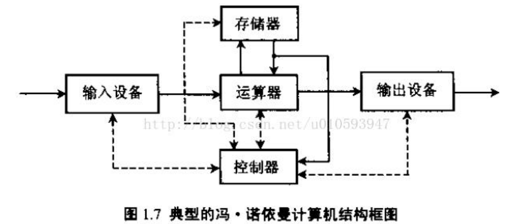

# 补充

## 冯诺依曼机的体系结构

主要由五大部件组成 

1. 存储器用来存放数据和程序 
2. 运算器主要运行算数运算和逻辑运算，并将中间结果暂存到运算器中
3. 控制器主要用来控制和指挥程序和数据的输入运行，以及处理运算结果
4. 输入设备用来将人们熟悉的信息形式转换为机器能够识别的信息形式，常见的有键盘，鼠标等 
5. 输出设备可以将机器运算结果转换为人们熟悉的信息形式，如打印机输出，显示器输出等

## 衡量计算机性能指标

吞吐量：表征一台计算机在某一时间间隔内能够处理的信息量，单位是字节/秒。

响应时间：表征从输入有效到系统产生响应之间的时间度量，用时间单位来度量，例如微秒（10-6S）、纳秒（10-9S）。 

利用率：表示在给定的时间间隔内，系统被实际使用的时间所占的比率，一般用百分比表示。

处理机字长：指处理机运算器中一次能够完成二进制数运算的位数。当前处理机的字长有8位、16 位、32 位、64 位。字长越长，表示计算的精度越高。 

总线宽度：一般指 CPU 中运算器与存储器之间进行互连的内部总线二进制位数。

存储器容量：存储器中所有存储单元的总数目，通常用 KB、MB、GB、TB 来表示。其中K=2^10，M=2^20，G=2^30，T=2^40， B=8 位（1 个字节）。 

存储器带宽：存储器的速度指标，单位时间内从存储器读出的二进制数信息量，一般用字节数/秒表示。

主频/时钟周期：CPU 的工作节拍受主时钟控制，主时钟不断产生固定频率的时钟，主时钟的频率（f）叫 CPU 的主频。度量单位是 MHz、GHz。 主频的倒数称为CPU 时钟周期（T），即T=1/f，度量单位是微秒、纳秒。

CPU 执行时间：表示 CPU 执行一段程序所占用的 CPU 时间，可用下式计算：
$$
CPU执行时间＝ CPU 时钟周期数 × CPU 时钟周期长 
$$
CPI：表示每条指令周期数，即执行一条指令所需的平均时钟周期数。 

MIPS:每秒百万条数据。MIPS 是单位时间内的执行指令数，所以 MIPS 值越高说明机器速度越快。MFLOPS 是基于操作而非指令的，只能用来衡量机器浮点操作的性能，而不能体现机器的整体性能。