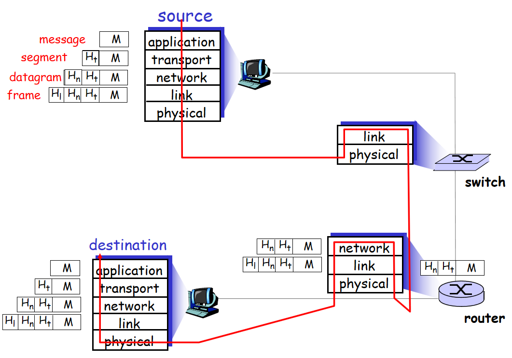
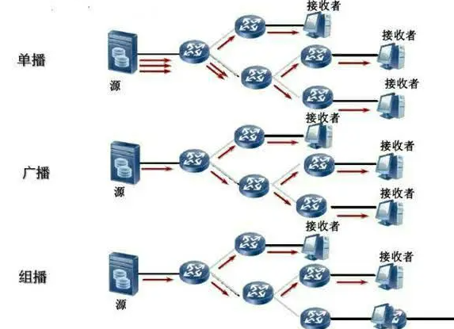

# 引入

Computer network=  components ( host, switch, router, etc) + media + topology +protocol

topology：

protocols define format, order of msgs sent and received among network entities, and actions taken on msg transmission, receipt.

The Internet: the interconnected set of networks of the Internet Service Providers (ISPs) providing data communications services.

>   三大运营商：中国电信，中国移动，中国联通。
>
>   其他：中国教育和科研计算机网；长城宽带；北京电信通；东南网络；广电宽带 ；中国科技网（隶属于中国科学院计算机网络信息中心）

datagram network provides network-layer connectionless service：no call setup at network layer，packets forwarded using destination host address

Virtual circuit network provides network-layer connection service：“source-to-dest path behaves much like telephone circuit”

Circuit Switching，Packet Switching

Packet switching allows more users to use network! great for bursty data, resource sharing, simpler, no call setup. But excessive congestion: packet delay and loss, protocols needed for reliable data transfer, congestion control.

-   nodal processing: check bit errors determine output link.
-   queueing: time waiting at output link for transmission
-   Transmission delay: R=link bandwidth (bps) L=packet length (bits) time to send bits into link = L/R
-   Propagation delay:d = length of physical link s = propagation speed in medium (~2x108 m/sec) propagation delay = d/s

sum of four

## 五层协议栈

1.   **应用层（application）**为用户程序提供接口，协议包括HTTP，FTP，SMTP，DNS等等。应用层的信息分组称为**报文（message）**。
2.   **运输层（transport）**实现进程到进程的通信，包括TCP和UDP协议。分组称为**报文段（segment）**。
3.   **网络层（network）**实现主机间的通信，包括IP协议。分组称为**数据报（datagram）**。
4.   **链路层（link）**实现相邻节点间的数据传输，协议包括以太网，WiFi和电缆接入网的DOCSIS协议。分组称为**帧（frame）**。
5.   **物理层（physical）**完成物理介质上比特流的传输。包括铜线，电缆以及光纤的协议。

## OSI七层模型

1.   应用层。
2.   **表示层（presentation）**为不同终端的上层用户提供信息和数据的格式化方法。
3.   **会话层（session）**负责在网络中的两节点之间建立和维持通信。
4.   运输层。
5.   网络层。
6.   链路层。
7.   物理层。

## 设备归属

-   路由器（Routers），网络层（第三层）。
-   交换机（Switches），链路层（第二层）。
-   网桥（Bridges），链路层，功能与交换机相似，区别在于交换机多端口，网桥二端口。
-   转发器（Repeater），物理层（第一层）。两个端口，一入一出，对衰减的信号进行放大整形或再生，起到扩展网段距离的作用。
-   集线器（Hubs），物理层（第一层）。起数据转发和网络拓展作用。和交换机不同的是集线器是通过广播的方式传递数据。多个端口，一进，在其他端口同时出。

## 冲突域和广播域

广播域就是说如果站点发出一个广播信号后能接收到这个信号的范围。通常来说一个局域网就是一个广播域。广播域是一个逻辑上的计算机组，该组内的所有计算机都会收到同样的广播信息。

冲突域指一个站点向另一个站点发出信号。除目的站点外，有多少站点能收到这个信号。这些站点就构成一个冲突域。冲突域是在同一个网络上两个比特同时进行传输则会产生冲突。所有的共享介质环境都是一个冲突域，在共享介质环境中一定类型的冲突域是正常行为。

冲突域通过集线器连接，集线器和所有接口构成一个广播域和冲突域，集线器既不能分割冲突域也不能分割广播域，它就像一根接口比较多的网线一样。

广播域则通过交换机。交换机的每个接口都是一个冲突域，交换机和所有接口构成一个广播域。交换机只能分割冲突域不能分割广播域。交换机连接的网段仍属于同一个广播域，广播数据包会在交换机连接的所有网段上传播，在某些情况会导致通信拥堵和安全漏洞。

路由器的每个端口所连接的网络都独自构成一个广播域。 路由器既分割了冲突域又分割了广播域。连接到路由器上的网段会被分配成不同的广播域，广播数据不会穿过路由器。

## 协议汇总

基于UDP：RIP，DNS，SNMP，DHCP。

-   **应用层**：HTTP，FTP，SMTP，POP3，IMAP，DNS，P2P，BitTorrent，SNMP。
-   **传输层**：UDP，ARQ，GBN，SR，TCP。
-   **网络层**：IP，DHCP，NAT，ICMP，RIP，OSPF，BGP，IGMP。
-   **链路层**：TDMA，FDMA，时隙ALOHA，ALOHA，CSMA，CSMA/CD，CSMA/CA，ARP。

## 单/广/组/任播

-   在**单播（unicast）**中，源主机对特定的主机进行数据传送。可以理解为一台机器和一台机器通信。
-   在**广播（broadcast）**中，主机对某一个网络上的所有主机发送数据包。
-   在**组播（multicast）**中，源主机只发送**一份**数据，数据的目的地址是组播组地址，属于该组的成员，都可以接收到一份源主机发送的数据的拷贝。
-   **多播**就是组播，英文都是multicast。
-   **任播（anycast）**，IPv6 增加的一种类型。任播的目的站是一组计算机，但数据报在交付时只交付其中的一个，通常是距离最近的一个。

## 局域网，城域网，广域网

**局域网（Local Area Network，LAN）**用于将有限范围内（例如一个实验室、一层办公楼或者校园）的各种计算机、终端互联成网。是封闭的内部（私有）网络，覆盖范围一般是方圆几千米之内。是链路层概念。两台电脑组成局域网只需要一根网线连接，多台电脑组成局域网只需要一个交换机，局域网和局域网互连才需要使用路由器。

**城域网（Metropolitan Area Network，MAN）**是在一个城市范围内所建立的计算机通信网。

**广域网（Wide Area Network，WAN）**又称广域网、外网、公网。是连接不同地区局域网或城域网计算机通信的远程网。通常跨接很大的物理范围，它能连接多个地区、城市，国家，洲，形成国际性的远程网络。广域网并不等同于互联网。一般所指的互联网属于一种公共型的广域网。