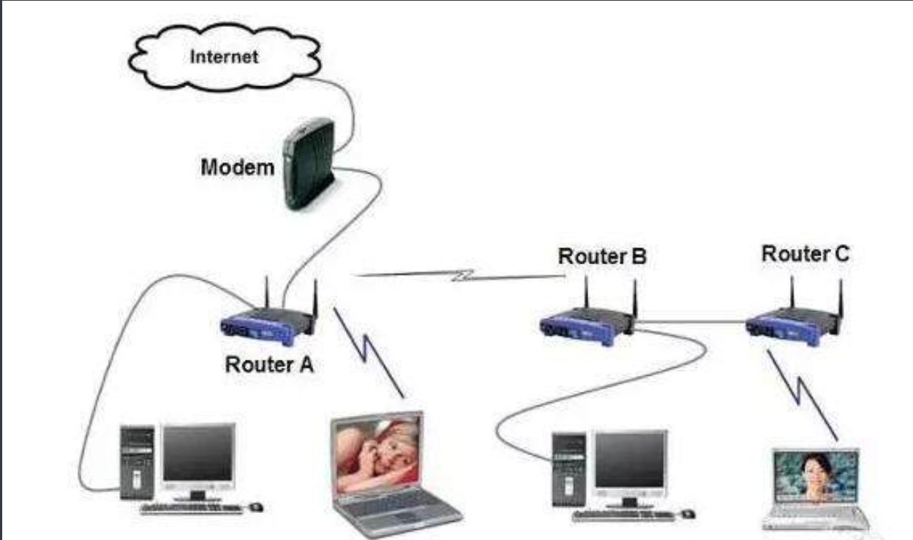
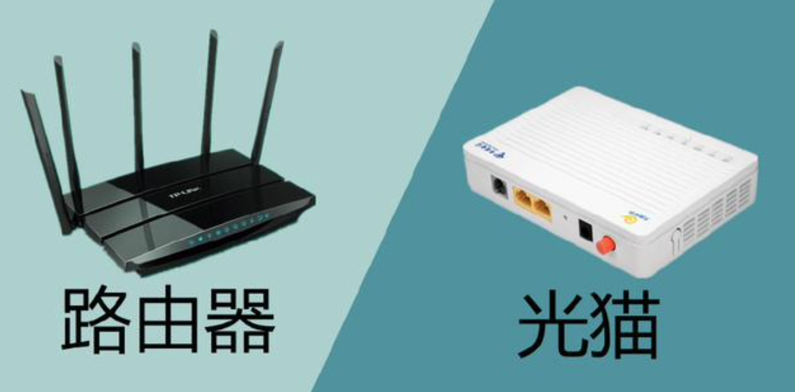
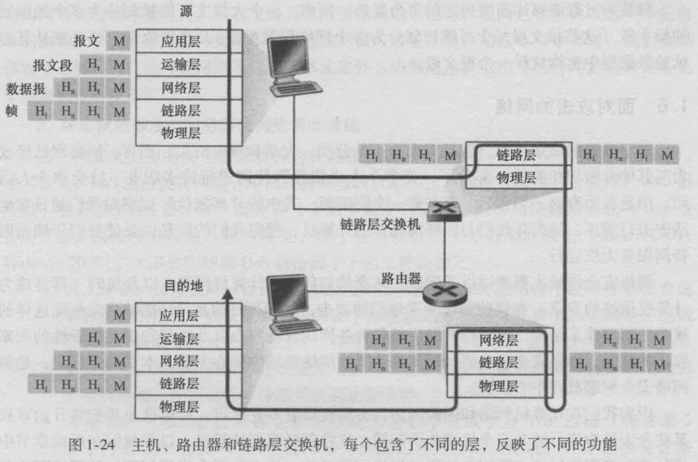
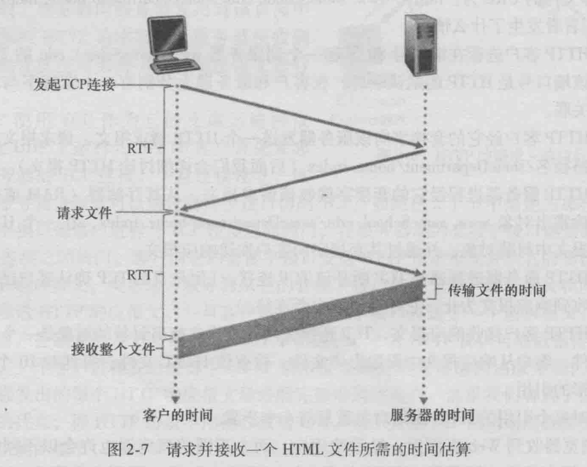
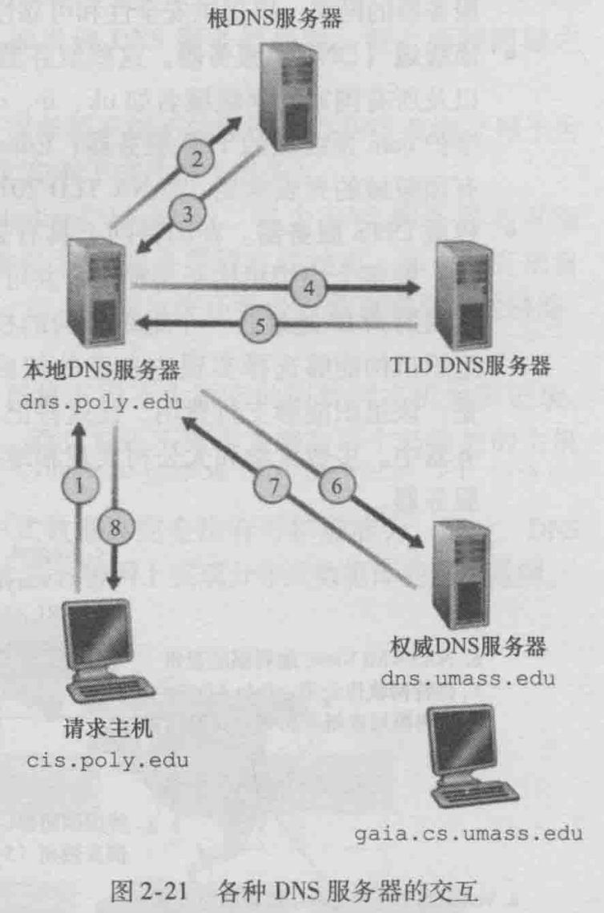
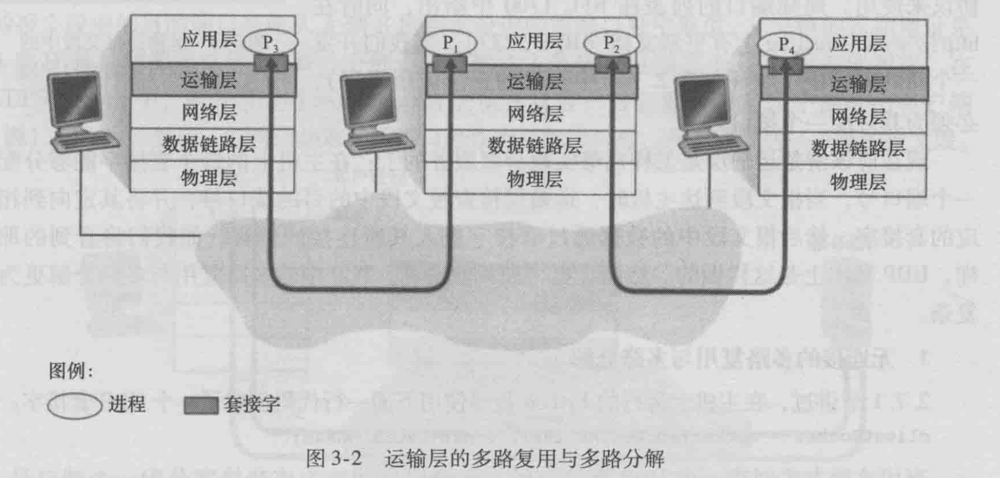

# 常见问答

## 引入

**Q1：因特网由哪些硬件构成？**

A1：这些硬件包括路由器，链路层交换机，调制解调器，以及主机（或者称为端系统）等。其中主机是一个宽泛的概念，比如智能手机，平板电脑，电视，游戏机等等。

**Q2：我每天都在使用主机类的设备，但是对于这些其他的硬件不了解，能简单说一下它们是干什么的吗？**

A2：举一个现实的例子：当一批货物想要从一个工厂运往远方的另外一个工厂，我们会雇很多卡车来运送这批货物。每辆卡车都会经过高速路以及十字路口。

-   其中，出发地与目的地工厂相当于**主机**。主机包括客户端，服务器和各种设备。
-   卡车相当于**分组**，也就是数据分段组成的信息包。
-   高速路相当于**通信链路**。通信链路包括电缆，光纤和无线电波这样的物理媒介。
-   十字路口相当于**分组交换机**。分组交换机包括路由器和链路层交换机，他们向最终目的地转发分组。

**Q3：在家庭中，我时常接触到路由器，调制解调器，“猫”的概念，它们的区别和联系是什么？**

A3：“**猫**”就是指**调制解调器**。调制解调器的英文是“Modem”，读音与“猫”相似，因此被称作“猫”。计算机只能理解数字信号，但互联网上传递模拟信号，调制解调器把数字信号和模拟信号相互转换。

>   在以前，家庭接入网络一般通过电话线，这时候的调解调器做数字信号和高频声音信号的相互转换。



狭义的调制解调器只做信号转换的工作。如果家中只有一台设备，那么只需要接入调制解调器就可以上网。

然而家里一般有多种设备，手机就连的是WiFi无线网络，无线网络由**路由器（Router）**负责搭建。也就是说，路由器接收由调制解调器传来的数字信号，并把信号分配到许许多多不同的设备中去。



现在，一些网络提供商在提供调制解调器的同时会内置路由器的功能。这种综合设备在转换信号的同时也能提供无线WiFi网络。

>   觉得概念模糊？看看这个https://www.bilibili.com/video/BV1sW411o758

**Q4：什么是TP-LINK？为什么我在连WiFi的时候经常看见它？**

A4：TP-LINK是一家中国公司，提供网络设备，包括路由器。TP-LINK这家公司凭借成功的市场策略，赢得了路由器大部分的市场份额。其他几家公司（比如华为）在卖路由器上都比不过它，所以我们在连WiFi的时候经常能看到TP-LINK的名字。关于TP-LINK成功的市场策略以及历史，可以看看相关资料。

**Q5：什么是协议？它们有什么用？**

A5：举一个现实的例子：你向三个网友分别说“你好”，第一个网友说“你也好”；第二个网友说“别烦我”；第三个网友说“What are you saying? I don't understand Chinese.”

-   可以看出，你和第一个网友可以进行进一步的沟通。你们使用相同的协议并且准备好了下一步动作。
-   第二个网友不太想和你说话。这表明协议可以表示当前的状态。
-   对于第三个网友，如果你不会英语，那就说不下去了。这表明如果使用不同的协议，对话就不能正常进行。

对于计算机与网络来说，传输在网络上的是0和1的比特位，我们需要一系列的格式以及顺序来决定进一步要采取的动作，这就是协议。

**Q6：谁负责提供我每天使用的网络？谁又负责提供提供商所提供的网络？**

A6：你可能想说的是**网络的网络**。这里引入一个名词，**因特网服务提供商（ISP）**。ISP有大有小，小的包括你的大学或者公司，它们提供校园网或单位网供你使用。校园网之类的网络可能再会接入市级别的ISP，再接入省级别的ISP，再接入国家级的ISP，最后可能接入世界级的ISP。同级别的ISP也会相互接入，这样构成了整个网络体系。（简单理解）

**Q7：我在打游戏的时候一直有延迟，这些延迟由哪些部分组成？**

A7：举一个现实的例子：假设游戏公司想要把一堆游戏数据送往你家。公司雇了十辆卡车组成的车队来运送这些数据。这十辆卡车需要经过一个又一个的收费站才能最终到达你家。在到达某个收费站时，领头车需要看地图来决定下到一个收费站要往哪儿开，这会耗费一些时间。收费站已经有一些车排在那了，这个车队也需要排队，这会耗费一些时间。这十辆车组成的车队要一起行动，而收费站每次只能处理一辆车，所以必须等到十辆车都通过收费站时才能出发。当然，在路上也会耗费时间。

-   其中，十辆卡车共同构成一个**分组**。
-   收费站相当于**路由器**。
-   查地图的时间相当于**处理时延**。它包括检查分组首部以及决定分组导向何处所需要的时间，也包括检查比特位差错需要的时间。
-   在收费站排队的时间相当于**排队时延**。
-   等待十辆卡车组成的车队一起经过收费站的时间相当于**传输时延**。如果说一辆卡车经过收费站要花费一分钟，那么这个车队的传输时延就是十分钟。
-   在路上花费的时间相当于**传播时延**。

**Q8：那么，什么又是丢包？**

A8：在现实中，排队队列可以一直延长下去，但对一个路由器来说，这种排队队列是有限的，如果说队列已满，这时又到达了一个新的分组，那么这个分组会被舍弃，或者说发生了**丢包**。

在网络游戏中，丢包意味着你精妙绝伦的操作无法传到服务器上；或者服务器上的战场现况不能传到你的电脑中。

**Q9：网络结构太抽象了，我能具体地看一看我的电脑连接到百度时经过了哪些路由器吗？**

A9：当然可以，可以使用**traceroute**这个命令行工具，或者使用**PingPlotter**这个可视化的工具。下面这张截图展示了我的电脑连接到百度时经过的路由器。


>   PingPlotter官网下载：https://www.pingplotter.com/download
>
>   PingPlotter的使用说明：https://www.pingplotter.com/fix-your-network/getting-started

**Q10：网络协议是分层的，这种分层的意义是什么？**

A10：拿坐飞机举个例子：首先我们买票并且拿到登机牌，然后托运行李，然后坐飞机飞到目的地，之后我们认领行李，如果对行程不满意，我们还可以向票务投诉。

这也是一个复杂而井井有条的系统。

-   票务只负责售卖机票以及接收投诉。
-   行李托运人员只负责正确地把行李托运并交付。
-   飞行员只负责把飞机开到目的地。

对于每一个环节或者说每一层，他们只负责他们自己的工作。并且如果某一层的服务细节改变了，其他层也不需要发生对应的改变。

**Q11：网络协议具体分哪几层？它们各自有什么用？**

A11：网络协议分层不是唯一的，这里使用五层协议栈。

1.   **应用层**是网络应用程序以及它们的应用层协议存留的地方，这些协议包括HTTP，FTP，SMTP，DNS等等。这本书把位于应用层的信息分组称为**报文（message）**。
2.   因特网的**运输层**在应用端点之间传送应用层报文，包括TCP和UDP协议。在这本书中，运输层的分组称为**报文段（segment）**。
3.   因特网的**网络层**负责将的网络层分组，也就是**数据报（datagram）**，从一台主机移动到另外一台主机，包括IP协议。
4.   网络层必须依靠**链路层**的服务，从源与目的地之间的一系列路由器将分组从一个节点移动到下个节点。链路层协议包括以太网，WiFi和电缆接入网的DOCSIS协议。在这本书中，链路层分组称为**帧（frame）**。
5.   **物理层**的任务是将帧中的一个个比特从一个节点移动到下个节点。包括铜线，电缆以及光纤的协议。



再举一个例子，比如说某个办公室的Alice要向Bob发送一封备忘录。

-   备忘录相当于**应用层报文**。
-   Alice将备忘录放入办事处之间的公函信封中，并在公函信封上方写上了Bob的名字和部门。这个公函信封相当于**运输层报文段**，它包括了首部信息（bob的名字和部门），并且封装了应用层报文（备忘录）。
-   当发送办事处的收发室拿到这个公函时，将其放入适合在公共邮政服务发送的信封中，并在邮政信封上写上了邮政地址。在这里邮政信封相当于**网络层数据报**，它封装了运输层报文段（公函）。
-   收件员收到了这个信封，把它打成邮包，标上更加具体的信息，并放到邮政公司的卡车里。这个邮包就相当于**链路层的帧**。
-   之后，司机负责将这些邮包从出发点送往目的地，这是**物理层**的工作。

当然，在Bob所在的城市也有一套相同的邮政系统。我们以相反的协议顺序一层一层解开外面的信息，最后Bob会收到Alice的备忘录。

## 应用层

**Q1：运行在不同主机上的程序是如何相互通信的？**

A1：用术语来说，进行通信的实际上是**进程**。进程通过一个被称为**套接字（scoket）**的软件接口向网络发送和接收报文。套接字是一台主机内应用层与运输层的接口。应用程序开发者可以控制套接字在应用层端的一切，但对套接字的运输层端几乎没有控制权。

进程可以类比为一座房子，它的套接字可以类比于它的门，应用程序开发者只能待在房子里面。如果一个进程想与另外一台主机上的另外一个进程发送报文，就将报文推出这个门（套捷字）。同样的，它也通过这个门接收报文。

**Q2：我理解了上面这个例子，对于这个“门”，有所谓“门牌号”的概念吗？**

A2：有的。为了向特定目的地发送报文，进程需要有一个地址。这个地址包括两种信息：

-   第一个是主机地址。在因特网中，主机由**IP地址**标识。
-   第二个信息是目的主机中接收进程的标识符，**端口号**用于这个目的。比如Web服务器用端口号80来标识。

**Q3：能简单说说当下流行的因特网应用吗？**

A3：当然，应用层就是干这个的。这本书主要讨论五种重要的应用：Web网页（使用HTTP协议），电子邮件（使用SMTP协议），目录服务（DNS），P2P下载和流视频。

**Q4：我每天都上网，但是我可能对Web术语不太了解，能先简单说一下吗？**

A4：我们每天用浏览器（例如Chrome浏览器，火狐浏览器，360浏览器）去浏览一个一个的Web页面。一个页面的主体是一个**HTML文件**，它可能会包括文字，图片，视频等内容，这些内容称为**对象（object）**。每个对象都会有一串**URL地址**来指示它来自于哪里，URL地址有两部分组成：存放对象的服务器主机名和对象的路径名。

>   例如：www.dlut.edu.cn/images/new/logoft.png，其中www.dlut.edu.cn是主机名，/images/new/logoft.png是路径名。

当我们从HTTP协议的角度来看，我们使用的浏览器其实就是**客户端**。我们向存放网页的**服务器**请求服务。再具体一点，每当我们点击一个超链接，我们的浏览器向目标服务器发出请求，服务器收到请求，并把这些对象返回给我们。

**Q5：假设我使用URLwww.dlut.edu.cn/images/new/logoft.png请求那张图片，HTTP协议具体指导浏览器做了哪些工作？**

A5：分几个操作：

1.   浏览器，或者说HTTP客户进程，在端口号80发起了一个到服务器www.dlut.edu.cn的TCP连接，该端口号是HTTP的默认端口。在客户端和服务器上分别有一个套接字与该连接相关联。
2.   HTTP客户端经它的套接字向服务器发送**HTTP请求报文**，这个报文中包含了路径名/images/new/logoft.png
3.   HTTP服务器进程经它的套接字接收请求报文。从存储体中检索出对象www.dlut.edu.cn/images/new/logoft.png，在一个**HTTP响应报文**中封装对象，并通过套接字向用户发送响应报文。
4.   HTTP服务器进程通知TCP可以断开该TCP连接。
5.   HTTP客户端接收响应报文，TCP连接关闭。

**Q6：等等，什么是TCP连接？**

A6：TCP是一个运输层协议，为应用层提供服务，之后我们会详细讨论它。在这里只需要知道它的两个特性：

1.   TCP是面向连接的服务。意思是在应用层报文开始流动之前，TCP会在客户与服务器之间建立一条连接。可以简单想象为一条通道让数据流动。
2.   第二个特点是TCP提供可靠的数据传送服务。这种服务提供无差错，并且按正确的顺序交付所有要发送的数据，并且为网络拥堵提供了一些解决方案。

**Q7：我经常听到别人说“三次握手”，这分别指什么？**

A7：在具体传送文件时：

1.   客户先发起TCP连接，向服务器发送一个小的TCP报文段。
2.   服务器再用一个小的TCP报文段做出确认和响应。
3.   之后客户向服务器返回确认和请求报文。

当请求报文到达服务器时，服务器才开始这个TCP连接上发送文件。注意，在真正开始发送文件之前，我们的客户与服务器之间已经进行了三次沟通，这叫做“三次握手”。



**Q8： 我可以看一看现实的HTTP报文吗？**

A8： 打开你的浏览器， 在浏览网页的时候打开开发者工具， 如果你用的是谷歌Chrome浏览器，进入网络（Network）页面，随便选一个请求，可以看到报文。

>   这是我的浏览器在请求百度页面时所发出的请求报文（部分）：
>
>   ```
>   GET / HTTP/1.1
>   Accept: text/html,application/xhtml+xml,application/xml;q=0.9,image/avif,image/webp,image/apng,*/*;q=0.8,application/signed-exchange;v=b3;q=0.9
>   Accept-Encoding: gzip, deflate, br
>   Accept-Language: zh-CN,zh;q=0.9
>   Cache-Control: max-age=0
>   Connection: keep-alive
>   Cookie: BIDUPSID=25A21878123458089IJFSKJGH052142; 
>   Host: www.baidu.com
>   Upgrade-Insecure-Requests: 1
>   User-Agent: Mozilla/5.0 (Macintosh; Intel Mac OS X 10_15_7) AppleWebKit/537.36 (KHTML, like Gecko) Chrome/108.0.0.0 Safari/537.36
>   sec-ch-ua: "Not?A_Brand";v="8", "Chromium";v="108", "Google Chrome";v="108"
>   sec-ch-ua-mobile: ?0
>   sec-ch-ua-platform: "macOS"
>   ```
>
>   响应报文头部（部分）：
>
>   ```
>   HTTP/1.1 200 OK
>   Cache-Control: private
>   Connection: keep-alive
>   Content-Encoding: gzip
>   Content-Type: text/html;charset=utf-8
>   Date: Sat, 31 Dec 2022 10:03:24 GMT
>   Expires: Sat, 31 Dec 2022 10:03:24 GMT
>   Isprivate: 1
>   Server: BWS/1.1
>   Set-Cookie: BDSTDPTM=799; path=/
>   Transfer-Encoding: chunked
>   ```

如果你想手动书写报文并与HTTP协议交互，可以看看同目录下的笔记：**qms_01_telnet与HTTP实验.md**

**Q9：当我登录某些网站时，这些网站要求我接受它们的“cookie政策”，这是什么？有什么用？**

A9：HTTP协议本身并不要求记录访问者的信息。意思是说对于一个简单的网站，如果你连续两次访问它，它并不会认出你就是上一个访问者。

然而，当我们访问某些购物网站时，我们并不需要重新登录，网站就已经知道我们的账号名。这可能是用**cookie技术**来实现的。cookie技术记录访问者的信息，以便在访问者之后访问时进行某些操作。

具体来说，cookie技术有四个组件：

1.   在HTTP请求报文中有个cookie首部行。
2.   在HTTP响应报文中也有一个cookie首部行。
3.   在用户端系统中保留一个cookie文件，并由用户的浏览器进行管理。
4.   位于Web站点的一个后端数据库。

当用户第一次访问网站时， 服务器在数据库中为用户创建ID，并且在相应报文中加入Set-cookie。 用户的浏览器记录这个cookie并管理它，当用户使用浏览器第二次访问这个网站时，浏览器会在请求报文中加入这个cookie，这样网站服务器就会认出这个用户。


**Q10： 之前说过在因特网中主机由一串数字（IP地址）来标识，但是我每天上网都用的是像www.baidu.com这样的主机名，这矛盾吗？**

A10： 确实，计算机更乐于处理数字，而我们人喜欢有意义的单词，这中间的转换是由**DNS服务**来处理的， 它将主机名转换成纯数字的IP地址。 

不过DNS服务并不与我们人直接交互，而由浏览器自动完成，意思是当你在浏览器上输入一个网址时，浏览器会自动查询网址所对应的IP地址，并访问对应的主机。 所以大多数人并没有察觉到这项服务的存在。

**Q11： 如果我要访问www.baidu.com，浏览器如何查询网址所对应的IP地址？**

A11： 分几步完成：

1.   同一台电脑（或主机）上运行着DNS应用的客户端。
2.   浏览器将这个主机名传给DNS应用的客户端。
3.   DNS客户向DNS服务器发送一个包含主机名的请求。
4.   DNS服务器返回一份回答报文，其中含有对于该主机名的IP地址。
5.   一旦浏览器收到该IP地址，它能够向位于该IP地址80端口的HTTP服务器进程发起一个TCP连接。

**Q12： 这台所谓的“DNS服务器”是怎么做到管理全世界的网址，并能将它们转换成对应的IP地址的？**

A12： 被你发现了，这台所谓的“DNS服务器”的并不是指一台服务器，严格来讲，它是一套庞大而复杂的系统。 这是一个分层的系统，包含根DNS服务器，顶级域（TLD）DNS服务器，权威DNS服务器。


上面的回答中“DNS客户向DNS服务器发送一个包含主机名的请求”其实是一个简化了的说法，详细来说，应该像下面这样：

1.   主机向本地DNS服务器请求相应的网址。
2.   本地DNS服务器向根DNS服务器发送请求，根DNS服务器从网址中提取顶级域（比如com, edu, org）并返回对应的TLD DNS服务器的IP地址。
3.   本地DNS服务器再向TLD DNS服务器发送请求，TLD DNS服务器返回对应的权威服务器的IP地址。
4.   本地DNS服务器再向权威DNS服务器发送请求， 权威服务器返回网址对应的IP地址。
5.   本地DNS服务器将IP地址返回给主机。



**Q13： 如果说我想追踪现实中DNS服务器的查询过程， 我可以怎么做？**

A13：你可以使用`dig [网址] +trace`的命令行命令来追踪。 下面这个例子是我的电脑在获取大学主页的IP地址时发生的DNS查询过程（部分）。

```
apple@appledembp@ ~ % dig www.dlut.edu.cn +trace

; <<>> DiG 9.10.6 <<>> www.dlut.edu.cn +trace
;; global options: +cmd
.			2169	IN	NS	m.root-servers.net.
.			2169	IN	NS	a.root-servers.net.
.			2169	IN	NS	f.root-servers.net.
.			2169	IN	NS	k.root-servers.net.
.			2169	IN	NS	c.root-servers.net.
.			2169	IN	NS	d.root-servers.net.
.			2169	IN	NS	g.root-servers.net.
.			2169	IN	NS	h.root-servers.net.
.			2169	IN	NS	e.root-servers.net.
.			2169	IN	NS	l.root-servers.net.
.			2169	IN	NS	j.root-servers.net.
.			2169	IN	NS	b.root-servers.net.
.			2169	IN	NS	i.root-servers.net.
;; Received 239 bytes from 192.168.93.114#53(192.168.93.114) in 90 ms

cn.			172800	IN	NS	d.dns.cn.
cn.			172800	IN	NS	g.dns.cn.
cn.			172800	IN	NS	f.dns.cn.
cn.			172800	IN	NS	ns.cernet.net.
cn.			172800	IN	NS	a.dns.cn.
cn.			172800	IN	NS	c.dns.cn.
cn.			172800	IN	NS	e.dns.cn.
cn.			172800	IN	NS	b.dns.cn.
;; Received 710 bytes from 192.112.36.4#53(g.root-servers.net) in 89 ms

edu.cn.			172800	IN	NS	ns2.cuhk.hk.
edu.cn.			172800	IN	NS	ns2.cernet.net.
edu.cn.			172800	IN	NS	dns2.edu.cn.
edu.cn.			172800	IN	NS	dns.edu.cn.
edu.cn.			172800	IN	NS	deneb.dfn.de.
;; Received 494 bytes from 203.119.29.1#53(e.dns.cn) in 40 ms

dlut.edu.cn.		172800	IN	NS	cedrus.dlut.edu.cn.
dlut.edu.cn.		172800	IN	NS	gingko.dlut.edu.cn.
;; Received 422 bytes from 202.38.109.35#53(dns.edu.cn) in 61 ms

www.dlut.edu.cn.	86400	IN	A	202.118.66.66
;; Received 60 bytes from 202.118.66.8#53(gingko.dlut.edu.cn) in 53 ms
```

可以看出：

-   首先查询的是根DNS服务器。（用一个`.`标识）
-   之后查询的是cn（中国）DNS服务器。
-   再查询的是edu DNS服务器。
-   然后是大学的权威DNS服务器。
-   最后返回www.dlut.edu.cn所对应的IP地址。

>   如果想要尝试更多关于DNS的小工具，可以看看同目录下笔记 **qms_04_DNS实验**

**Q14：我想我已经理解了最基础的因特网应用层协议，我可自己编写代码并实现自己的因特网应用吗？**

A14： 当然可以，不过最简单的因特网应用代码在这个问答笔记中也过于啰嗦了，具体的代码实现以及程序部署，可以看看同目录下的笔记，你最终可以在浏览器上看到你自己编写的网页：

-   qms_05_UDP套接字编程
-   qms_06_TCP套接字编程
-   qms_07_WebServer套接字编程作业

**Q15：在应用层这个层次上，我是否还错过了某些精彩内容？**

A15：当我们上网浏览时，有更多的事情在背后发生，有一些问题在这里并没有进行解答，原因包括：

-   这些内容过于复杂或者这些知识是边缘的。
-   博主自己还没有找到一个让自己满意的答案。
-   一些内容是相似的，只是在细节上有所区分。
-   有些内容对我们普通人在日常使用网络时是隐形的（比如DNS），我们不会主动去提出关于它们的问题。

不过你可以自己阅读书籍去寻找更深入的答案， 这些问题包括：

-   当我注册一个公司并想要注册相应的网站时，DNS是如何把我的网站的记录插入它们的服务器中的？
-   当我与某个服务器之间的网络连接速度达到限度时，是否要升级这之间的所有链路与路由器才能提升连接速度？ 这听上去代价过于庞大了，是否有简单的解决方案？（Tip：了解一下缓存或者代理服务器）
-   电子邮件使用哪些协议？ 它们的工作方式与报文格式是怎样的？
-   P2P是指什么？迅雷下载使用了这项技术吗？
-   在我看来，视频网站会占用网络的大部分流量，有什么优化或者加速方案吗？（Tip：了解一下内容分发网CDN）

## 运输层

**Q1： 运输层提供怎样的服务？运输层和它上下层的关系是怎样的？**

A1： 复习一下，在应用层这个层次上，程序（严谨来说是进程）将数据推出套接字，然后希望运输层将这些数据运送到目标程序。

从中我们可以看出，运输层提供进程到进程的逻辑通信。

具体来说，运输层在应用层报文的基础上加上一点信息，形成运输层报文段，再将其交付给网络层，希望网络层能够运送到相应的主机。

这里做一个区分：运输层提供的是进程到进程的逻辑通信；网络层提供主机到主机的逻辑通信。

 运输层协议的基本职责是将网络层送给这台主机的一大堆数据**分配**到不同进程所属的套接字中去。 换句话说，运输层并不负责数据在网络上的传输，它只负责把网络层传到这台主机的所有数据分发到不同的套接字，以及把这台主机所有要发往其他套接字的数据集中送给网络层，仅此而已。



**Q2： 运输层有哪些协议？它们的区别与联系是什么？**

A2：之前我们了解了TCP协议，它还有个兄弟叫做UDP协议。它们都能提供进程到进程间的逻辑通信。复习一下，我们之前说过，TCP协议是基于连接的，提供可靠的数据传送服务，并且有网络拥塞的处理方法。相比之下，UDP是一个更加简单的协议，它不建立连接，尽力而为提供服务但不保证可靠，也没有网络拥塞的处理方法。

>   或许你留意到了，造成UDP协议不保证可靠的原因是由于网络层的IP协议，IP协议尽力而为交付服务，但不作任何保证，在此基础上UDP没有加入更多的操作，因此UDP协议不保证可靠。

**Q3：这样看来，TCP协议比如UDP协议高级很多，那还会有人选择使用UDP协议吗？**

A3：TCP协议确实比UDP协议更可靠，但它同时也更复杂。这种可靠的代价是它将耗时更多，并且使用更多的资源。耗时体现在传输有意义的信息前TCP要进行三次握手，而UDP没有这个流程。 使用更多资源表现在TCP的报文段首部比UDP更长。而且在网络拥堵时TCP还会非常“绅士”地降低发送报文段的速度，而UDP没有这个机制。所以，TCP的优势也是TCP的劣势。

-   在进行实际的选择时，如果你追求可靠的数据传输，应该更多地考虑TCP，比如Web就采用TCP。
-   如果报文很简单并且追求速度（比如DNS）或者不在意少数的数据缺失（比如视频会议），那可以考虑UDP。

**Q4：TCP协议如何保证数据可靠传输？**

A4： 这是一个很大的问题，如果想搞明白里面的所有细节，你可能要查阅更多资料。这里只是简单举个例子来展示要考虑的基本问题。

假设你向另外一个人打电话，并嘱咐了一大堆东西，你可能得到的答复如下：

1.   “好的，我明白了。”
2.   “我没听清，你能再说一遍吗？”
3.   “好……不……什……”（含混不清的回答）
4.   “…………”（没有回答）

我们把这现实中的四种情况对应到TCP所要处理的情况，即TCP向另一端发送了很多信息，它可能收到的回复是：

1.   对方确认已经清晰完整地收到了这些信息，并且对方的回复也很完整。
2.   对方认为这些信息没有被完整地接收到，或者出了差错，不过对方的回复很完整。
3.   对方的回复是含混不清的，我们不知道对方收到的信息是否有差错。
4.   对方没有回复，我们也完全不知道发生了什么事情。可能我们说的话对方一句也没有听到，或者对方说的话我们一句没有听到，甚至有可能我们等待的时间太短，也许再等一段时间对方就会回复。

面对第一种情况，我们会很开心，因为这种情况下数据被成功传输。 面对二，三，四种情况，我们会选择重传这些信息。 特别是对第四种情况，我们会在等待一段时间后进行重传，但这又引出了一个新问题：要等待多久才是合适的？ 可能数据被丢失了，可能数据还在路上马上就到。对于更深入的问题以及这些情况的具体对策，可以阅读书籍进一步了解。

**Q5：我能得知目标主机上所有开放的TCP端口吗？**

A5：你可以借助一个工具叫做**nmap**，它试图与目标主机上的所有端口建立一条TCP连接，以此来扫描所有端口，并且得知开放的TCP端口。 我扫描了我大学服务器的所有TCP端口（是不是有点黑客的感觉了？），结果如下：

```
apple@appledembp@ ~ % nmap www.dlut.edu.cn
Starting Nmap 7.93 ( https://nmap.org ) at 2023-01-04 12:17 CST
Nmap scan report for www.dlut.edu.cn (202.118.66.66)
Host is up (0.046s latency).
Other addresses for www.dlut.edu.cn (not scanned): 2001:da8:a800:3::66
Not shown: 985 closed tcp ports (conn-refused)
PORT     STATE    SERVICE
22/tcp   filtered ssh
23/tcp   filtered telnet
80/tcp   open     http
111/tcp  filtered rpcbind
135/tcp  filtered msrpc
139/tcp  filtered netbios-ssn
443/tcp  open     https
445/tcp  filtered microsoft-ds
593/tcp  filtered http-rpc-epmap
1025/tcp filtered NFS-or-IIS
3389/tcp filtered ms-wbt-server
4125/tcp filtered rww
4444/tcp filtered krb524
6129/tcp filtered unknown
8009/tcp filtered ajp13

Nmap done: 1 IP address (1 host up) scanned in 11.28 seconds
```

>   nmap官网下载：https://nmap.org/download
>
>   

**Q6： 保证数据可靠运输的前提下，TCP可以进一步提高自己的效率吗？**

A6： 我们依旧举一个例子来回答这个问题。在下面两种通话方式中，每一种方式你觉得效率更高？

1.   在打电话时，你一次只说一句话， 然后等待，直到对方回答“刚才那句话我听明白了”，你再讲一句话。
2.   在打电话时，你一次讲很多句话，对方可能的回复是“你的第一句话我听清楚了，但是第二句话我没听清楚，第三句话我又听清楚了”，然后你再做相应的回复。

对应到TCP，第一种方式叫做**停等**协议，第二种方式叫做**流水线**协议。第二种方式显然效率更高，我们会同时追踪多个报文段的情况，并且对于损坏的报文段重传。当然，流水线协议要处理的情况更多，也更复杂。

**Q7：TCP如何得知网络拥塞？**

A7：TCP作为一种运输层协议，在网络层的基础上进行工作。然而对于网络层来说，没有人要求它一定要向TCP提供网络拥塞的情况，换句话说，TCP只能依靠自己的观察来判断网络是否拥塞。

简单来说，当出现丢失的报文段时，TCP会认为出现了网络拥塞，并且降低发送速率。因为丢失的报文段通常意味着这条链路上的某个路由器的排队队伍很长，并且占满了路由器缓存，最后到来的分组只能被路由器简单地丢弃。

**Q8：TCP会因为网络拥塞降低发送速率，UDP却不会，这对TCP是否公平？**

A8： 这个问题更多地涉及伦理道德，这个回答只是把我所想的写下来：

当我们更多地顾及自己的利益时，在遭遇网络拥塞时，我们不应该降低发送速率。 

-   一是因为如果我们正常地发送信息，我们所占用的流量跟这条链路上的所有流量比起来，可能微不足道。 
-   二是因为我们没有理由相信，在等待一段时间后网络拥塞的情况会变好。 
-   三是因为如果我们降低了我们的发送速率，可能会有潜在的主机增加自己的发送速率，网络依旧拥塞，我们的让步白费了。

所以，当某些应用不在乎少量的信息丢失，并且不想降低网络速度，它们会选择UDP协议， 比如视频会议。

相比之下，TCP是一个更“绅士”的协议，由于网络拥塞而降低发送速率，更多的是利于整个网络 稳定运行，而不是利于自己。但是我们不必感到悲观，理由如下：

-   当大部分因特网应用基于TCP实现时，相当于大部分人都是“绅士”，在这种环境中，我们的网络不仅能正常运行，并且会更和谐，更高效。
-   TCP并不一味地让步，准确来说，TCP尝试找到这样一种最佳状态：网络不会拥塞，也能够充分利用所有可用的宽带。TCP会反复提高降低发送速率，来找到这平衡点。
-   当多个TCP同时竞争一条链路，可以证明，最终这些TCP连接使用的流量会趋于相同。

>   这是TCP，它给你带来了稳定的网络环境。请让我们说：“谢谢TCP。”

**Q9：TCP的发送方如何确定发送速率，使得网络不会拥塞，也能够充分利用所有可用的宽带？**

A9：基本的思想是：

-   一个丢失的报文段意味着网络拥塞，因此当丢失报文段时，应当降低TCP发送方的速率。
-   一个成功的回复意味着一切顺利，网络不拥塞，可以提高发送方的速率。

在这种思想的指导下可以有很多实现，一个简单的实现如下：

1.   在开始发送时，发送速率可以从零开始，指数上升，快速逼近最大速率。
2.   在接近最大速率时（网络即将拥塞），发送速率可以线性提升，缓慢逼近。
3.   当出现丢包时，发送速率可以减半，再重新开始提升。

可以看到，TCP会反复提高降低发送速率，来找到平衡点，现实情况下发送速率通常会呈现锯齿的形状。


**Q10： 运输层这个层次上，我还错过了哪些精彩内容吗？**

A10：有一些问题在这里并没有进行提出与解答，原因包括：

-   这些内容过于复杂或者这些知识是边缘的。
-   博主自己还没有找到一个让自己满意的答案。
-   一些内容是相似的，只是在细节上有所区分。
-   有些内容对我们普通人在日常使用网络时是隐形的，我们不会主动去提出关于它们的问题。

不过你可以自己阅读书籍去寻找更深入的答案， 这些问题包括：

-   接收方如何得知收到的信息是否发生了损坏？（Tip：了解一下校验和）
-   对于流水线协议，容量（比如路由器缓存）是有限的，如何决定要追踪的分组数量？
-   对于流水线协议， 一些分组会被成功接收，一些分组可能损坏和丢失，流水线协议具体怎么处理这些情况？
-   对于超时事件，我们怎样决定等待的时间？

## 网络层

**Q1： 网络层提供怎样的服务？**

A1： 网络层的作用可以概括为：将分组从一台发送主机移动到一台接收主机。 为此需要两种重要的网络层功能：

-   **转发。** 当一个分组到达某个路由器的一条输入链路时，路由器必须将该分组移动到适当的输出链路。
-   **路由选择**。当分组从发送方流向接收方时，网络层必须决定这些分组的路径，这种计算路径的算法被称为**路由选择算法**。

举一个现实的例子， 当一个司机到达一个交通枢纽时，司机首先要根据地图计算出他的路线，然后经过这个交通枢纽。 其中司机是**分组**，交通枢纽是**路由器**，计算路线是**路由选择**的任务，经过交通枢纽是**转发**的任务。

**Q2： 为什么上面的回答中都在拿路由器举例子？**

A2： 记得我们之前讨论过的分层的网络协议吗？ 对于一台典型的路由器，它只有物理层，链路层以及网络层，而没有更高的层。 所以在网络层这一章中，我们都将以路由器作为我们的讨论中心，也请注意一台典型的主机（比如个人电脑）同样有这些层和功能。

**Q3：我之前就听说过IP协议，以及IPv4编址，它们是什么意思？**

A3： IP协议是网络层的一个非常重要的协议，它为因特网上的设备提供了一个地址，所以分组能够找到目的地。

IPv4是现在（2023年）主流使用的编制方式， 每个IP地址长度为32比特， 因此总共有大约40亿个可能的IP地址。 比特是二进制，但对于人类来说更喜欢十进制，所以我们将IP地址分为四个部分，每个部分包括八个比特，中间用一个点`.`隔开，比如`0.0.0.0`，`255.255.255.255`，`192.168.0.1`都是合法的IP地址。

**Q4： 我能看看我电脑的IP地址是什么吗？**

A4：当然，在我的mac上，控制台输入命令`ifconfig`会输出很多有关网络的信息，其中一小段如下，可以看到地址为192.168.1.4：

```
inet 192.168.1.4 netmask 0xffffff00 broadcast 192.168.1.255
```

