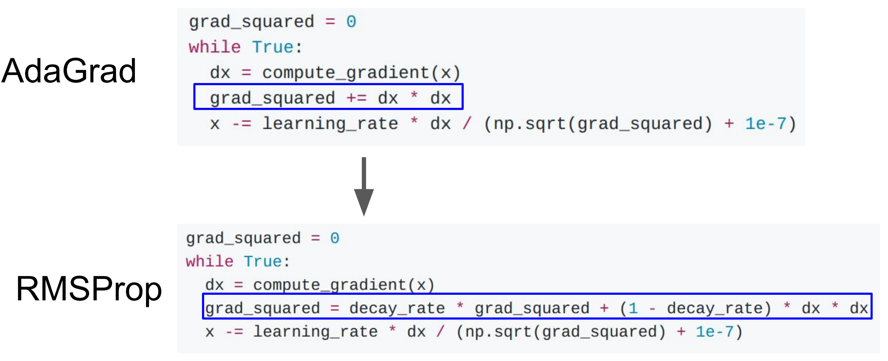
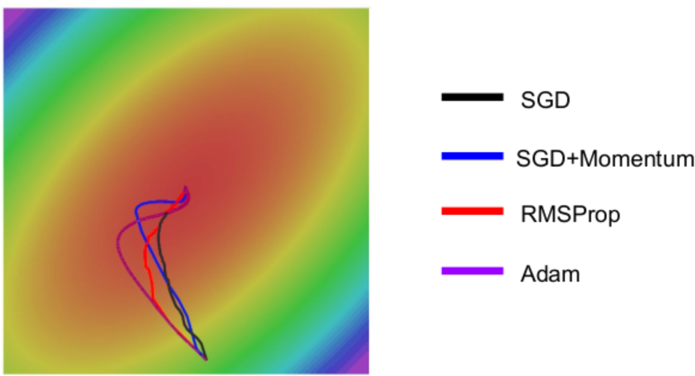
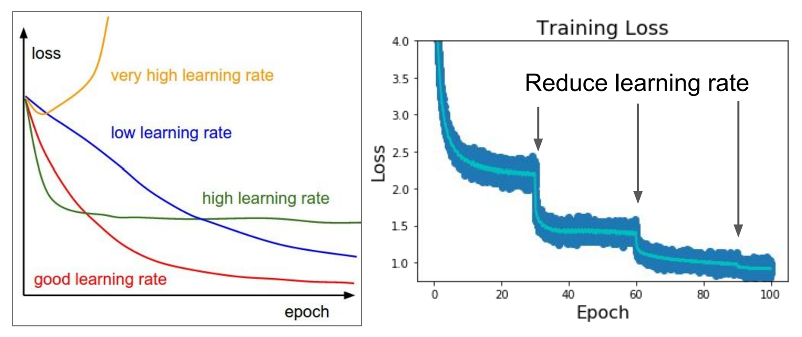
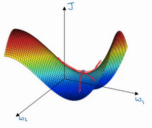

# 优化算法

## SGD随机梯度下降

梯度下降法中，有3中不同的策略。分别是：

- (full) batch gradient descent = 批梯度下降，是指所有数据一次性全部喂给模型，然后用梯度下降法更新参数。这种策略的问题就是一次迭代的时间太长了，难得等。
-  mini-batch gradient descent = 小批梯度下降，是指把训练数据分成很多了mini-batch（也就是很多个数据的集合），每次喂一个mini-batch给模型，然后用梯度下降法来更新参数。这种方法是BGD和SGD这两个方法的折中。这里面也有随机。
- stochastic gradient descent = 随机梯度下降，每次随机选择一个数据，喂给模型，然后更新参数。这种策略的问题是每次数据太少了，模型学不到什么东西。 平时我们说的随机梯度下降，就是SGD，随机是指随机选择一个数据喂给模型。 

## Mini-batch 梯度下降

### 思想

之前学过，向量化能够有效地对所有$m$个样本进行计算，允许处理整个训练集。具体来说，$X$的维数是$(n_{x},m)$，$Y$的维数是$(1,m)$，向量化能够相对较快地处理所有$m$个样本。

但是，如果$m$很大的话，处理速度仍然缓慢。比如$m$是500万或5000万或者更大的一个数。

可以把训练集分割为小一点的子集训练，这些子集被取名为**mini-batch**，假设每一个子集中只有1000个样本，那么把其中的$x^{(1)}$到$x^{(1000)}$取出来，将其称为第一个子训练集（也叫做**mini-batch**），称为$X^{\{1\}}$，然后再取出接下来的1000个样本，从$x^{(1001)}$到$x^{(2000)}$，称为$X^{\{2\}}$，然后再取1000个样本，以此类推。

如果训练样本一共有500万个，每个**mini-batch**都有1000个样本，那么共有5000个**mini-batch**，最后得到是$X^{\left\{ 5000 \right\}}$，维数都是$(n_{x},1000)$。对$Y$也要进行相同拆分处理，一直到$Y^{\{ 5000\}}$，维数都是$(1,1000)$。

>复习一下：
>
>-   上角小括号$(i)$表示训练集里的值，$x^{(i)}$是第$i$个训练样本。
>-   上角中括号$[l]$来表示神经网络的层数，$z^{\lbrack l\rbrack}$表示神经网络中第$l$层的$z$值。
>-   现在引入了大括号$\{t\}$来代表不同的**mini-batch**，有$X^{\{ t\}}$和$Y^{\{ t\}}$。

### 介绍

**batch**梯度下降法指的是之前讲过的（随机）梯度下降法算法（SGD），就是同时处理整个训练集。

相比之下，**mini-batch**梯度下降法，指的是每次同时处理的单个的**mini-batch** $X^{\{t\}}$和$Y^{\{ t\}}$，而不是同时处理全部的$X$和$Y$训练集。

### 处理流程

前向传播，具体看公式：
$$
Z^{\lbrack 1\rbrack} = W^{\lbrack 1\rbrack}X^{\{ t\}} + b^{\lbrack1\rbrack}
$$

$$
A^{[1]} =g^{[1]}(Z^{[1]})
$$

每层都以此类推，直到：
$$
A^{\lbrack L\rbrack} = g^{\left\lbrack L \right\rbrack}(Z^{\lbrack L\rbrack})
$$
计算损失成本函数$J$（子集规模是1000，加上正则化）：
$$
J^{\{t\}} = \frac{1}{1000}\sum_{i = 1}^{l}{L(\hat y^{(i)},y^{(i)})} +\frac{\lambda}{2\cdot 1000}\sum_{l}^{}{||W^{[l]}||}_{F}^{2}
$$
执行反向传播来计算$J^{\{t\}}$的梯度：
$$
W^{[l]}:= W^{[l]} - \alpha dW^{[l]}
$$

至此，完成了“一代”（**1 epoch**）的训练。“一代”这个词意味着只是一次遍历了训练集。因为有5000个**mini-batch**，当全部遍历一遍训练集后，能做5000个梯度下降，在训练巨大的数据集时比较常用。

### 注意

使用**batch**梯度下降法时，每次迭代你都需要历遍整个训练集，如果成本函数$J$是迭代次数的一个函数，它应该会随着每次迭代而减少。

使用**mini-batch**梯度下降法，每次迭代下你都在训练不同的样本集或者说训练不同的**mini-batch**，如果要作出成本函数$J$的图，很可能会看到这样的结果，走向朝下，但有更多的噪声。

>   Q：**mini-batch**的大小应该怎么选择呢？
>
>   A：样本集较小就没必要使用**mini-batch**梯度下降法，这里的少是说小于2000个样本，这样比较适合使用**batch**梯度下降法。不然，样本数目较大的话，一般的**mini-batch**大小为64到512。（考虑到电脑内存设置和使用的方式，如果**mini-batch**大小是2的$n$次方，代码会运行地快一些）

## AdaGrad

AdaGrad算法是梯度下降法的改进算法，在SDG优化算法中不能自适应学习率。AdaGrad可以。
$$
W:= W -\frac{\alpha}{\sqrt{\sum_t (dW)^2}}dW
$$

- 在较为平缓处，梯度小，被放在了分母上，学习速率大，有比较高的学习效率。
- 在陡峭处，梯度大，反而学习率小，在一定程度上可以避免越过极小值点。
- 不过，注意分母是累积形式，最终会因为分母过大而梯度下降停止

## 动量梯度下降法

--------

### 思想

**Gradient descent with Momentum**，或者叫做动量梯度下降法，运行速度几乎总是快于标准的梯度下降算法。基本的想法就是计算梯度的指数加权平均数。

举个例子，如果优化成本函数形状如图（蓝线），红点代表最小值的位置。如果按照传统的梯度下降算法，下降的过程将很曲折，或者说很慢。

注意到真正有用的部分是水平方向的下降，垂直方向的下降是不必要的，我们可以**平均**每次的偏移量，这样垂直方向的平均梯度就为0，只从水平方向梯度下降。如图红线。

此外，由于动量的存在，我们希望它在经过局部最小值点和鞍点时仍有“速度”，因此能越过这些区域。

### 指数加权平均数

对于一系列数据 $\theta_1,\theta_2,\theta_3 \dots \theta_n$，计算指数加权平均数 $v_{t}$ 的递推公式为：
$$
v_{t} = \beta v_{t - 1} + (1 - \beta)\theta_{t}
$$
其中 $\beta$ 是一个常数，最常用的值是0.9。$\beta$ 越大，曲线更平坦，原因在于你多平均了一些值。缺点是曲线进一步右移，因为现在平均的温度值更多，要平均更多的值，适应地更缓慢一些，所以会出现一定延迟。

举个例子，对于下面这张图，蓝点代表数据，红线代表的指数加权平均数选用的 $\beta$ 较小；绿线代表的指数加权平均数选用的 $\beta$ 较大。

>   ### 技巧：偏差修正
>
>   偏差修正可以让平均数运算更加准确。
>
>   因为当 $v_{0}$ 初始化为 0 时，最初计算的指数加权平均数会偏小，在估测初期，可以使用公式：
>   $$
>   v_{t} = \frac{\beta v_{t - 1} + (1 - \beta)\theta_{t}}{1- \beta^{t}}
>   $$
>   通常，大家不在乎执行偏差修正，因为大部分人宁愿熬过初始时期，拿到具有偏差的估测，然后继续计算下去。如果你关心初始时期的偏差，在刚开始计算指数加权移动平均数的时候，偏差修正能帮助你在早期获取更好的估测。

### 处理流程

简单来说，就是使用梯度的平均值来代替梯度，具体公式为：
$$
v_{{dW}}= \beta v_{{dW}} + \left( 1 - \beta \right)dW
$$

$$
W:= W -av_{{dW}}
$$

## RMSprop算法

------

使用梯度的平均值来代替梯度（类似于给grad_squared做动量），具体公式为：
$$
S_{dW}= {\beta} S_{dW} + (1 -{\beta}) {dW}^{2}
$$

$$
W:= W -\alpha \frac{dW}{\sqrt{S_{dW}}+\varepsilon}
$$

其中，$\varepsilon$ 的加入只是为了避免分母过小，$10^{-8}$是个不错的选择。 $\beta$ 依旧是一个常数，这里最常用的值是0.999。

## Adam算法

------

Adam算法(Adam optimization algorithm)，基本上就是将**Momentum**和**RMSprop**结合在一起，思想也类似，使用梯度的平均值来代替梯度，具体流程如下 :

首先根据上面的公式计算出 $v_{{dW}}$,  $S_{dW}$

计算偏差修正的值，因为**Momentum**和**RMSprop**都会使用$\beta$，所以区分${\beta}_1$和${\beta}_2$
$$
v_{dW}^{\text{corrected}}= \frac{v_{dW}}{1 - \beta_{1}^{t}},S_{dW}^{\text{corrected}} =\frac{S_{dW}}{1 - \beta_{2}^{t}}
$$

最后更新权重
$$
W:= W - \frac{a v_{dW}^{\text{corrected}}}{\sqrt{S_{dW}^{\text{corrected}}} +\varepsilon}
$$

-   其中，Momentum使用的${\beta}_1$常用的缺省值为0.9
-   RMSprop使用的${\beta}_2$常用的缺省值为0.999
-   $\varepsilon$ 常用的缺省值为$10^{-8}$
-   这三个超参数没那么重要，一般情况下，并不需要特别调试它

## 动画总结

- Momentum（动量法）：模拟物理动量的概念，积累之前的动量来替代真正的梯度
- Adagrad（Adaptive Gradient）：每个参数反比于历史梯度平方总和的平方根
- RMSprop（Root Mean Squared propagation）：AdaGrad的升级。通过平均梯度的平方来调整学习率，从而缓解训练过程中的震荡。
- Adam（Adaptive Moment Estimation）：Momentum+ RMSProp + Bias Correction（偏差修正）是目前最流行和常用的优化算法之一。

> 更多动画例子可以看：https://juntang-zhuang.github.io/adabelief/

## 学习率衰减

------

### 思想

加快学习算法的一个办法就是随时间慢慢减少学习率，称为学习率衰减。在学习初期，能承受较大的步伐，但当开始收敛的时候，小一些的学习率能让步伐小一些。可以更稳定地靠近优化成本函数的最小值。

### 常用函数

首先介绍几个变量

-   **decay-rate**为衰减率，是另一个需要调整的超参数
-   **epoch-num**为代数
-   $\alpha_{0}$ 为初始学习率
-   $k$ 为一个常数

$$
\alpha= \frac{1}{1 + decayrate * \text{epoch}\text{-num}}{\alpha}_{0}
$$

$$
\alpha ={0.95}^{\text{epoch-num}} {\alpha}_{0}
$$

$$
\alpha =\frac{k}{\sqrt{\text{epoch-num}}}{\alpha}_{0}
$$

也可以尝试在训练时手动衰减 $\alpha$

## 局部最优的问题

------

在深度学习研究早期，人们总是担心优化算法会困在极差的局部最优。梯度下降法或者某个算法可能困在一个局部最优中，而不会抵达全局最优。如下图：

事实上，对于一个神经网络，成本函数是一个具有高维度空间的函数，通常梯度为零的点并不是这个图中的局部最优点，而是鞍点。因为不太容易出现每个维度都是梯度为零的情况。在这种情况下，可以在另一个维度上梯度下降。

