# 卷积神经网络

## 边缘检测示例

卷积运算是卷积神经网络最基本的组成部分，这一小节使用边缘检测作为入门样例。

-   如上图，左边是一个6×6的灰度图像。（因为是灰度图像，没有RGB三通道，所以它是6×6×1的矩阵，而不是6×6×3的）
-   为了检测图像中的垂直边缘，构造中间的一个3×3矩阵，被称为过滤器（在论文它有时候会被称为核）。
-   对这个6×6的图像进行卷积运算，卷积运算用“$*$”来表示，用3×3的过滤器对其进行卷积。
-   这个卷积运算的输出将会是一个4×4的矩阵，可以将它看成一个4×4的图像。

>   过滤器先和对应灰度图像矩阵进行元素乘法（**element-wise products**）运算，再求和得到输出值。对于输出的左上角值 $-5$ 来说，计算过程如下：
>   $$
>   \begin{bmatrix} 3 \times 1 & 0 \times 0 & 1 \times \left(1 \right) \\ 1 \times 1 & 5 \times 0 & 8 \times \left( - 1 \right) \\ 2 \times1 & 7 \times 0 & 2 \times \left( - 1 \right) \\ \end{bmatrix} = \begin{bmatrix}3 & 0 & - 1 \\ 1 & 0 & - 8 \\ 2 & 0 & - 2 \\\end{bmatrix}
>   $$
>
>   $$
>   3+1+2+0+0 +0+(-1)+(-8) +(-2)=-5
>   $$

为什么这样可以做垂直边缘检测呢？这是另外一个例子。把输出看做图像，它能很好地体现图片边缘，而不是每一个像素点的灰度。

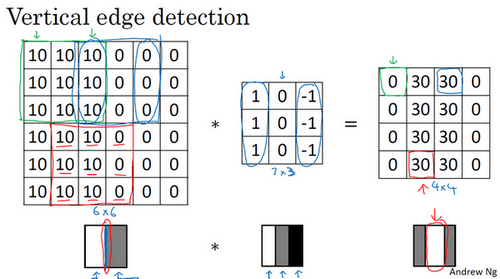

在这个例子中，好像检测到的边缘太粗了，是因为在这个例子中图片太小了。如果用一个1000×1000的图像，而不是6×6的图片，会发现其会很好地检测出图像中的垂直边缘。

> 卷积具有平移不变性，比方说目标是在图像的左上角，经过卷积之后，目标的特征也会在特征图的左上角；目标在图像的左下角，经过相同的卷积核卷积之后，目标的特征也会在特征图的左下角。
>
> 类似的，最大池化也可以看作具有平移不变性

## 更多过滤器选择

当然，过滤器不止这一种，来看看更多过滤器例子：

通过使用不同的过滤器，可以找出垂直的或是水平的边缘。

**Sobel**过滤器：$\begin{bmatrix}1 & 0 & - 1 \\ 2 & 0 & - 2 \\ 1 & 0 & - 1 \\\end{bmatrix}$，它的优点在于增加了中间一行元素的权重，这使得结果的鲁棒性会更高一些。

**Scharr**过滤器：$\begin{bmatrix} 3& 0 & - 3 \\ 10 & 0 & - 10 \\ 3 & 0 & - 3 \\\end{bmatrix}$，实际上也是一种垂直边缘检测，如果你将其翻转90度，你就能得到对应水平边缘检测。

如上图，甚至不一定要去使用那些研究者们所选择的这九个数字，可以把这矩阵中的9个数字当成9个参数，并且在之后可以学习使用反向传播算法，其目标就是去理解这9个参数。

一些卷积核（kernel）的例子，尺寸都是[11x11]：

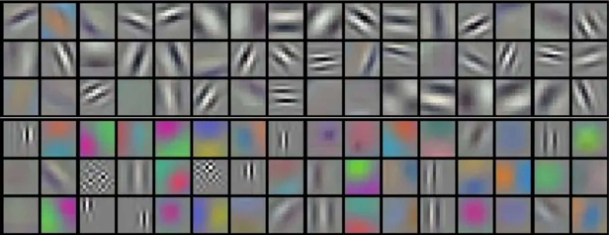

当图片某些部分与卷积核模式一致时，卷积核会给出强烈的响应，可以看作卷积核在积极寻找和匹配某种模式。

## Padding

为了构建深度神经网络，一个基本的卷积操作就是**padding**。

如果按照之前的方式运算，用一个3×3的过滤器卷积一个6×6的图像，最后会得到一个4×4的输出矩阵。那是因为3×3过滤器在6×6矩阵中，只可能有4×4种可能的位置。

>    这背后的数学解释是，对于$n×n$的图像，用$f×f$的过滤器做卷积，那么输出的维度就是$(n-f+1)×(n-f+1)$。

这样的话会有两个缺点：

1.   每次做卷积操作，图像就会缩小，从6×6缩小到4×4，可能做了几次之后，图像就会变得很小了，甚至可能会缩小到只有1×1的大小。
2.   那些在角落或者边缘区域的像素点，相比更靠中间的像素点，在输出中采用较少，意味着丢掉了图像边缘位置的许多信息。

为了解决这些问题，可以在卷积操作之前填充这幅图像。在这个案例中，可以沿着图像边缘再填充一层像素（习惯上，可以用0去填充）。如果6×6的图像被填充成了一个8×8的图像。再用3×3的过滤器做卷积，就会得到6×6的与原来大小相同的图像。

总结一下，**Valid**卷积方法不填充图像，将会给你一个$(n-f+1)×(n-f+1)$维的输出。**Same**卷积方法填充图像并得到和输入大小一样的输出，具体来说，填充$p=(f-1)/2$个像素点。

习惯上，计算机视觉中，$f$通常是奇数。因为只有$f$是奇数的情况下，**Same**卷积才会有自然的填充，并且奇数维过滤器有一个中心点，在计算机视觉里，如果有一个中心像素点会更方便，便于指出过滤器的位置。

## 卷积步长

这里引入卷积步长的概念，之前例子中卷积步长为1，意思是每次移动一格，向右或向下。

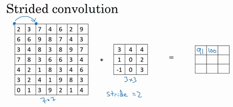

我们可以设置卷积步长为其他值，比如上图这个例子卷积步长为2，在计算完最左上角的$3*3$个元素（左上角为2）之后，计算左上角为7的$3*3$个元素。

当移动到下一行的时候，也是使用步长2，所以蓝色框移动到这里：

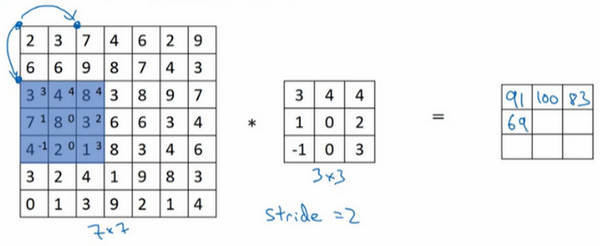

如果跳到某一位置时蓝色框（过滤器）不能覆盖原矩阵，则不进行计算。

总结一下维度情况，如果有一个$n×n$的矩阵或者$n×n$的图像，与一个$f×f$的矩阵卷积，或者说$f×f$的过滤器。**Padding**是$p$，步幅为$s$，输出尺寸为：
$$
\lfloor{\frac{n + 2p - f}{s}}+1\rfloor \times \lfloor{\frac{n + 2p - f}{s}}+1\rfloor
$$

## 多通道卷积

假如不仅想检测灰度图像的特征，也想检测**RGB**彩色图像的特征。彩色图像如果是6×6×3，这里的3指的是三个颜色通道，你可以把它想象成三个6×6图像的堆叠。为了检测图像的边缘或者其他的特征，需要跟一个三维的过滤器做卷积，它的维度是3×3×3，这样这个过滤器也有三层，对应红绿、蓝三个通道。

一个6×6×3的输入图像卷积上一个3×3×3的过滤器，步长为1，不使用Padding，得到一个4×4的二维输出。

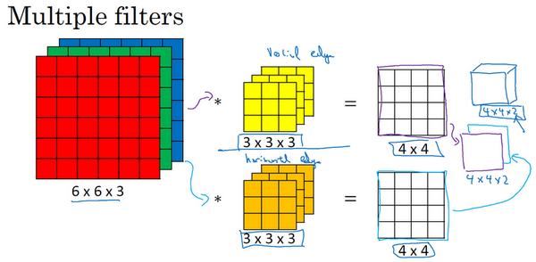

当然可以使用多个过滤器，再把输出堆叠得到三维输出。一个6×6×3的输入图像卷积上两个3×3×3的过滤器，步长为1，不使用Padding，得到一个4×4×2的三维输出。

总结一下维度，如果有一个$n \times n \times n_{c}$的输入图像，这里的$n_{c}$就是通道数目，然后卷积上一个$f×f×n_{c}$的过滤器，按照惯例，前一个$n_{c}$和后一个$n_{c}$必须数值相同，步长为1，不使用Padding，然后得到$(n-f+1)×(n-f+1)×n_{c^{'}}$的输出，这里$n_{c^{'}}$其实就是下一层的通道数，它就是用的过滤器的个数。

> 注：2D卷积并考虑通道数，与3D卷积但不考虑通道数一样，都是想象为立方体。
>
> - 1D 卷积（不考虑多通道）：卷积核是一个向量
> - 2D 卷积（不考虑多通道）：卷积核是一个矩阵
> - 3D 卷积（不考虑多通道）：卷积核是一个立方体

##  单层卷积网络

现在考虑将这些卷积操作对应到神经网络中。

复习一下，在从输入$a^{\left\lbrack 0\right\rbrack}$（也就是$x$）前向传播到$a^{[1]}$时，我们做的计算是：
$$
z^{[1]} = W^{[1]}a^{[0]} + b^{[1]}
$$

$$
a^{[1]} = g(z^{[1]})
$$

我们使用之前的例子，有一个6×6×3的输入图像卷积上两个3×3×3的过滤器，步长为1，不使用Padding。现在我们做对应：

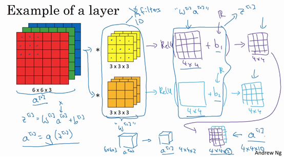

-   6×6×3的输入图像为$a^{\left\lbrack 0\right\rbrack}$（也就是$x$）
-   两个3×3×3的过滤器为$W^{[1]}$
-   两个4×4的输出为$W^{[1]}a^{[0]}$
-   再加上偏差$b^{[1]}$，然后应用激活函数$g$，演化为一个4×4×2维度的$a^{[1]}$

最后总结一下用于描述卷积神经网络中的一层（以$l$层为例），也就是卷积层的各种标记：

-   $f^{[l]}$表示表示$l$层中过滤器大小为$f×f$
-   $p^{[l]}$来标记**Padding**的数量
-   $s^{[l]}$标记步幅
-   某层数据维度表示为$n_{H}^{[l]} \times n_{W}^{[l]} \times n_{c}^{[l]}$，分别为高，宽，颜色通道数
-   这一层的输入会是$n_{H}^{\left\lbrack l - 1 \right\rbrack} \times n_{W}^{\left\lbrack l - 1 \right\rbrack} \times n_{c}^{\left\lbrack l - 1\right\rbrack}$，因为它是上一层的激活值
-   这一层的输出$n_{H}^{[l]} = \lfloor\frac{n_{H}^{\left\lbrack l - 1 \right\rbrack} +2p^{[l]} - f^{[l]}}{s^{[l]}} +1\rfloor$
-   这一层的输出$n_{W}^{[l]} = \lfloor\frac{n_{W}^{\left\lbrack l - 1 \right\rbrack} +2p^{[l]} - f^{[l]}}{s^{[l]}} +1\rfloor$
-   这一层的输出$n_{c}^{[l]}$等于该层中过滤器的数量
-   复习一下，过滤器中通道的数量必须与输入中通道的数量一致，所以所有过滤器维度等于$f^{[l]} \times f^{[l]} \times n_{c}^{\left\lbrack l - 1 \right\rbrack}$
-   如果有$m$个例子，就是有$m$个激活值的集合，那么输出$A^{[l]} = m \times n_{H}^{[l]} \times n_{W}^{[l]} \times n_{c}^{[l]}$

在多层卷积处理完成后，可以将输出平滑或展开成多个单元。平滑处理后可以输出一个向量，再做后续处理。

一个典型的卷积神经网络通常有三层：

-   一个是卷积层，我们常常用**Conv**来标注。
-   一个是池化层，我们称之为**POOL**。
-   最后一个是全连接层，用**FC**表示。

虽然仅用卷积层也有可能构建出很好的神经网络，但大部分神经网络架构师依然会添加池化层和全连接层。幸运的是，池化层和全连接层比卷积层更容易设计。后两节会快速讲解这两个概念。

## 池化层

除了卷积层，卷积网络也经常使用池化层来缩减模型的大小，提高计算速度，同时提高所提取特征的鲁棒性。

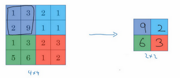

先举一个池化层的例子，输入是一个4×4矩阵，用到的池化类型是最大池化（**max pooling**）。执行最大池化的树池是一个2×2矩阵。把4×4的输入拆分成不同的色块。对于2×2的输出，输出的每个元素都是其对应色块中的最大元素值。

这就像是应用了一个规模为2的过滤器（只是像，没有使用过滤器），因为我们选用的是2×2区域，步幅是2，这些就是最大池化的超参数。即$f=2$，$s=2$。

之前计算卷积层输出大小的公式同样适用于最大池化，即$\lfloor\frac{n + 2p - f}{s} + 1\rfloor$，而$n_c$保持不变（对$n_c$个通道分别做池化）。

大部分情况下，最大池化很少用**Padding**。初始设置好之后池化过程中没有需要学习的参数。

最大化运算的实际作用就是，如果在过滤器中提取到某个特征，那么保留其最大值（类似神经元中激发程度超过阈值，超过阈值的那个数是最重要的）。尽管刚刚描述的直观理解经常被引用，但人们使用最大池化的主要原因是此方法在很多实验中效果都很好。

另外还有一种类型的池化，平均池化，这种运算顾名思义，选取的是每个区域的平均值。目前来说，最大池化比平均池化更常用。

## 卷积神经网络示例

这节加入全连接层并给出一个简单卷积神经网络示例。

有一张大小为32×32×3的输入图片，这是一张**RGB**模式的图片，如果想识别这张图片有从0-9这10个数字中的哪一个，可以构建一个神经网络来实现这个功能。

结构为：输入->卷积层1->池化层1->卷积层2->池化层2->全连接层1->全连接层2->softmax得到输出。

它有很多超参数，关于如何选定这些参数，之后会提供更多建议。常规做法是，尽量不要自己设置超参数，而是查看文献中别人采用了哪些超参数，选一个在别人任务中效果很好的架构，那么它也有可能适用于你自己的应用程序。

一个普遍的规律是，随着层数增加，高度$n_{H}$和宽度$n_{W}$都会减小，而通道数量$n_{c}$会增加，激活值尺寸会逐渐变小。

>    **Q：为什么使用卷积？**
>
>   A：假设有一张32×32×3维度的图片，用了6个大小为5×5的过滤器，输出维度为28×28×6。
>
>   不使用卷积，两层中的每个神经元彼此相连，然后计算权重矩阵，它等于4074×3072≈1400万，所以要训练的参数很多。
>
>   使用卷积，计算卷积层的参数数量，每个过滤器都是5×5，再加上偏差参数，每个过滤器就有26个参数，一共有6个过滤器，所以参数共计156个，参数数量很少。并且当图片变大时，参数数量不会变多因为它与输入无关。
>
>   简单来说，参数很少，代价很小，但依然有效。

## 直观理解

在一个多层的卷积神经网络中，可以把前面的卷积层看作提取简单的视觉信息，例如线，后面的卷积层提取高级的图像模式，这与人类视觉细胞有相似之处。

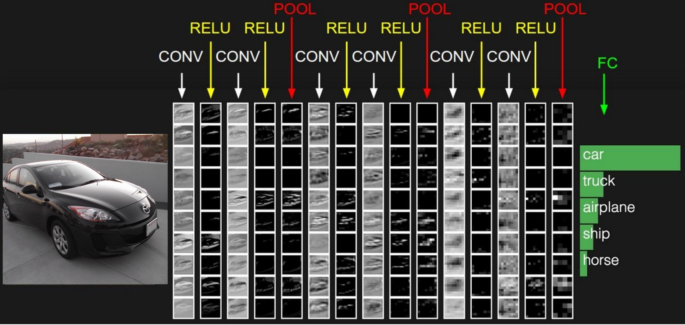

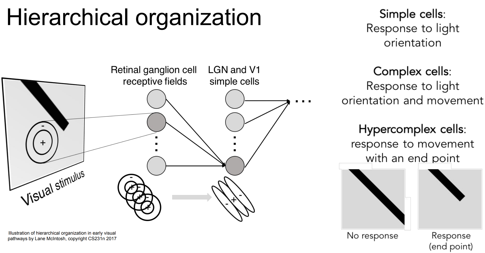

在提取高级的图像模式后，全连接层将其转化为特征向量，这些特征向量有聚类效应：同类图片的特征向量会比较相似。

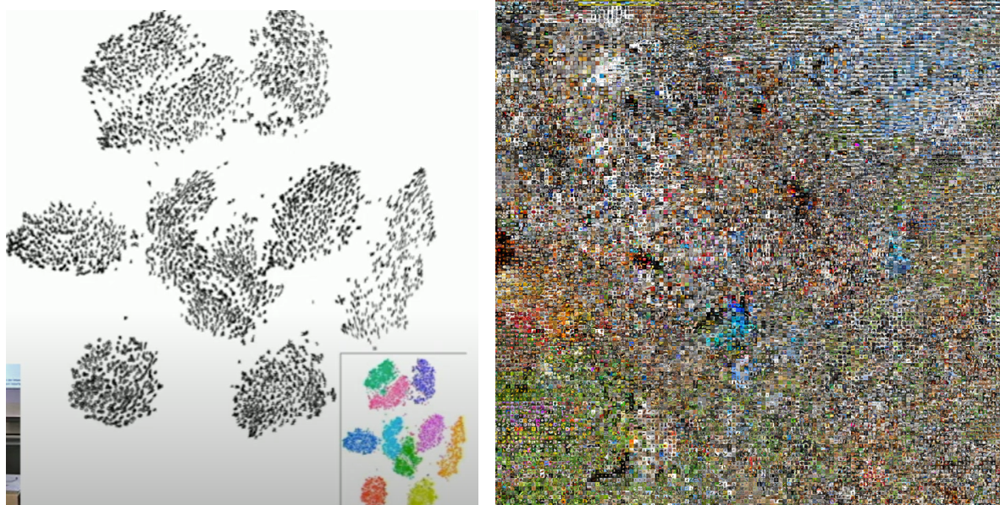

CNN 的每层都给出了 C x H x W 的特征张量，我们将这个特征张量转为一个矩阵G，称为Gram matrix，通过让一张噪声图片的G和已有图像的G通过损失函数不断训练接近，我们可以从噪声图片慢慢得到原图像的纹理：

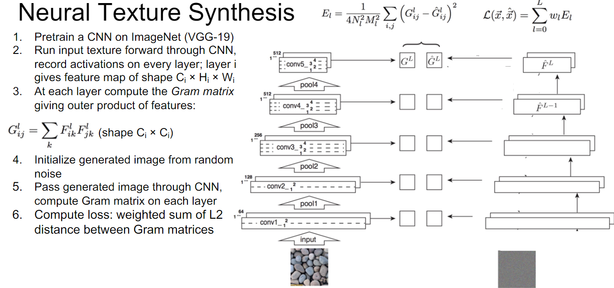

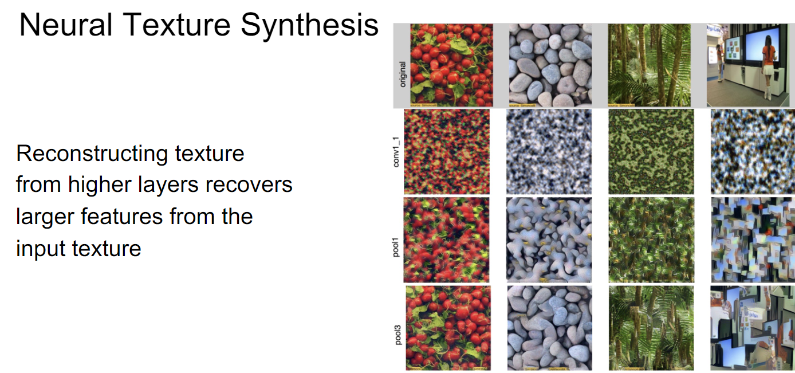

换一种思路，如果我们不断优化图片，使得某一层的神经元被最大激活（梯度上升），那么我们能看到CNN网络是如何看待分类任务的：

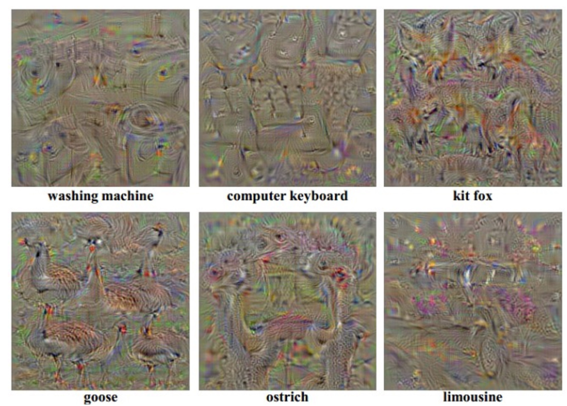