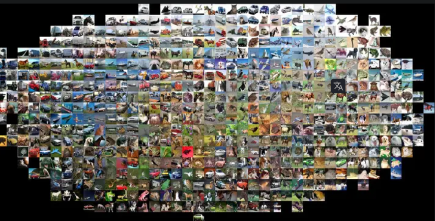
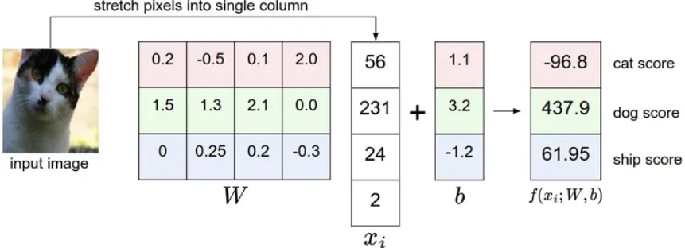
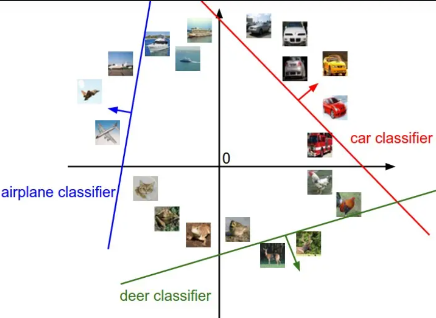
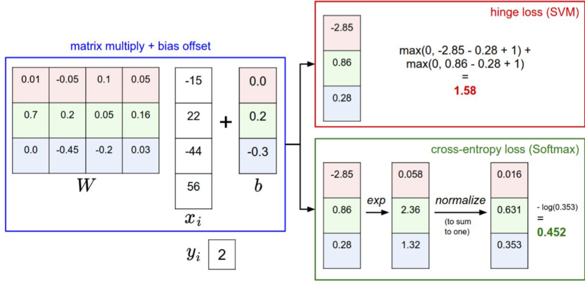

# 复习：从计算机视觉的角度

## Nearest Neighbor的缺点

Nearest Neighbor分类器在某些特定情况（比如数据维度较低）下，可能是不错的选择。但是在实际的图像分类工作中，很少使用。因为图像都是高维度数据（他们通常包含很多像素），而高维度向量之间的距离通常是反直觉的。下面的图片展示了基于像素的相似和基于感官的相似是有很大不同的：

在高维度数据上，基于像素的的距离和感官上的非常不同。上图中，右边3张图片和左边第1张原始图片的L2距离是一样的。很显然，基于像素比较的相似和感官上以及语义上的相似是不同的。

这里还有个视觉化证据，可以证明使用像素差异来比较图像是不够的。z这是一个叫做t-SNE的可视化技术，它将CIFAR-10中的图片按照二维方式排布，这样能很好展示图片之间的像素差异值。在这张图片中，排列相邻的图片L2距离就小。

具体说来，这些图片的排布更像是一种颜色分布函数，或者说是基于背景的，而不是图片的语义主体。比如，狗的图片可能和青蛙的图片非常接近，这是因为两张图片都是白色背景。从理想效果上来说，我们肯定是希望同类的图片能够聚集在一起，而不被背景或其他不相关因素干扰。为了达到这个目的，我们不能止步于原始像素比较，得继续前进。

## 线性分类器

举例来说，在CIFAR-10中，我们有一个**N**=50000的训练集，每个图像有**D**=32x32x3=3072个像素，而**K**=10，这是因为图片被分为10个不同的类别（狗，猫，汽车等）。
$$
f(x,W)=Wx+b
$$
在上面的公式中，假设每个图像数据都被拉长为一个长度为D的列向量，大小为[D x 1]。其中大小为[K x D]的矩阵W和大小为[K x 1]列向量b为该函数的参数（parameters）。

以CIFAR-10为例， 每个图像被拉成为一个[3072 x 1]的列向量，W大小为[10x3072]，b的大小为[10x1]。因此，3072个数字（原始像素数值）输入函数，函数输出10个数字（不同分类得到的分值）。

**将图像看做高维度的点**：既然图像被伸展成为了一个高维度的列向量，那么我们可以把图像看做这个高维度空间中的一个点（即每张图像是3072维空间中的一个点）。整个数据集就是一个点的集合，每个点都带有1个分类标签。

既然定义每个分类类别的分值是权重和图像的矩阵乘，那么每个分类类别的分数就是这个空间中的一个线性函数的函数值。我们没办法可视化3072维空间中的线性函数，但假设把这些维度挤压到二维，那么就可以看看这些分类器在做什么了：

图像空间的示意图。其中每个图像是一个点，有3个分类器。以红色的汽车分类器为例，红线表示空间中汽车分类分数为0的点的集合，红色的箭头表示分值上升的方向。所有红线右边的点的分数值均为正，且线性升高。红线左边的点分值为负，且线性降低。

从上面可以看到，**W**的每一行都是一个分类类别的分类器。对于这些数字的几何解释是：如果改变其中一行的数字，会看见分类器在空间中对应的直线开始向着不同方向旋转。而偏差**b**，则允许分类器对应的直线平移。需要注意的是，如果没有偏差，所有分类器的线都会穿过原点。

**将线性分类器看做模板匹配**：关于权重**W**的另一个解释是**它**的每一行对应着一个分类的模板（有时候也叫作*原型*）。一张图像对应不同分类的得分，是通过使用内积（也叫*点积*）来比较图像和模板，然后找到和哪个模板最相似。

从这个角度来看，线性分类器就是在利用学习到的模板，针对图像做模板匹配。从另一个角度来看，可以认为还是在高效地使用k-NN，不同的是我们没有使用所有的训练集的图像来比较，而是每个类别只用了一张图片（这张图片是我们学习到的，而不是训练集中的某一张），而且我们会使用内积来计算向量间的距离，而不是使用L1或者L2距离。

## 折叶损失（hinge loss）

折叶损失函数想要在正确分类上的得分始终比不正确分类上的得分高出一个边界值 $\Delta$，在下面的公式中，边界值为1
$$
L_i=\sum_{j\neq y_i} \max(0,s_j-s_{y_i}+ 1)
$$

$$
L=\frac{1}{N}\sum_{i=1}^N L_i
$$

计算例子如下：

## Softmax分类器

即将折叶损失（hinge loss）替换为**交叉熵损失**（**cross-entropy loss）**，或者说**softmax 函数**
$$
L_i=-\log \left( \frac{ e^{f_{y_i}} }{\sum_j e^{f_j}}  \right)
$$
精确地说，SVM分类器使用的是*折叶损失（hinge loss）*，有时候又被称为*最大边界损失（max-margin loss）*。Softmax分类器使用的是*交叉熵损失（corss-entropy loss）*。softmax函数将原始分类评分变成正的归一化数值，所有数值和为1，这样处理后交叉熵损失才能应用。

对于hinge loss，只要已经得到了比边界值还要高的分数，它就会认为损失值是0，对于数字个体的细节是不关心的。但交叉熵损失对于分数是永远不会满意的：只要正确分类得到更高的可能性，错误分类得到更低的可能性，损失值总是能够更小。