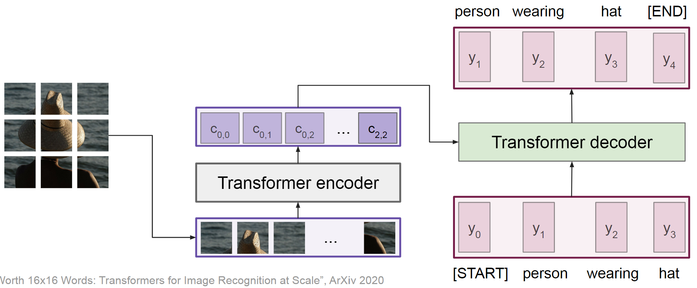

# 注意力

## 句子翻译

我要对机器翻译做一些改进，称为注意力模型（**the Attention Model**）。人工翻译并不会记住整个法语句子再开始翻译，而是看一部分，翻译一部分，一点一点地翻译，因为记忆整个的长句子是非常困难的。**注意力模型如何让一个神经网络只注意到一部分的输入句子。当它在生成句子的时候，更像人类翻译**。以下为计算流程：

1.   我们使用一个**RNN**计算输入的法语，这一步没有输出，我们计算好每一个时间步$t$的状态 $h_t$

2.   我们定义 $e_{ij}$为翻译到第i个英文词时，与第j个法语词的关联有多大，这个生成e的函数可以用一个小神经网络来完成

3.   经过softmax，得到 $e_{ij}$的概率解释 $a_{ij}$

4.   现在我们来生成第i个英文词$y_i$，这是第二个RNN，每个时间步输入是上下文$C_i$

$$
C_i=\sum_{j=1}^T a_{ij} h_i
$$

例如，e可以如下图计算：

然后，我们计算上下文C

换一种图示看看能不能看懂！展示了英语转西班牙语的句子翻译中生成第一个词的例子：

注意力机制运用在机器翻译中，<源语言词，目标语言词>的注意力权重基本与两个词互为翻译的情况一致。下图展示了注意力矩阵，抓住了不同语言中的词序。

> 注意力机制运用在机器阅读中，给文章中每句话一个attention权重，根据问题选出最有可能包含答案的句子

## 直观理解

注意力函数将 query 和 key-value 对映射成输出 output 。具体来说，output 是 value 的一个加权和，权重等价于 query 和对应的 key 的相似度 ，输出的维度与 value 的维度相同。

即使 key-value 并没有变，但是随着 query 的改变，因为权重的分配不一样，导致输出会有不一样，这就是注意力机制。

> Transfomer 首先将 token 映射成向量，这种多维向量本身带有信息，但还没有综合上下文信息。注意力机制可以看作让每个 token 都能够关注到其他 token 的信息，从而综合上下文。例如*假期*和*假货*的**假**代表不同的意义，但这种区别只有通过上下文才能体现出来。

例如，在一句句子中，一个名词的 query 可能代表：有没有修饰我的形容词？某个形容词的 key 可能代表：我在这！我们希望这两个向量相似度大（在高维空间中指向同一个方向），这样放在他们上面的注意力权重就会大，这个名词就会被修饰。换句话说，上下文被考虑到了。

value 可以看作，如果 query 和 key 相似度高，那么这个形容词是修饰名词的，那么名词的向量应该偏移多少来表示这个形容词的影响。例如“塔”这个字，如果出现了“埃菲尔铁塔”作为修饰，那么这个“塔”的名词对应的向量应该偏移以代表更高更大的东西，如果又出现了“埃菲尔铁塔玩具”，那么这个“塔”的名词对应的向量应该再次偏移以代表更小的东西。

## 图像描述

在朴素的图像描述网络架构中，模型需要在 c (即上下文) 中对它图片所有内容进行编码，如果我们想生成非常长的描述，比如100多字，这个c限制了网络的发挥。

思路：每个时间步都有新的上下文向量。每个上下文向量将处理不同的图像区域。类似于上面的注意力思想，下图为生成第一个词的图例：

图像中的注意力例子：

## 自注意力

在上面图像描述的例子中，h可以看作 query，这和自注意力已经有点像了，事实上，我们稍加改造就可以得到自注意力。

按照这样的思路，我们可以把图像描述模型中的注意力换成 [Transformer](https://qmmms.github.io/posts/Attention-Is-All-You-Need/) block，这样的另一个好处是：它不再是一个序列模型，转而一次计算完成。

为什么不把CNN丢掉？这样我们得到了类似Vision Transformer的模型：

