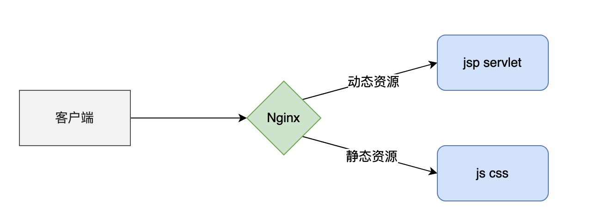

# Nginx 基本原理

Nginx 是一个高性能的 HTTP 和反向代理 Web 服务器。特点包括：内存占用少、并发能力强（可支持大约 50000 个并发连接）等等

## 反向代理

要想搞明白什么是反向代理，就必须得搞明白什么是正向代理。

举个例子，如果浏览器是无法直接访问谷哥的，但香港的代理服务器是可以访问谷哥的，于是可以先访问香港的代理服务器，也就间接地访问了谷哥。那这台代理服务器也就是**正向代理**。


**正向代理是代理客户端的**，让你能正常访问目的服务器。与之相反，**反向代理是代理服务器的**，让大量的请求均衡地访问到某一台服务器上。

举个例子，10 万个用户同时在访问网站， 如果只有一台服务器的话，很容易就瘫痪了，于是高并发的情况下会有很多台服务器（假如 10 台吧）来接这个活，那怎么让 10 万个用户访问到这 10 台服务器呢？ 

这就需要一个反向代理服务器了，反向代理服务器让 1 万个用户访问服务器 A，1 万个用户访问服务器 B，1 个用户访问服务器 C，这样的话，每台服务器的压力就相应减小了

**Nginx 内置了轮询和加权轮询来达到负载均衡的目的**。可以通过设置权重为每个服务器加不同比例的负载。

## 动静分离

Nginx 还有一个很牛逼的功能是**动静分离**。

在我们的软件开发中，有些请求是需要后台处理的；有些请求是不需要后台处理的，比如说 css、js 这些文件请求，这些不需要经过后台处理的文件就叫静态文件。

我们可以根据一些规则，把动态资源和静态资源分开，然后通过 Nginx 把请求分开，静态资源的请求就不需要经过 Web 服务器处理了，从而提高整体上的资源的响应速度。



## Nginx 的配置

Nginx 的配置结构图：

```text
main        # 全局配置
├── events  # 配置网络连接
├── http    # 配置代理、缓存、日志等
│   ├── upstream # 配置负载均衡
│   ├── server   # 配置虚拟主机，可以有多个 server
│   ├── server
│   │   ├── location  # 用于匹配 URI（URL 是 URI 的一种），可以有多个 location
│   │   ├── location
│   │   └── ...
│   └── ...
└── https
...
```

具体的命令和配置在这里不再展开。可以参考别人写好的配置。