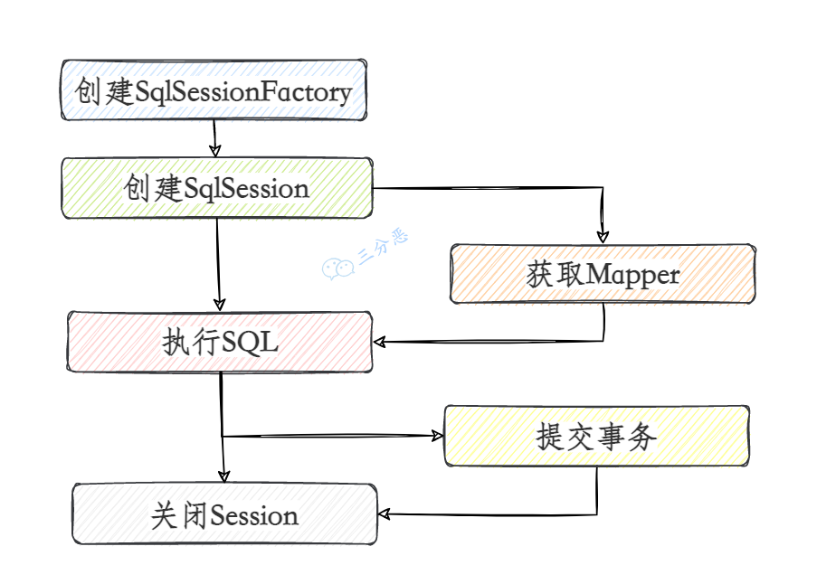
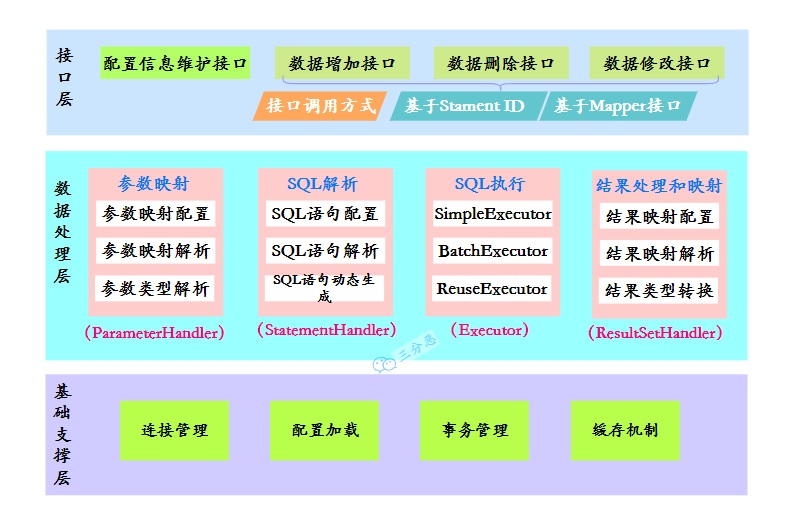

# MyBatis

Mybatis 是一个半 ORM（对象关系映射）框架，它内部封装了 JDBC，开发时只需要关注 SQL 语句本身，不需要花费精力去处理加载驱动、创建连接、创建 statement 等繁杂的过程。程序员直接编写原生态 sql，可以严格控制 sql 执行性能，灵活度高。

ORM（Object Relational Mapping），对象关系映射，是一种为了解决关系型数据库数据与简单 Java 对象（POJO）的映射关系的技术。简单来说，ORM 是通过使用描述对象和数据库之间映射的元数据，将程序中的对象自动持久化到关系型数据库中。

与传统 JDBC 编程比较：

- 数据连接创建、释放频繁造成系统资源浪费从而影响系统性能，在 mybatis-config.xml 中配置数据链接池，使用连接池统一管理数据库连接。
- sql 语句写在代码中造成代码不易维护，将 sql 语句配置在 XXXXmapper.xml 文件中与 java 代码分离。
- 向 sql 语句传参数麻烦，因为 sql 语句的 where 条件不一定，可能多也可能少，占位符需要和参数一一对应。Mybatis 自动将 java 对象映射至 sql 语句。
- 对结果集解析麻烦，sql 变化导致解析代码变化，且解析前需要遍历，如果能将数据库记录封装成 pojo 对象解析比较方便。Mybatis 自动将 sql 执行结果映射至 java 对象

与Hibernate比较：

- Hibernate 是标准的 ORM 框架，SQL 编写量较少，但不够灵活，适合于需求相对稳定，中小型的软件项目，比如：办公自动化系统
- MyBatis 是半 ORM 框架，需要编写较多 SQL，但是比较灵活，适合于需求变化频繁，快速迭代的项目，比如：电商网站

MyBatis 缺点：

- SQL 语句的编写工作量较大，尤其当字段多、关联表多时，对开发人员编写 SQL 语句的功底有一定要求
- SQL 语句依赖于数据库，导致数据库移植性差，不能随意更换数据库

## 传统 JDBC 的使用步骤

Java 数据库连接（JDBC）是一个用于执行 SQL 语句的 Java API，它为多种关系数据库提供了统一访问的机制。使用 JDBC 操作数据库通常涉及以下步骤：

1. 加载数据库驱动。在与数据库建立连接之前，首先需要通过`Class.forName()`方法加载对应的数据库驱动。这一步确保 JDBC 驱动注册到了`DriverManager`类中。
2. 建立数据库连接。使用`DriverManager.getConnection()`方法建立到数据库的连接。这一步需要提供数据库 URL、用户名和密码作为参数。`Connection`对象代表了应用程序和数据库的一个连接会话。
3. 通过建立的数据库连接对象`Connection`创建`Statement`、`PreparedStatement`或`CallableStatement`对象，用于执行 SQL 语句。`PreparedStatement`相比`Statement`支持参数化查询防止注入，并提供预编译提高效率，是执行 SQL 语句的首选方式，尤其是在处理含有用户输入的动态查询时。
4. 使用`Statement`或`PreparedStatement`对象执行 SQL 语句。执行查询（SELECT）语句时，使用`executeQuery()`方法，它返回`ResultSet`对象；执行更新（INSERT、UPDATE、DELETE）语句时，使用`executeUpdate()`方法，它返回一个整数表示受影响的行数。
5. 如果执行的是查询操作，需要处理`ResultSet`对象来获取数据。
6. 最后，需要依次关闭`ResultSet`、`Statement`和`Connection`等资源，释放数据库连接等资源。

在 Java 开发中，通常会使用 JDBC 模板库（如 Spring 的 JdbcTemplate）或 ORM 框架（如 Hibernate、MyBatis、MyBatis-Plus）来简化数据库操作和资源管理。

## 基本使用与生命周期



一旦创建了 SqlSessionFactory，就不再需要它了。 因此 SqlSessionFactoryBuilder 实例的生命周期只存在于方法的内部。

SqlSessionFactory 是用来创建 SqlSession 的，相当于一个数据库连接池，每次创建 SqlSessionFactory 都会使用数据库资源，多次创建和销毁是对资源的浪费。所以 SqlSessionFactory 是应用级的生命周期，而且应该是单例的。

SqlSession 相当于 JDBC 中的 Connection，SqlSession 的实例不是线程安全的，因此是不能被共享的，所以它的最佳的生命周期是一次请求或一个方法。

映射器是一些绑定映射语句的接口。映射器接口的实例是从 SqlSession 中获得的，它的生命周期在 sqlsession 事务方法之内，一般会控制在方法级。


## 传参方式

**普通传参（集合SpringBoot）**：

```java
@Update("update student set tot_cred=#{totCred} where ID=#{ID}")
public int updateTotCred(int totCred, String ID);
```

**Java Bean 传参法**：

```java
public User selectUser(User user);

<select id="selectUser" parameterType="com.jourwon.pojo.User" resultMap="UserResultMap">
    select * from user
    where user_name = #{userName} and dept_id = #{deptId}
</select>
```

- `#{}`里面的名称对应的是 User 类里面的成员属性。当使用 `#{}` 时，MyBatis 会在 SQL 执行之前，将占位符替换为问号 `?`，并使用参数值来替代这些问号。由于 `#{}` 使用了预处理，它能有效防止 SQL 注入，可以确保参数值在到达数据库之前被正确地处理和转义。
- 这种方法直观，需要建一个实体类，扩展不容易，需要加属性，但代码可读性强，业务逻辑处理方便，推荐使用。（推荐使用）。

> 防止SQL注入的方式：
>
> - 使用参数化查询。通过`setXxx`方法设置参数值，而不是通过字符串拼接 SQL 语句。
> - 对用户输入进行验证和过滤，只允许输入预期的数据，不允许输入特殊字符或 SQL 关键字
> - 使用 ORM 框架。比如在 MyBatis 中，使用`#{}`占位符来代替直接拼接 SQL 语句，MyBatis 会自动进行参数化处理。

实体类属性名和表中字段名不一样 ，怎么办? 通过在查询的 SQL 语句中定义字段名的别名，让**字段名的别名和实体类的属性名**一致

```sql
select order_id id, order_no orderno ,order_price price form orders where order_id=#{id};
```

## 缓存

一级缓存: 基于 PerpetualCache 的 HashMap 本地缓存，其存储作用域为 SqlSession，各个 SqlSession 之间的缓存相互隔离，当 Session flush 或 close 之后，该 SqlSession 中的所有 Cache 就将清空，MyBatis 默认打开一级缓存。

二级缓存与一级缓存其机制相同，默认也是采用 PerpetualCache，HashMap 存储，不同之处在于其存储作用域为 Mapper(Namespace)，可以在多个 SqlSession 之间共享，并且可自定义存储源，如 Ehcache。默认不打开二级缓存，要开启二级缓存，使用二级缓存属性类需要实现 Serializable 序列化接口(可用来保存对象的状态),可在它的映射文件中配置。


## 功能架构

我们一般把 Mybatis 的功能架构分为三层：

- API 接口层：提供给外部使用的接口 API，开发人员通过这些本地 API 来操纵数据库。接口层一接收到调用请求就会调用数据处理层来完成具体的数据处理。
- 数据处理层：负责具体的 SQL 查找、SQL 解析、SQL 执行和执行结果映射处理等。它主要的目的是根据调用的请求完成一次数据库操作。
- 基础支撑层：负责最基础的功能支撑，包括连接管理、事务管理、配置加载和缓存处理，这些都是共用的东西，将他们抽取出来作为最基础的组件。为上层的数据处理层提供最基础的支撑



## 分页

MyBatis 使用 RowBounds 对象进行分页，它是针对 ResultSet 结果集执行的内存分页，而非物理分页。

> 可以在 sql 内直接书写带有物理分页的参数来完成物理分页功能，也可以使用分页插件来完成物理分页。

分页插件的原理：

- 使用 Mybatis 提供的插件接口，实现自定义插件，拦截 Executor 的 query 方法
- 在执行查询的时候，拦截待执行的 sql，然后重写 sql，根据 dialect 方言，添加对应的物理分页语句和物理分页参数。
- 举例：`select * from student`，拦截 sql 后重写为：`select t.* from (select * from student) t limit 0, 10`

关于插件，Mybatis 会话的运行需要 ParameterHandler、ResultSetHandler、StatementHandler、Executor 这四大对象的配合，插件的原理就是在这四大对象调度的时候，插入一些我我们自己的代码。


> 会话运行是 MyBatis 最复杂的部分，它的运行离不开四大组件的配合：
>
> - Executor 起到了至关重要的作用，SqlSession 只是一个门面，相当于客服，真正干活的是是 Executor，就像是默默无闻的工程师。它提供了相应的查询和更新方法，以及事务方法。
> - StatementHandler，顾名思义，处理数据库会话的。我们以 SimpleExecutor 为例，看一下它的查询方法，先生成了一个 StatementHandler 实例，再拿这个 handler 去执行 query。
> - PreparedStatementHandler 里对 sql 进行了预编译处理
> - 最后的结果要通过 ResultSetHandler 来进行处理，handleResultSets 这个方法就是用来包装结果集的。Mybatis 为我们提供了一个 DefaultResultSetHandler，通常都是用这个实现类去进行结果的处理的。

Mybatis 使用 JDK 的动态代理，为目标对象生成代理对象。它提供了一个工具类`Plugin`，实现了`InvocationHandler`接口。使用`Plugin`生成代理对象，代理对象在调用方法的时候，就会进入 invoke 方法，在 invoke 方法中，如果存在签名的拦截方法，插件的 intercept 方法就会在这里被我们调用，然后就返回结果。如果不存在签名方法，那么将直接反射调用我们要执行的方法。
