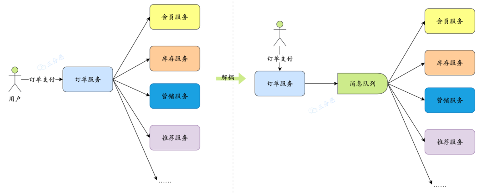
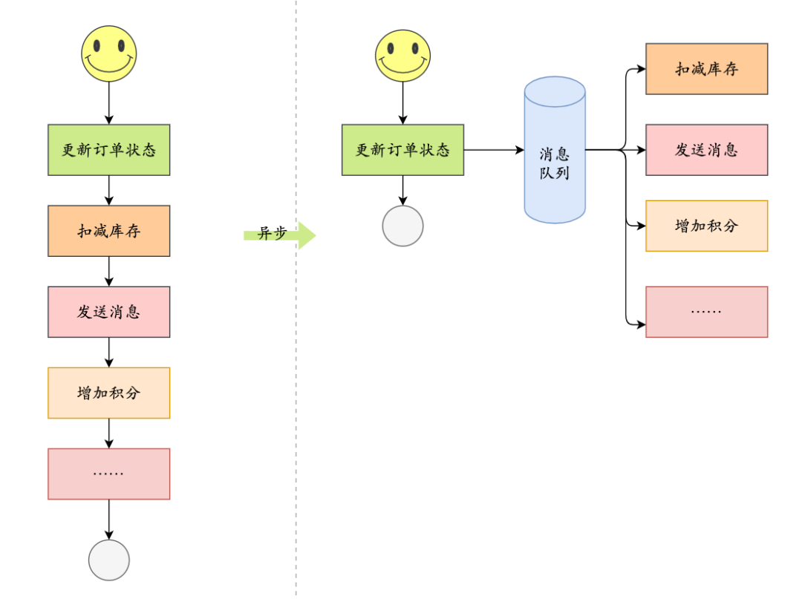
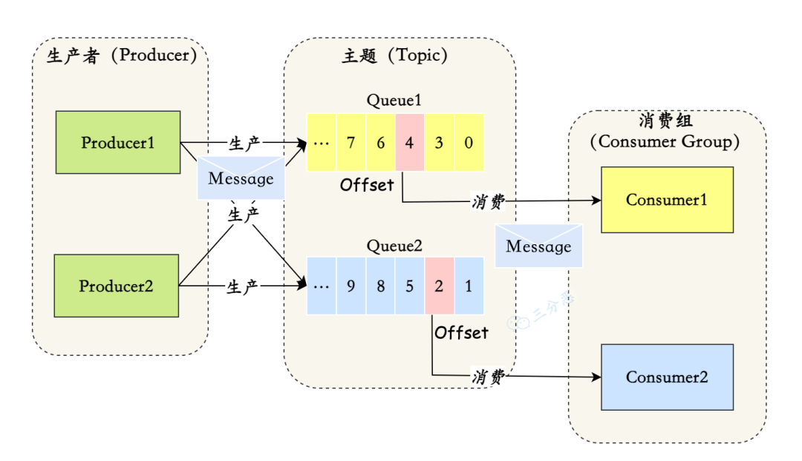
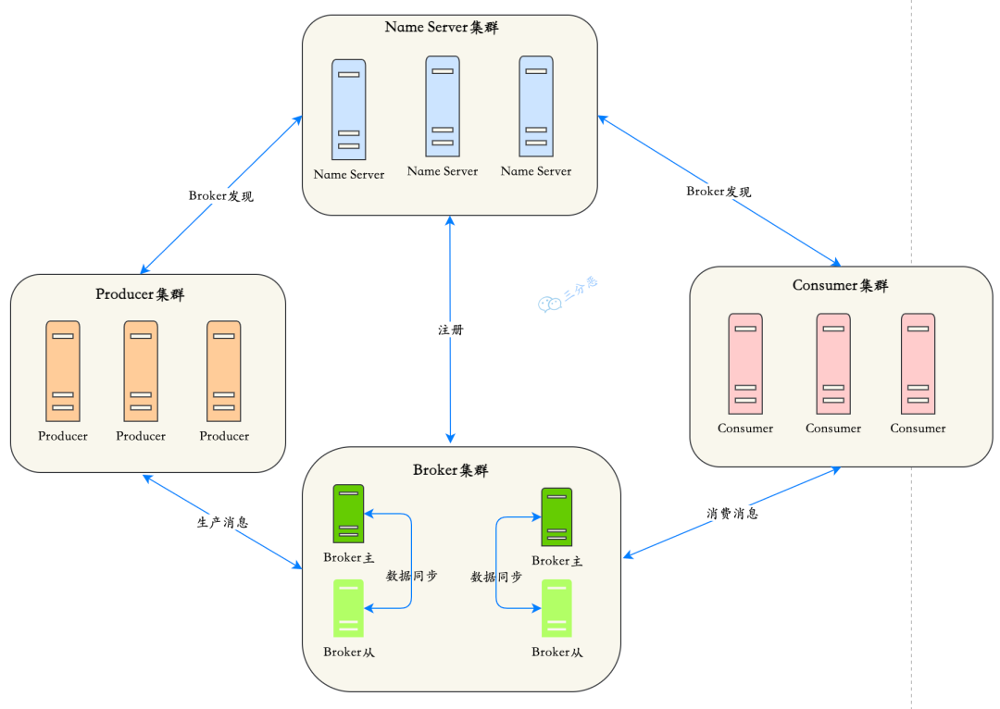

# RocketMQ

消息队列（Message Queue, MQ）是一种非常重要的中间件技术，广泛应用于分布式系统中，以提高系统的可用性、解耦能力和异步通信效率。

生产者将消息放入队列，消费者从队列中取出消息，这样一来，生产者和消费者之间就不需要直接通信，生产者只管生产消息，消费者只管消费消息，这样就实现了**解耦**。

系统可以将那些耗时的任务放在消息队列中**异步处理**，从而快速响应用户的请求。

**削峰填谷**是一种常见的技术手段，用于应对系统高并发请求的瞬时流量高峰，通过消息队列，可以将瞬时的高峰流量转化为持续的低流量，从而保护系统不会因为瞬时的高流量而崩溃。

具体来说，用户请求到达系统后，由生产者接收请求并将其转化为消息，发送到 RocketMQ 队列中。队列用来充当缓冲区，将大量请求按照顺序排队，这样就可以削减请求高峰时对后端服务的直接压力。

不仅如此，生产者通过异步方式发送消息，还可以快速响应用户请求。

消费者从 RocketMQ 队列中按照一定速率读取消息并进行处理。可以根据后端处理能力和当前负载情况动态调整消费者的消费速率，达到填谷的效果。

> RocketMQ：
>
> - 优点：性能好，高吞吐量，稳定可靠，有活跃的中文社区
> - 缺点：兼容性上不是太好，没有在 MQ 核心中去实现**JMS**等接口，有些系统要迁移需要修改大量代码
>
> Kafka：
>
> - 优点：拥有强大的性能及吞吐量，兼容性很好
> - 缺点：由于“攒一波再处理”导致延迟比较高
>
> 我们的系统是面向用户的 C 端系统，具有一定的并发量，对性能也有比较高的要求，所以选择了低延迟、吞吐量比较高，可用性比较好的 RocketMQ

## 消息模型

消息队列有两种模型：**队列模型**和**发布/订阅模型**

**队列模型**是最初的一种消息队列模型，对应着消息队列“发-存-收”的模型。生产者往某个队列里面发送消息，一个队列可以存储多个生产者的消息，一个队列也可以有多个消费者，但是消费者之间是竞争关系，也就是说每条消息只能被一个消费者消费。

但是如果需要将一份消息数据分发给多个消费者，并且每个消费者都要求收到全量的消息。很显然，队列模型无法满足这个需求。解决的方式就是**发布/订阅模型**。

在发布 - 订阅模型中，消息的发送方称为发布者（Publisher），消息的接收方称为订阅者（Subscriber），服务端存放消息的容器称为主题（Topic）。发布者将消息发送到主题中，订阅者在接收消息之前需要先“订阅主题”。“订阅”在这里既是一个动作，同时还可以认为是主题在消费时的一个逻辑副本，每份订阅中，订阅者都可以接收到主题的所有消息。

RocketMQ 使用的消息模型是标准的发布-订阅模型，在 RocketMQ 的术语表中，生产者、消费者和主题，与发布-订阅模型中的概念是完全一样的。

RocketMQ 中，订阅者的概念是通过消费组（Consumer **Group**）来体现的。每个消费组都消费主题中一份完整的消息 **Message**，不同消费组之间消费进度彼此不受影响，也就是说，一条消息被 Consumer Group1 消费过，也会再给 Consumer Group2 消费。

消费组中包含多个消费者 **Consumer** ，同一个组内的消费者是竞争消费的关系，每个消费者负责消费组内的一部分消息。默认情况，如果一条消息被消费者 Consumer1 消费了，那同组的其他消费者就不会再收到这条消息。

**Message**（消息）就是要传输的信息。

一条消息必须有一个主题（**Topic**），可以看做消息的归类，它是消息的第一级类型。比如一个电商系统可以分为：交易消息、物流消息等。**Topic** 与生产者和消费者的关系非常松散，都是多对多关系。

一个 Topic 下可以设置多个消息队列，Topic 包括多个 Message **Queue** ，如果一个 Consumer 需要获取 Topic 下所有的消息，就要遍历所有的 Message Queue。RocketMQ 还有一些其它的 Queue——例如 Consumer Queue。

在 Topic 的消费过程中，由于消息需要被不同的组进行多次消费，所以消费完的消息并不会立即被删除，这就需要 RocketMQ 为每个消费组在每个队列上维护一个消费位置（Consumer **Offset**），这个位置之前的消息都被消费过，之后的消息都没有被消费过，每成功消费一条消息，消费位置就加一。

一条消息也可以拥有一个**可选**的标签（**Tag**）和额处的键值对，可以看作子主题，它是消息的第二级类型，用于为用户提供额外的灵活性。使用标签，同一业务模块不同目的的消息就可以用相同 Topic 而不同的 **Tag** 来标识。比如交易消息又可以分为：交易创建消息、交易完成消息等。

## 消费模式

消息消费模式有两种：**Clustering**（集群消费）和**Broadcasting**（广播消费）。

默认情况下就是集群消费，一个消费者组共同消费一个主题的多个队列，一个队列只会被一个消费者消费，如果某个消费者挂掉，分组内其它消费者会接替挂掉的消费者继续消费。

而广播消费消息会发给消费者组中的**每一个**消费者进行消费

## RocketMQ 架构

RocketMQ 一共有四个部分组成：NameServer，Broker，Producer 生产者，Consumer 消费者，它们对应了：发现、存、发、收，为了保证高可用，一般每一部分都是集群部署的

> 类比一下我们生活的邮政系统——邮政系统要正常运行，离不开下面这四个角色， 一是发信者，二 是收信者， 三是负责暂存传输的邮局， 四是负责协调各个地方邮局的管理机构。对应到 RocketMQ 中，这四个角色就是 Producer、 Consumer、 Broker 、NameServer。

**NameServer** 是一个无状态的服务器，角色类似于 Kafka 使用的 Zookeeper，但比 Zookeeper 更轻量。每个 NameServer 结点之间是相互独立，彼此没有任何信息交互。功能主要有两个： 1、和 Broker 结点保持长连接。 2、维护 Topic 的路由信息

**Broker** 是消息存储和中转角色，负责存储和转发消息。Broker 内部维护着一个个 Consumer Queue，用来存储消息的索引，真正存储消息的地方是 CommitLog（日志文件）。单个 Broker 与所有的 Nameserver 保持着长连接和心跳，并会定时将 Topic 信息同步到 NameServer，和 NameServer 的通信底层是通过 Netty 实现的

**Producer** 是 消息生产者，业务端负责发送消息，由用户自行实现和分布式部署。消息由Producer 通过多种负载均衡模式发送到**Broker**集群，发送低延时，支持快速失败。提供了三种方式发送消息：同步、异步和单向

- **同步发送**：同步发送指消息发送方发出数据后会在收到接收方发回响应之后才发下一个数据包。一般用于重要通知消息，例如重要通知邮件、营销短信。
- **异步发送**：异步发送指发送方发出数据后，不等接收方发回响应，接着发送下个数据包，一般用于可能链路耗时较长而对响应时间敏感的业务场景，例如用户视频上传后通知启动转码服务。
- **单向发送**：单向发送是指只负责发送消息而不等待服务器回应且没有回调函数触发，适用于某些耗时非常短但对可靠性要求并不高的场景，例如日志收集

**Consumer** 也由用户部署，是消息消费者，负责消费消息，一般是后台系统负责异步消费。支持 PUSH 和 PULL 两种消费模式，支持**集群消费**和**广播消费**，提供**实时的消息订阅机制**。

- **Pull**：拉取型消费者（Pull Consumer）主动从消息服务器拉取信息，只要批量拉取到消息，用户应用就会启动消费过程，所以 Pull 称为主动消费型。
- **Push**：推送型消费者（Push Consumer）封装了消息的拉取、消费进度和其他的内部维护工作，将消息到达时执行的回调接口留给用户应用程序来实现。所以 Push 称为被动消费类型，但其实从实现上看还是从消息服务器中拉取消息，不同于 Pull 的是 Push 首先要注册消费监听器，当监听器处触发后才开始消费消息。