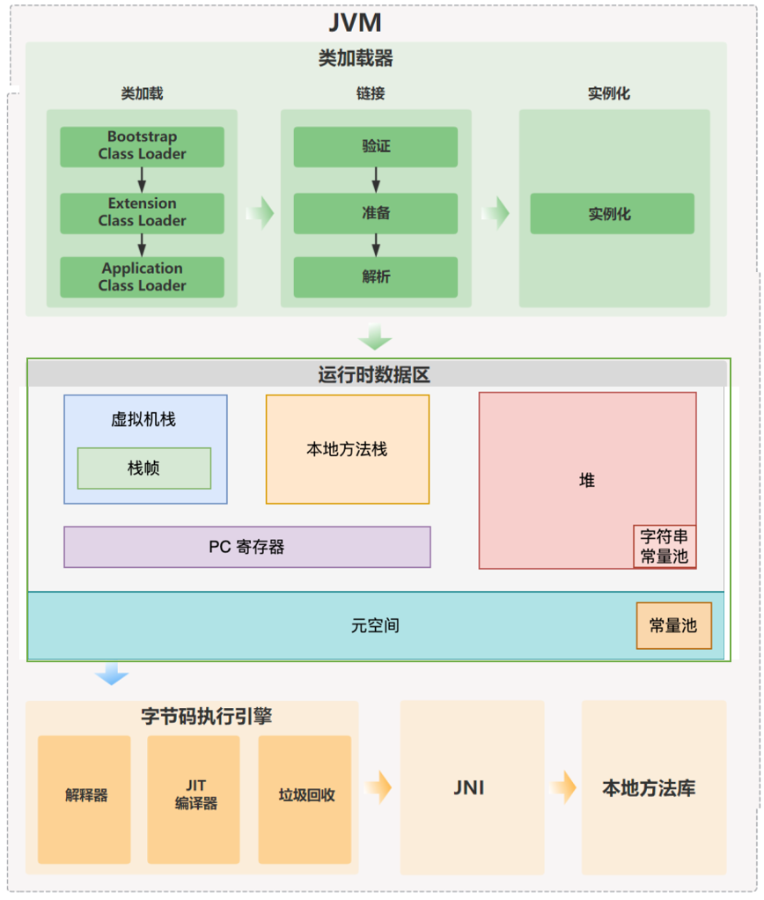

# JVM

Java 虚拟机：Java Virtual Machine。我们编写 Java 代码，编译 Java 代码，目的不是让它在 Linux、Windows 或者 MacOS 上跑，而是在不同平台上面的 JVM 上跑。实现了“一次编译，到处运行”的理念

HotSpot VM，OracleJDK（商用）和 OpenJDK（开源）的默认虚拟机，也是目前使用最广泛的 Java 虚拟机

JVM 的组织架构：

有 4 个地方可以用来存储数据。”

1）寄存器。这是最快的存储区，因为它位于 CPU 内部，用来暂时存放参与运算的数据和运算结果。

2）栈。位于 RAM（Random Access Memory，也叫主存，与 CPU 直接交换数据的内部存储器）中，速度仅次于寄存器。但是，在分配内存的时候，存放在栈中的数据大小与生存周期必须在编译时是确定的，缺乏灵活性。基本数据类型的值和对象的引用通常存储在这块区域。

3）堆。也位于 RAM 区，可以动态分配内存大小，编译器不必知道要从堆里分配多少存储空间，生存周期也不必事先告诉编译器，Java 的垃圾收集器会自动收走不再使用的数据，因此可以得到更大的灵活性。但是，运行时动态分配内存和销毁对象都需要占用时间，所以效率比栈低一些。new 创建的对象都会存储在这块区域。

4）磁盘。如果数据完全存储在程序之外，就可以不受程序的限制，在程序没有运行时也可以存在。像文件、数据库，就是通过持久化的方式，让对象存放在磁盘上。当需要的时候，再反序列化成程序可以识别的对象。