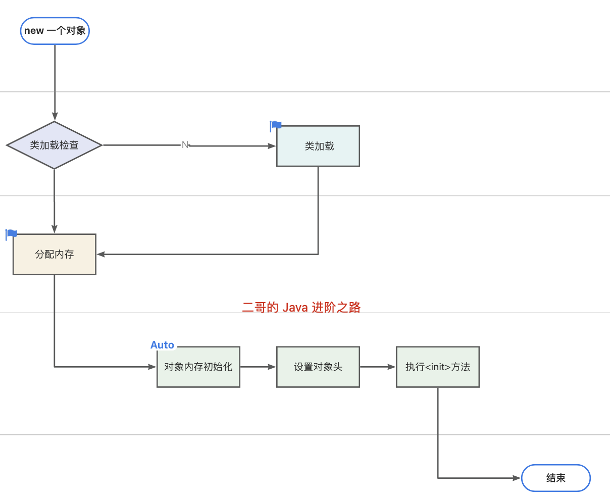
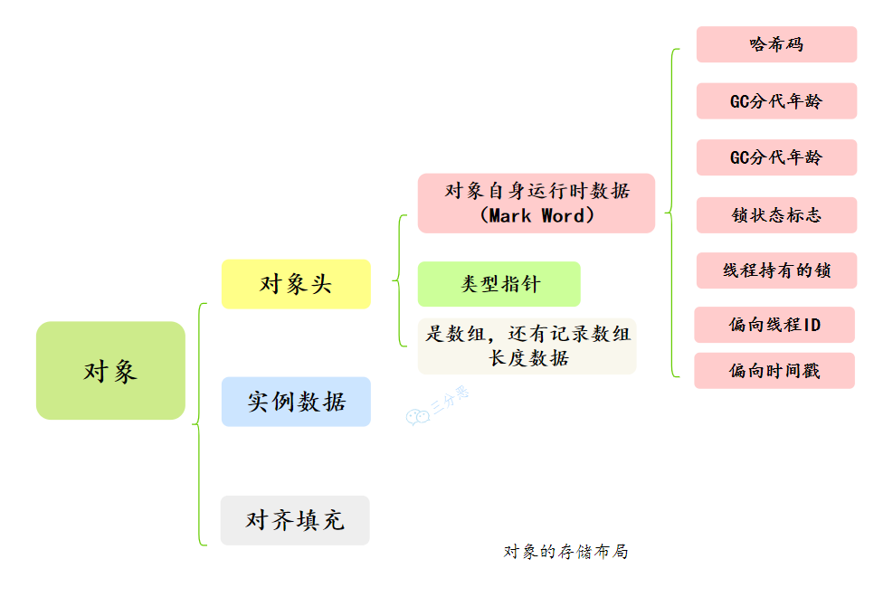
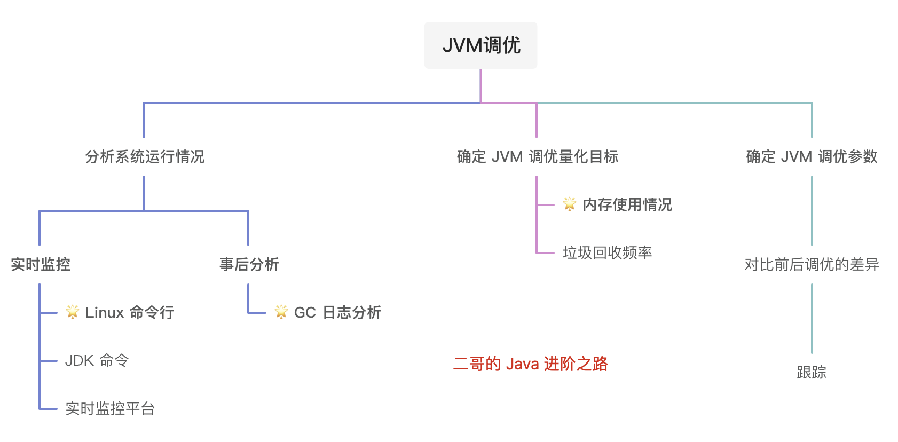
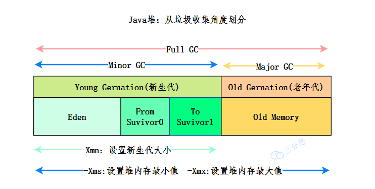

# JVM

Java 虚拟机：Java Virtual Machine。我们编写 Java 代码，编译 Java 代码，目的不是让它在 Linux、Windows 或者 MacOS 上跑，而是在不同平台上面的 JVM 上跑。实现了“一次编译，到处运行”的理念


HotSpot VM，OracleJDK（商用）和 OpenJDK（开源）的默认虚拟机，也是目前使用最广泛的 Java 虚拟机

JVM 的组织架构：


## 运行时数据区

根据 Java 虚拟机规范的规定，运行时数据区可以分为以下几个部分：

- 程序计数器（Program Counter Register）：当前线程所执行的字节码指令的行号指示器。字节码解释器会在工作的时候改变这个计数器的值来选取下一条需要执行的字节码指令
- Java 虚拟机栈（Java Virtual Machine Stacks）：一个个栈帧，每个栈帧对应一个被调用的方法。当线程执行一个方法时，会创建一个对应的栈帧，并将栈帧压入栈中。当方法执行完毕后，将栈帧从栈中移除。
- 本地方法栈（Native Method Stack）：与 Java 虚拟机栈类似，只不过 Java 虚拟机栈为虚拟机执行 Java 方法服务，而本地方法栈则为虚拟机使用到的 Native 方法（非Java语言方法）服务。
- 堆（Heap）：所有线程共享的一块内存区域，在 JVM 启动的时候创建，用来存储对象（数组也是一种对象）。
- 方法区（Method Area）：JDK 8 开始，使用元空间取代了永久代。**方法区是 JVM 中的一个逻辑区域**，用于存储类的结构信息，包括类的定义、方法的定义、字段的定义以及字节码指令。不同的是，元空间不再是 JVM 内存的一部分，而是通过本地内存（Native Memory）来实现的。
- 运行时常量池是每一个类或接口的常量在运行时的表现形式，它包括了编译器可知的数值字面量，以及运行期解析后才能获得的方法或字段的引用。简而言之，当一个方法或者变量被引用时，JVM 通过运行时常量区来查找方法或者变量在内存里的实际地址。

> 从 JDK 7 开始，JVM 已经默认开启逃逸分析了，意味着如果某些方法中的对象引用没有被返回或者未被方法体外使用（也就是未逃逸出去），那么对象可以直接在栈上分配内存。

## 对象创建过程

当我们使用 new 关键字创建一个对象的时候：

1. JVM 首先会检查 new 指令的参数是否能在常量池中定位到一个类的符号引用，然后检查这个符号引用代表的类是否已被加载、解析和初始化过。如果没有，就先执行相应的类加载过程。

2. 如果已经加载，JVM 会为新生对象分配内存。
3. 内存分配完成之后，JVM 将分配到的内存空间初始化为零值（成员变量，数值类型是 0，布尔类型是 false，对象类型是 null），接下来设置对象头，对象头里包含了对象是哪个类的实例、对象的哈希码、对象的 GC 分代年龄等信息。
4. 最后，JVM 会执行构造方法（`<init>`），将成员变量赋值为预期的值，这样一个对象就创建完成了。



## 类加载

类加载过程有：

- 载入：
  1. 通过一个类的全限定名来获取定义此类的二进制字节流。
  2. 将这个字节流所代表的静态存储结构转化为方法区的运行时数据结构。
  3. 在内存中生成一个代表这个类的 `java.lang.Class` 对象，作为方法区这个类的各种数据的访问入口。
- 验证：对二进制字节流进行校验，只有符合 JVM 字节码规范的才能被 JVM 正确执行。
- 准备：对类变量（也称为静态变量，static 关键字修饰的变量）分配内存并初始化，初始化为数据类型的默认值，如 0、0L、null、false 等。
- 解析：将常量池内的符号引用替换为直接引用的过程。解析动作主要针对类或接口、字段、类方法、接口方法、成员方法等。
- 初始化：类变量将被赋值为代码期望赋的值

这 5 个阶段一般是顺序发生的，但在动态绑定的情况下，解析阶段会发生在初始化阶段之后。

> 如何部署实现一个热部署（Hot Deployment）？功能
>
> 1. 使用文件监控机制（如 Java NIO 的 WatchService）来监控类文件或配置文件的变更。当监控到文件变更时，触发热部署流程。
> 2. 创建一个自定义类加载器，继承自`java.lang.ClassLoader`，重写`findClass()`方法，实现类的加载。
>
> 像 Intellij IDEA 就提供了热部署功能，当我们修改了代码后，IDEA 会自动编译，如果是 Web 项目，在 Chrome 浏览器中装一个 LiveReload 插件，一旦编译完成，页面就会自动刷新。对于测试或者调试来说，就非常方便。

## 双亲委派模型

双亲委派模型（Parent Delegation Model）是 Java 类加载机制中的一个重要概念。这种模型指的是一个类加载器在尝试加载某个类时，首先会将加载任务委托给其父类加载器去完成。

只有当父类加载器无法完成这个加载请求（即它找不到指定的类）时，子类加载器才会尝试自己去加载这个类。

为什么有这个机制？可以为 Java 应用程序的运行**提供一致性和安全性的保障**。

- 保证 Java 核心类库的类型安全：如果自定义类加载器优先加载一个类，比如说自定义的 Object，那在 Java 运行时环境中就存在多个版本的 java.lang.Object，双亲委派模型确保了 Java 核心类库的类加载工作由启动类加载器统一完成，从而保证了 Java 应用程序都是使用的同一份核心类库。
- 避免类的重复加载：在双亲委派模型中，类加载器会先委托给父加载器尝试加载类，这样同一个类不会被加载多次。如果没有这种模型，可能会导致同一个类被不同的类加载器重复加载到内存中，造成浪费和冲突。

## 垃圾回收

对象创建完成后，就可以通过引用来访问对象的方法和属性，当对象不再被任何引用指向时，对象就会变成垃圾。

### 垃圾判断算法

引用计数算法（Reachability Counting）是通过在对象头中分配一个空间来保存该对象被引用的次数（Reference Count）。如果该对象被其它对象引用，则它的引用计数加 1，如果删除对该对象的引用，那么它的引用计数就减 1，当该对象的引用计数为 0 时，那么该对象就会被回收。

> 引用计数算法看似很美好，但实际上它存在一个很大的问题，那就是无法解决循环依赖的问题。
>
> ```java
> a.instance = b; b.instance = a;
> a = null; b = null;
> ```
>
> 由于它们相互引用着对方，导致它们的引用计数永远都不会为 0

可达性分析算法（Reachability Analysis）的基本思路是，通过 GC Roots 作为起点，然后向下搜索，搜索走过的路径被称为 Reference Chain（引用链），当一个对象到 GC Roots 之间没有任何引用相连时，即从 GC Roots 到该对象节点不可达，则证明该对象是需要垃圾收集的。

> 所谓的 GC Roots，就是一组必须活跃的引用，不是对象，它们是程序运行时的起点，是一切引用链的源头。在 Java 中，GC Roots 包括以下几种：
>
> - 虚拟机栈中的引用（方法的参数、局部变量等）
> - 本地方法栈中 JNI 的引用
> - 类静态变量
> - 运行时常量池中的常量（String 或 Class 类型）

### 垃圾清除算法

标记清除算法（Mark-Sweep）是最基础的一种垃圾回收算法，它分为 2 部分，先把内存区域中的这些对象进行标记，哪些属于可回收的标记出来（用前面提到的可达性分析法），然后把这些垃圾拎出来清理掉。但它存在一个很大的问题，那就是**内存碎片**。

复制算法（Copying）是在标记清除算法上演化而来的，用于解决内存碎片问题。**将可用内存按容量划分为大小相等的两块，每次只使用其中的一块**（浪费了一半！）。当一块的内存用完了，就将还存活着的对象复制到另外一块上面，然后再把已使用过的内存空间一次清理掉。这样就保证了内存的连续性。

标记整理算法（Mark-Compact），标记过程仍然与标记清除算法一样，但后续步骤不是直接对可回收对象进行清理，而是让所有存活的对象都向一端移动，再清理掉端边界以外的内存区域。但**内存变动更频繁**，需要整理所有存活对象的引用地址，在效率上比复制算法差很多


**分代收集算法**（Generational Collection）根据对象存活周期的不同会将内存划分为几块，一般是把 Java 堆分为新生代和老年代，这样就可以根据各个年代的特点采用最适当的收集算法。

- 在新生代中，每次垃圾收集时都发现有大批对象死去，只有少量存活，那就选用**复制算法**，只需要付出少量存活对象的复制成本就可以完成收集。
- 老年代中因为对象存活率高、没有额外空间对它进行分配担保，就必须使用**标记清理或者标记整理算法**来进行回收。

堆（Heap）是 JVM 中最大的一块内存区域，也是垃圾收集器管理的主要区域。堆主要分为 2 个区域，年轻代与老年代，其中年轻代又分 Eden 区和 Survivor 区，其中 Survivor 区又分 From 和 To 两个区。


- 有将近 98% 的对象是朝生夕死，所以针对这一现状，大多数情况下，对象会在新生代 Eden 区中进行分配，当 Eden 区没有足够空间进行分配时，JVM 会发起一次 Minor GC。之后，Eden 区中绝大部分对象会被回收，而那些无需回收的存活对象，将会进到 Survivor 的 From 区，如果 From 区不够，则直接进入 To 区。
- Survivor 区相当于是 Eden 区和 Old 区的一个缓冲。有很多对象虽然一次 Minor GC 没有消灭，但其实也并不会蹦跶多久，或许第二次，第三次就需要被清除。
- 为啥设置两个 Survivor 区？最大的好处就是解决内存碎片化。每次 Minor GC，会将之前 Eden 区和 From 区中的存活对象复制到 To 区域。第二次 Minor GC 时，From 与 To 职责兑换，这时候会将 Eden 区和 To 区中的存活对象再复制到 From 区域，以此反复。这种机制最大的好处就是，整个过程中，永远有一个 Survivor space 是空的，另一个非空的 Survivor space 是无碎片的。
- 老年代占据着 2/3 的堆内存空间，只有在 Major GC 的时候才会进行清理，每次 GC 都会触发“Stop-The-World”（暂停所有的用户线程）。

### 垃圾收集器

| 特性           | CMS                               | G1                             |
| -------------- | --------------------------------- | ------------------------------ |
| 设计目标       | 低停顿时间                        | 可预测的停顿时间               |
| 并发性         | 是                                | 是                             |
| 内存碎片       | 是，容易产生碎片                  | 否，通过区域划分和压缩减少碎片 |
| 收集代数       | 年轻代和老年代                    | 整个堆，但区分年轻代和老年代   |
| 并发阶段       | 并发标记、并发清理                | 并发标记、并发清理、并发回收   |
| 停顿时间预测   | 较难预测                          | 可配置停顿时间目标             |
| 容易出现的问题 | 内存碎片、Concurrent Mode Failure | 较少出现长时间停顿             |

- CMS 适用于对延迟敏感的应用场景，主要目标是减少停顿时间，但容易产生内存碎片。
- G1 则提供了更好的停顿时间预测和内存压缩能力，适用于大内存和多核处理器环境。

一些收集器的适用场景：

- Serial ：如果应用程序有一个很小的内存空间（大约 100 MB）亦或它在没有停顿时间要求的单线程处理器上运行。
- Parallel：如果优先考虑应用程序的峰值性能，并且没有时间要求要求，或者可以接受 1 秒或更长的停顿时间。
- CMS/G1：如果响应时间比吞吐量优先级高，或者垃圾收集暂停必须保持在大约 1 秒以内。
- ZGC：如果响应时间是高优先级的，或者堆空间比较大。

> 你们线上用的什么垃圾收集器？为什么要用它？
>
> - 我们生产环境中采用了设计比较优秀的 G1 垃圾收集器，因为它不仅能满足低停顿的要求，而且解决了 CMS 的浮动垃圾问题、内存碎片问题。G1 非常适合大内存、多核处理器的环境。
> - 我们系统采用的是 CMS 收集器，CMS 采用的是标记-清除算法，能够并发标记和清除垃圾，减少暂停时间，适用于对延迟敏感的应用。
> - 我们系统采用的是 Parallel 收集器，Parallel 采用的是年轻代使用复制算法，老年代使用标记-整理算法，适用于高吞吐量要求的应用。

## 对象的内存布局

> 在 Java 中，对象的内存布局是由 Java 虚拟机规范定义的，但具体的实现细节可能因不同的 JVM 实现（如 HotSpot、OpenJ9 等）而异。

在 HotSpot 中，对象在堆内存中的存储布局可以划分为三个部分：对象头（Object Header）、实例数据（Instance Data）和对齐填充（Padding）。



每个 Java 对象都有一个对象头。如果是非数组类型，则用 2 个字宽来存储对象头，如果是数组，则会用 3 个字宽来存储对象头。在 32 位处理器中，一个字宽是 32 位；在 64 位虚拟机中，一个字宽是 64 位。对象头的内容如下表所示：

| 长度     | 内容                   | 说明                           |
| -------- | ---------------------- | ------------------------------ |
| 32/64bit | Mark Word              | 存储对象的 hashCode 或锁信息等 |
| 32/64bit | Class Metadata Address | 存储到对象类型数据的指针       |
| 32/64bit | Array length           | 数组的长度（如果是数组）       |

**类型指针**（Class Pointer）是**指向对象所属类的元数据的指针**，JVM 通过这个指针来确定对象的类。在开启了压缩指针的情况下，这个指针可以被压缩。在开启指针压缩的情况下占 4 个字节，否则占 8 个字节。

**对齐填充**是为了使对象的总大小是 8 字节的倍数（这在大多数现代计算机体系结构中是最优访问边界），JVM 可能会在对象末尾添加一些填充。这部分是为了满足内存对齐的需求，并不包含任何具体的数据。

Object a = new object()的大小也有上图的几个部分组成：

- 对象头的大小在 32 位 JVM 上是 8 字节，在 64 位 JVM 上是 16 字节（如果开启了压缩指针，就是 12 字节）。
- 实例数据的大小取决于对象的属性和它们的类型。对于`new Object()`来说，Object 类本身没有实例字段，因此这部分可能非常小或者为零。
- 对齐填充的大小取决于对象头和实例数据的大小，以确保对象的总大小是 8 字节的倍数。

一般来说，目前的操作系统都是 64 位的，并且 JDK 8 中的压缩指针是默认开启的，因此在 64 位 JVM 上，`new Object()`的大小是 16 字节（**12字节的对象头+4字节的对齐填充**）。


对象引用占多少大小？在 64 位 JVM 上，未开启压缩指针时，对象引用占用 8 字节；开启压缩指针时，对象引用可被压缩到 **4字节**（HotSpot JVM 默认开启了压缩指针）。

## 内存泄漏

**静态集合类引起内存泄漏**：静态集合的生命周期和 JVM 一致，所以静态集合引用的对象不能被释放。

```java
 static List list = new ArrayList();
```

**单例模式**：单例对象在初始化后会以静态变量的方式在 JVM 的整个生命周期中存在。如果单例对象持有外部的引用，那么这个外部对象将不能被 GC 回收，导致内存泄漏。

**数据连接、IO、Socket 等连接**：创建的连接不再使用时，需要调用 **close** 方法关闭连接，只有连接被关闭后，GC 才会回收对应的对象（Connection，Statement，ResultSet，Session）。忘记关闭这些资源会导致持续占有内存，无法被 GC 回收。

```java
Scanner sc = new Scanner();
// sc.close()
```

**变量不合理的作用域**：一个变量的定义作用域大于其使用范围，很可能存在内存泄漏；或不再使用对象没有及时将对象设置为 null，很可能导致内存泄漏的发生。

**hash 值发生变化**：对象 Hash 值改变，使用 HashMap、HashSet 等容器中时候，由于对象修改之后的 Hah 值和存储进容器时的 Hash 值不同，所以无法找到存入的对象，自然也无法单独删除了，这也会造成内存泄漏。说句题外话，这也是为什么 String 类型被设置成了不可变类型。

**ThreadLocal 使用不当**：ThreadLocal 的弱引用导致内存泄漏也是个老生常谈的话题了，使用完 ThreadLocal 一定要记得使用 remove 方法来进行清除。

## JVM 调优



1. JVM 的堆内存主要用于存储对象实例，如果堆内存设置过小，可能会导致频繁的垃圾回收。例如可以在启动 JVM 的时候调整了一下 -Xms 和-Xmx 参数，让堆内存最大可用内存为 2G。
2. 在项目运行期间，我会使用 JVisualVM 定期观察和分析 GC 日志，如果发现频繁的 Full GC，就需要特别关注老年代的使用情况。接着，通过分析 Heap dump 寻找内存泄漏的源头，看看是否有未关闭的资源，长生命周期的大对象等。
3. 之后，就要进行代码优化了，比如说减少大对象的创建、优化数据结构的使用方式、减少不必要的对象持有等。

**排查CPU高占用**：使用 top 命令查看 CPU 占用情况，找到占用 CPU 较高的**进程** ID。接着，使用 jstack 命令查看对应进程的线程堆栈信息。再使用 top 命令查看进程中线程的占用情况，找到占用 CPU 较高的**线程** ID。最后，根据堆栈信息定位到具体的**业务方法**，查看是否有**死循环**、频繁的**垃圾回收**（GC）、资源竞争（如**锁竞争**）导致的**上下文频繁切换**等问题。

**排查内存飚高**：一般是因为创建了大量的 Java 对象所导致的，如果持续飙高则说明垃圾回收跟不上对象创建的速度，或者内存泄漏导致对象无法回收。可以先**观察垃圾回收**的情况，可以通过 `jstat -gc PID 1000` 查看 GC 次数和时间。或者 `jmap -histo PID | head -20` 查看堆内存占用空间最大的前 20 个对象类型。然后通过 jmap 命令 dump 出堆内存信息。使用可视化工具分析 dump 文件，比如说 VisualVM，**找到占用内存高的对象**，再找到创建该对象的业务代码位置，从代码和业务场景中定位具体问题。



**优化Minor GC频繁问题**：通常情况下，由于新生代空间较小，Eden 区很快被填满，就会导致频繁 Minor GC，因此可以通过增大新生代空间`-Xmn`来降低 Minor GC 的频率

**优化Full GC频繁问题**：常见的原因有：

- 大对象（如大数组、大集合）直接分配到老年代，导致老年代空间快速被占用。可以通过 `-XX:PretenureSizeThreshold` 参数设置大对象直接进入老年代的阈值。
- 程序中存在内存泄漏，导致老年代的内存不断增加，无法被回收。比如 IO 资源未关闭。可以通过分析堆内存 dump 文件找到内存泄漏的对象，再找到内存泄漏的代码位置。
- 一些长生命周期的对象进入到了老年代，导致老年代空间不足。要及时释放资源，比如说 ThreadLocal、数据库连接、IO 资源等。
- 不合理的 GC 参数配置也导致 GC 频率过高。比如说新生代的空间设置过小。可以通过调整 GC 参数来优化 GC 行为。或者直接更换更适合的 GC 收集器，如 G1、ZGC 等。

大厂一般都会有专门的性能监控系统，可以通过监控系统查看 GC 的频率和堆内存的使用情况。否则可以使用 JDK 的一些自带工具，包括 jmap、jstat 等。或者使用一些可视化的工具，比如 VisualVM、JConsole 等。

**处理OOM问题**：也就是内存溢出，Out of Memory，是指当程序请求分配内存时，由于没有足够的内存空间满足其需求，从而触发的错误。当发生 OOM 时，可以导出堆转储（Heap Dump）文件进行分析。如果 JVM 还在运行，可以使用 jmap 命令手动生成 Heap Dump 文件，可以使用 MAT、JProfiler 等工具进行分析，查看内存中的对象占用情况。