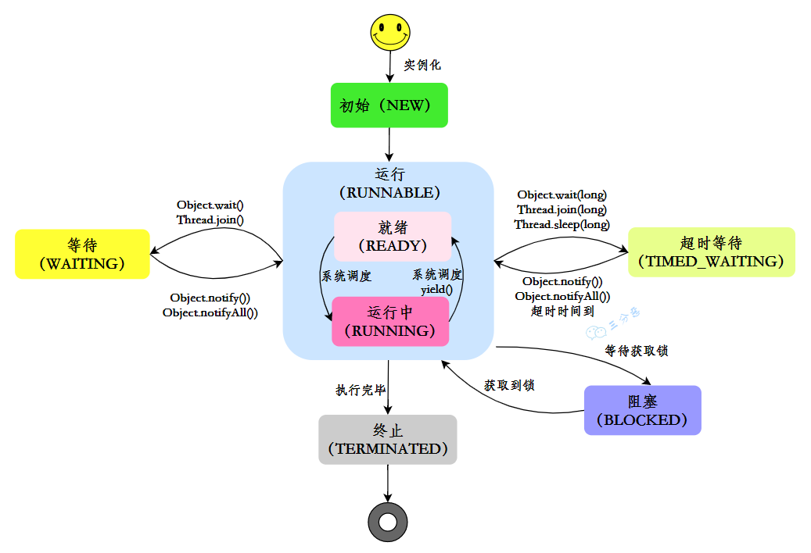
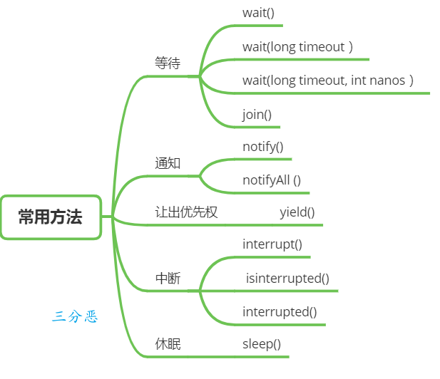

# 并发编程基础



默认的 JVM 栈大小是 1024 KB，也就是 1M。一个 8G 内存的系统，可以创建的线程大约在8000个。

启动一个 Java 程序，你能说说里面有哪些线程吗？

- 首先是 main 线程，这是程序开始执行的入口。 
- 然后是垃圾回收线程，它是一个后台线程，负责回收不再使用的对象。 
- 还有编译器线程，在及时编译中（JIT），负责把一部分热点代码编译后放到 codeCache 中，以提升程序的执行效率。

## 创建线程

1. **继承** Thread 类，重写 `run()`方法，调用 `start()`方法启动线程。
2. 第二种，实现 Runnable **接口**，重写 `run()` 方法，然后创建 Thread 对象，将 Runnable 对象作为参数传递给 Thread 对象，调用 `start()` 方法启动线程。
3. 实现 Callable 接口，重写 `call()` 方法，然后创建 FutureTask 对象，参数为 Callable 对象；紧接着创建 Thread 对象，参数为 FutureTask 对象，调用 `start()` 方法启动线程。

前 2 种方式都有一个缺陷：`run()` 方法的返回值为 void，在执行完任务之后无法获取执行结果。如果需要获取执行结果，就必须通过共享变量或者线程通信的方式来达到目的，这样使用起来就比较麻烦。实现 Callable 接口获得执行结果较为方便。

```java
FutureTask<String> task=new FutureTask<>(new CallerTask());
new Thread(task).start();
System.out.println(task.get());  //等待执行完成，并获取返回结果
```

> - `run()`：在当前线程中运行，没有新的线程被创建。
> - `start()`：会启动一个新的线程，并让这个新线程调用`run()`方法。这样，`run()`方法就在新的线程中运行，从而实现多线程并发。
>
> ```java
> MyRunnable mr = new MyRunnable();
> Thread t1 = new Thread(mr, "张飞");
> t1.start();
> ```

## 线程调度



`wait()`当一个线程 A 调用一个共享变量的 `wait()` 方法时，线程 A 会被阻塞挂起，直到发生下面几种情况才会返回 ：

- 线程 B 调用了共享对象 `notify()`或者 `notifyAll()` 方法；
- 其他线程调用了线程 A 的 `interrupt()` 方法，线程 A 抛出 InterruptedException 异常返回。
- 如果使用带时间参数的wait，如果没有在指定的 timeout 时间内被其它线程唤醒，那么这个方法还是会因为超时而返回。

唤醒线程主要有下面两个方法：

- `notify()`：一个线程 A 调用共享对象的 `notify()` 方法后，会唤醒一个在这个共享变量上调用 wait 系列方法后被挂起的线程。（一个共享变量上可能会有多个线程在等待，具体唤醒哪个等待的线程是随机的。）
- `notifyAll()`：不同于在共享变量上调用 `notify()` 方法会唤醒被阻塞到该共享变量上的一个线程，notifyAll 方法会唤醒所有在该共享变量上调用 wait 系列方法而被挂起的线程。

对于 `join()` 方法，意思是如果一个线程 A 执行了 `thread.join()`，当前线程 A 会等待 thread 线程终止之后才从 `thread.join()` 返回。

```java
t1.start();  // Thread
try {
    t1.join(); //等待t1执行完才会轮到t2抢
} catch (InterruptedException e) {
    e.printStackTrace();
}
t2.start();
```

`sleep(long millis)`：Thread 类中的静态方法，当一个执行中的线程 A 调用了 Thread 的 sleep 方法后，线程 A 会暂时让出指定时间的执行权。但是线程 A 所拥有的监视器资源，比如锁，还是持有不让出的。指定的睡眠时间到了后该方法会正常返回，接着参与 CPU 的调度，获取到 CPU 资源后就可以继续运行。

`yield()`：Thread 类中的静态方法，当一个线程调用 yield 方法时，实际是在暗示线程调度器，当前线程请求让出自己的 CPU，然而，它只是向线程调度器提出建议，调度器可能会忽略这个建议。具体行为取决于操作系统和 JVM 的线程调度策略。

线程中断通过设置线程的中断标志并不能直接终止该线程的执行。例如，当线程 A 运行时，线程 B 可以调用线程 `interrupt()` 方法来设置线程的中断标志为 true 并立即返回。设置标志仅仅是设置标志, 线程 B 实际并没有被中断，会继续往下执行。

为了响应中断，线程的执行代码应该这样编写：

```java
public void run() {
    try {
        while (!Thread.currentThread().isInterrupted()) {
            // 执行任务
        }
    } catch (InterruptedException e) {
        // 线程被中断时的清理代码
    } finally {
        // 线程结束前的清理代码
    }
}
```

stop 方法用来强制线程停止执行，目前已经处于废弃状态，因为 stop 方法会导致线程立即停止，可能会在不一致的状态下释放锁，破坏对象的一致性，导致难以发现的错误和资源泄漏。

## 线程状态

在 Java 中，线程共有 6 种状态：

| 状态         | 说明                                                         |
| ------------ | ------------------------------------------------------------ |
| NEW          | 当线程被创建后，如通过`new Thread()`，它处于新建状态。此时，线程已经被分配了必要的资源，但还没有开始执行。 |
| RUNNABLE     | 当调用线程的`start()`方法后，线程进入可运行状态。在这个状态下，线程可能正在运行也可能正在等待获取 CPU 时间片，包括了操作系统线程的**ready**和**running**两个状态。 |
| BLOCKED      | 线程在试图获取一个锁以进入同步块/方法时，如果锁被其他线程持有，线程将进入阻塞状态，直到它获取到锁。 |
| WAITING      | 线程进入等待状态是因为调用了如下方法之一：`Object.wait()`或`LockSupport.park()`。在等待状态下，线程需要其他线程显式地唤醒，否则不会自动执行。 |
| TIME_WAITING | 当线程调用带有超时参数的方法时，如`Thread.sleep(long millis)`、`Object.wait(long timeout)` 或`LockSupport.parkNanos()`，它将进入超时等待状态。线程在指定的等待时间过后会自动返回可运行状态。 |
| TERMINATED   | 当线程的`run()`方法执行完毕后，或者因为一个未捕获的异常终止了执行，线程进入终止状态。一旦线程终止，它的生命周期结束，不能再被重新启动。 |

线程在自身的生命周期中，并不是固定地处于某个状态，而是在不同的状态之间进行切换（看看笔记开头的图）

## 线程调度实例

```java
// testMethod() 方法是同步方法(等待100ms)，两个线程争夺锁
Thread a = new Thread(this::testMethod, "a");
Thread b = new Thread(this::testMethod, "b");
a.start();b.start();
System.out.println(a.getName() + ":" + a.getState()); // 输出 RUNNABLE
System.out.println(b.getName() + ":" + b.getState()); // 输出 BLOCKED
```

初看之下，可能会觉得线程 a 会先调用同步方法，同步方法内又调用了`Thread.sleep()`方法，必然会输出 TIMED_WAITING，而线程 b 因为等待线程 a 释放锁所以必然会输出 BLOCKED。

其实不然，有两点需要值得大家注意：

- 一是在测试方法内还有一个 main 线程，只保证了 a，b 两个线程调用 start 方法（转化为 RUNNABLE 状态）
- 二是启动线程后执行 run 方法还是需要消耗一定时间的。

因此 a 输出 RUNNABLE，是由于还未执行 `testMethod` 中的sleep代码

如何修改一下代码，使得 a 输出 TIMED_WAITING？例如如下：

```java
a.start();Thread.sleep(50L);b.start();
```

我们再把上面的例子线程启动那里改变一下：

```java
a.start();a.join();b.start();
// a 输出TERMINATED
```

要是没有调用 join 方法，main 线程不管 a 线程是否执行完毕都会继续往下走。

a 线程启动之后马上调用了 join 方法，这里 main 线程就会等到 a 线程执行完毕，所以这里 a 线程打印的状态固定是**TERMINATED**。

至于 b 线程的状态，有可能打印 RUNNABLE（尚未进入同步方法），也有可能打印 TIMED_WAITING（进入了同步方法）

## Java 内存模型

> Java 运行时内存区域描述的是在 JVM 运行时，如何将内存划分为不同的区域，并且每个区域的功能和工作机制。例如本地方法栈等等
>
> Java 内存模型 (JMM) 主要针对的是多线程环境下，如何在主内存与工作内存之间安全地执行操作。一般来说，JMM 中的主存属于共享数据区域，包含了堆和方法区；同样，JMM 中的本地内存属于私有数据区域，包含了程序计数器、本地方法栈、虚拟机栈。

Java 内存模型（Java Memory Model，JMM）定义了 Java 程序中的变量、线程如何和主存以及工作内存进行交互的规则。它主要涉及到多线程环境下的共享变量可见性、指令重排等问题，包括：

- 线程间如何通信？即：线程之间以何种机制来交换信息
- 线程间如何同步？即：线程以何种机制来控制不同线程间发生的相对顺序

有两种并发模型可以解决这两个问题：消息传递并发模型；共享内存并发模型。Java选择后者。

### 线程通信

对于每一个线程来说，栈和程序计数器是私有的，而堆和方法区是共有的。也就是说，在栈中的变量（局部变量、方法定义的参数、异常处理的参数）不会在线程之间共享，也就不会有内存可见性的问题，也不受内存模型的影响。内存可见性针对的是堆中的共享变量。

因为现代计算机为了高效，往往会在高速缓存区中缓存共享变量，因为 CPU 访问缓存区比访问内存要快得多，这会造成**内存可见性问题**。如图，线程 A 无法直接访问线程 B 的工作内存，线程间通信必须经过主存。


不过，根据 JMM 的规定，**线程对共享变量的所有操作都必须在自己的本地内存中进行，不能直接从主存中读取**。所以线程 B 并不是直接去主存中读取共享变量的值，而是先在本地内存 B 中找到这个共享变量，发现这个共享变量已经被更新了，然后本地内存 B 去主存中读取这个共享变量的新值，并拷贝到本地内存 B 中，最后线程 B 再读取本地内存 B 中的新值。

那么怎么知道这个共享变量的被其他线程更新了呢？这就是 JMM 的功劳了，也是 JMM 存在的必要性之一。**JMM 通过控制主存与每个线程的本地内存之间的交互，来提供内存可见性保证**。

> Java 中的 volatile 关键字可以保证多线程操作共享变量的可见性以及禁止指令重排序，synchronized 关键字不仅保证可见性，同时也保证了原子性（互斥性）。

### 线程同步

从另一个角度看，Java 内存模型（JMM）对于正确同步多线程程序的内存一致性做了以下保证：**如果程序是正确同步的，程序的执行将具有顺序一致性**。即程序的执行结果和该程序在**顺序一致性模型**中执行的结果相同。

> 这里的同步包括使用 volatile、final、synchronized 等关键字实现的同步。

顺序一致性模型是一个**理想化的理论参考模型**，它为程序提供了极强的内存可见性保证。顺序一致性模型有两大特性：

- 一个线程中的所有操作必须按照程序的**顺序**（即 Java 代码的顺序）来执行。（实际上计算机在执行程序时，为了提高性能，编译器和处理器可能会对指令做重排）
- 不管程序是否同步，所有线程都只能看到一个单一的操作执行顺序。即在顺序一致性模型中，每个操作必须是**原子性的，且立刻对所有线程可见**。

假设**正确使用了同步**，A 线程的 3 个操作执行后释放锁，B 线程获取同一个锁。那么在**顺序一致性模型**中的执行效果如下所示：


假设**没有使用同步**，那么在**顺序一致性模型**中的执行效果如下所示：


JMM 只保证了上者，**没有保证下者**，因为如果要保证下者执行结果一致，那么 JMM 需要禁止大量的优化，对程序的执行性能会产生很大的影响。对于未同步的多线程，JMM 只提供**最小安全性**：线程读取到的值，要么是之前某个线程写入的值，要么是默认值，不会无中生有。

而对于上者（正确使用了同步），临界区内（同步块或同步方法中）的代码可以发生重排序（但不允许临界区内的代码“逃逸”到临界区之外，因为会破坏锁的内存语义）。虽然线程 A 在临界区做了重排序，但是因为锁的特性，线程 B 无法观察到线程 A 在临界区的重排序。这种重排序既提高了执行效率，又没有改变程序的执行结果。

### happens-before 规则

对于开发者，JMM 提供了**happens-before 规则**（JSR-133 规范），简单易懂，并且提供了足够强的内存可见性保证。 换言之，开发者只要遵循 happens-before 规则，那么我们写的程序就能保证在 JMM 中具有强的内存可见性。

happens-before 的概念来定制两个操作之间的执行顺序。如果操作 A happens-before 操作 B，那么操作 A 在内存上所做的操作对操作 B 都是可见的，不管它们在不在一个线程。

> 如果重排序之后的执行结果，与按 happens-before 关系来执行的结果一致，那么 JMM 也允许这样的重排序。

在 Java 中，有以下天然的 happens-before 关系：

- 程序顺序规则：一个线程中的每一个操作，happens-before 于该线程中的任意后续操作。
- 监视器锁规则：对一个锁的解锁，happens-before 于随后对这个锁的加锁。
- volatile 变量规则：对一个 volatile 域的写，happens-before 于任意后续对这个 volatile 域的读。
- 传递性：如果 A happens-before B，且 B happens-before C，那么 A happens-before C。
- start 规则：如果线程 A 执行操作 `ThreadB.start()`启动线程 B，那么 A 线程的 `ThreadB.start()`操作 happens-before 于线程 B 中的任意操作。
- join 规则：如果线程 A 执行操作 `ThreadB.join()`并成功返回，那么线程 B 中的任意操作 happens-before 于线程 A 从 `ThreadB.join()`操作成功返回。

## volatile关键字

volatile 可以保证可见性，**但不保证原子性**。

当我们使用 volatile 关键字来修饰一个变量时，Java 内存模型会插入内存屏障（一个处理器指令，可以对 CPU 或编译器重排序做出约束）来确保以下两点：

- 写屏障（Write Barrier）：当一个 volatile 变量被写入时，写屏障确保在该屏障之前的所有变量的写入操作都提交到主内存。 
- 读屏障（Read Barrier）：当读取一个 volatile 变量时，读屏障确保在该屏障之后的所有读操作都从主内存中读取。

换句话说，当程序执行到 volatile 变量的读操作或者写操作时，禁止指令重排，在其前面操作的更改肯定已经全部进行，且结果对后面的操作可见；在其后面的操作肯定还没有进行。

直观理解，volatile帮我们手动加上了happens-before链条：

```java
int a = 0;
boolean volatile flag = false;
void writer() {
    a = 1;flag = true;
}
void reader() {
    if (flag) int i =  a * a;
}
```

如果不再 flag 上加上volatile，writer和reader可能会做指令重排，volatile强制先做writer，在做reader


## synchronized关键字

主要有以下 3 种应用方式： 

```java
public synchronized void instanceLock() {
    // 等价同步代码块 synchronized(this)
}

public static synchronized void classLock() {
    // 等价同步代码块 synchronized(xxx.class)
}

public void blockLock() {
    Object o = new Object();
    synchronized (o) {  
        // code
    }
}
```

- 同步方法，为当前对象（this）加锁，可以保证在任意时刻，只有一个线程能执行方法。注意，每个对象都有一个对象锁，不同的对象，他们的锁不会互相影响。
- 同步静态方法，为当前类加锁（锁的是 Class 对象），进入同步代码前要获得当前类的锁； 
- 同步代码块，某些情况下，我们编写的方法代码量比较多，存在一些比较耗时的操作，而需要同步的代码块只有一小部分，如果直接对整个方法进行同步，可能会得不偿失，此时我们可以使用同步代码块的方式对需要同步的代码进行包裹。对指定对象或者类加锁。

需要注意的是如果线程 A 调用了一个对象的非静态 synchronized 方法，线程 B 需要调用这个对象所属类的静态 synchronized 方法，是不会发生互斥的，因为访问静态 synchronized 方法占用的锁是当前类的 Class 对象，而访问非静态 synchronized 方法占用的锁是当前对象（this）的锁

synchronized 是可重入锁，一个线程调用 synchronized 方法的同时，在其方法体内部调用该对象另一个 synchronized 方法是允许的

## 四种锁状态

**无锁**就是没有对资源进行锁定，任何线程都可以尝试去修改它。其他三种状态：

| 锁       | 优点                                                         | 缺点                                             | 适用场景                             |
| -------- | ------------------------------------------------------------ | ------------------------------------------------ | ------------------------------------ |
| 偏向锁   | 加锁和解锁不需要额外的消耗，和执行非同步方法比仅存在纳秒级的差距。 | 如果线程间存在锁竞争，会带来额外的锁撤销的消耗。 | 适用于只有一个线程访问同步块场景。   |
| 轻量级锁 | 竞争的线程不会阻塞，提高了程序的响应速度。                   | 如果始终得不到锁竞争的线程使用自旋会消耗 CPU。   | 追求响应时间。同步块执行速度非常快。 |
| 重量级锁 | 线程竞争不使用自旋，不会消耗 CPU。                           | 线程阻塞，响应时间缓慢。                         | 追求吞吐量。同步块执行时间较长。     |

在具体实现上，保存在Java对象头的Mark Word中：

| 锁状态   | 29 bit 或 61 bit                       | 1 bit 是否是偏向锁？       | 2 bit 锁标志位 |
| -------- | -------------------------------------- | -------------------------- | -------------- |
| 无锁     |                                        | 0                          | 01             |
| 偏向锁   | 线程 ID                                | 1                          | 01             |
| 轻量级锁 | 指向栈中锁记录的指针                   | 此时这一位不用于标识偏向锁 | 00             |
| 重量级锁 | 指向堆中的 monitor（监视器）对象的指针 | 此时这一位不用于标识偏向锁 | 10             |
| GC 标记  |                                        | 此时这一位不用于标识偏向锁 | 11             |

### 偏向锁

Hotspot 的作者经过以往的研究发现大多数情况下**锁并不存在多线程竞争，而且总是由同一线程多次获得**，于是引入了偏向锁。偏向锁会偏向于第一个访问锁的线程，如果在接下来的运行过程中，该锁没有被其他的线程访问，则持有偏向锁的线程将永远不需要触发同步，无需再走各种加锁/解锁流程。

在具体实现上，一个线程在第一次进入同步块时，会在对象头和栈帧中的锁记录里存储锁偏向的线程 ID。当下次该线程进入这个同步块时，会去检查锁的 Mark Word 里面是不是放的自己的线程 ID。

如果是，表明该线程已经获得了锁，以后该线程在进入和退出同步块时不需要花费 CAS 操作来加锁和解锁；如果不是，就代表有另一个线程来竞争这个偏向锁。这个时候会尝试使用 CAS（Compare and Swap） 来替换 Mark Word 里面的线程 ID 为新线程的 ID，这个时候要分两种情况：

- 成功，表示之前的线程不存在了， Mark Word 里面的线程 ID 为新线程的 ID，锁不会升级，仍然为**偏向锁**；
- 失败，表示之前的线程仍然存在，那么暂停之前的线程，设置偏向锁标识为 0，并设置锁标志位为 00，升级为轻量级锁，会按照**轻量级锁**的方式进行竞争锁。

### 轻量级锁

多个线程在**不同时段**获取**同一把锁**，即**不存在锁竞争**的情况，也就没有线程阻塞。针对这种情况，JVM 采用轻量级锁来避免线程的阻塞与唤醒。

JVM 会为每个线程在当前线程的栈帧中创建用于存储锁记录的空间，我们称为 Displaced Mark Word。如果一个线程获得锁的时候发现是轻量级锁，会把锁的 Mark Word 复制到自己的 Displaced Mark Word 里面。

然后线程尝试用 CAS 将锁的 Mark Word 替换为指向锁记录的指针。如果成功，当前线程获得锁，如果失败，表示 Mark Word 已经被替换成了其他线程的锁记录，说明在与其它线程竞争锁，当前线程就尝试使用自旋来获取锁。

> 自旋：不断尝试去获取锁，一般用循环来实现。

自旋是需要消耗 CPU 的，如果一直获取不到锁的话，那该线程就一直处在自旋状态，白白浪费 CPU 资源。解决这个问题最简单的办法就是指定自旋的次数，例如让其循环 10 次，如果还没获取到锁就进入阻塞状态。

但是 JDK 采用了更聪明的方式——适应性自旋，简单来说就是线程如果自旋成功了，则下次自旋的次数会更多，如果自旋失败了，则自旋的次数就会减少。

自旋也不是一直进行下去的，如果自旋到一定程度（和 JVM、操作系统相关），依然没有获取到锁，称为自旋失败，那么这个线程会阻塞。同时这个锁就会**升级成重量级锁**。

### 重量级锁

重量级锁依赖于操作系统的互斥锁（mutex，用于保证任何给定时间内，只有一个线程可以执行某一段特定的代码段） 实现，如果线程尝试获取锁失败，它会直接进入阻塞状态，等待操作系统的调度，而操作系统中线程间状态的转换需要相对较长的时间，所以重量级锁效率很低，但被阻塞的线程不会消耗 CPU。

### 锁的升级流程

1. 每一个线程在准备获取共享资源时： 第一步，检查 MarkWord 里面是不是放的自己的 ThreadId ,如果是，表示当前线程是处于 “偏向锁” 。
2. 如果 MarkWord 不是自己的 ThreadId，锁升级，这时候，用 CAS 来执行切换，新的线程根据 MarkWord 里面现有的 ThreadId，通知之前线程暂停，之前线程将 Markword 的内容置为空。
3. 两个线程都把锁对象的 HashCode 复制到自己新建的用于存储锁的记录空间，接着开始通过 CAS 操作， 把锁对象的 MarKword 的内容修改为自己新建的记录空间的地址的方式竞争 MarkWord。
4. 第三步中成功执行 CAS 的获得资源，失败的则进入自旋 。
5. 自旋的线程在自旋过程中，成功获得资源(即之前获的资源的线程执行完成并释放了共享资源)，则整个状态依然处于 轻量级锁的状态，如果自旋失败 。
6. 进入重量级锁的状态，这个时候，自旋的线程进行阻塞，等待之前线程执行完成并唤醒自己。

### CAS（Compare and Swap）

CAS（Compare-and-Swap）是一种乐观锁的实现方式，全称为“比较并交换”，是一种无锁的原子操作。判断 要改变的值 是否等于 旧值，如果等于，将值设置为 新值；如果不等，说明已经有其它线程更新了值，于是当前线程放弃更新，什么都不做。当多个线程同时使用 CAS 操作一个变量时，只有一个会胜出，并成功更新，其余均会失败，但失败的线程并不会被挂起，仅是被告知失败，并且允许再次尝试，当然也允许失败的线程放弃操作。

- 对于悲观锁来说，它总是认为每次访问共享资源时会发生冲突，所以必须对每次数据操作加上锁，以保证临界区的程序同一时间只能有一个线程在执行
- 乐观锁总是假设对共享资源的访问没有冲突，线程可以不停地执行，无需加锁也无需等待。一旦多个线程发生冲突，乐观锁通常使用一种称为 CAS 的技术来保证线程执行的安全性。

CAS的问题：

- CAS 多与自旋结合。如果自旋 CAS 长时间不成功，会占用大量的 CPU 资源。因此要重量级锁
- 一个值原来是 A，变成了 B，又变回了 A。这个时候使用 CAS 是检查不出变化的，但实际上却被更新了两次。

## ThreadLocal

通常，我们会使用 synchronzed 关键字 或者 lock 来控制线程对临界区资源的同步顺序，但这种加锁的方式会让未获取到锁的线程进行阻塞，很显然，这种方式的时间效率不会特别高。

**线程安全问题的核心在于多个线程会对同一个临界区的共享资源进行访问**，那如果每个线程都拥有自己的“共享资源”，各用各的，互不影响，这样就不会出现线程安全的问题了，对吧？

ThreadLocal 就是线程的“本地变量”，即每个线程都拥有该变量的一个副本，达到人手一份的目的，这样就可以避免共享资源的竞争

ThreadLocal 的使用场景非常多，比如说：

- 用于保存用户登录信息，这样在同一个线程中的任何地方都可以获取到登录信息。
- 用于保存数据库连接、Session 对象等，这样在同一个线程中的任何地方都可以获取到数据库连接、Session 对象等。
- 用于保存事务上下文，这样在同一个线程中的任何地方都可以获取到事务上下文。
- 用于保存线程中的变量，这样在同一个线程中的任何地方都可以获取到线程中的变量。
