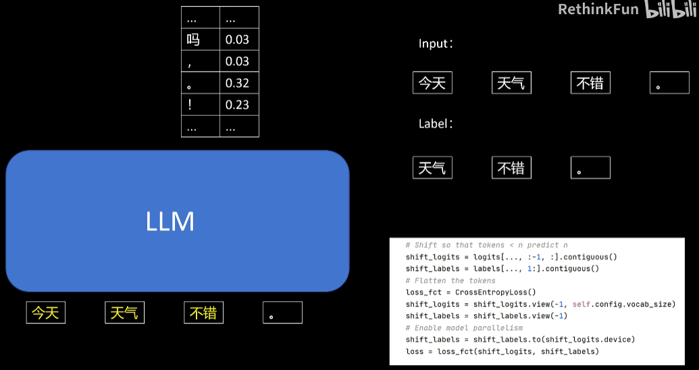

# 预训练

预训练的两种情况

- **从零开始预训练**：训练起始时，模型所有参数随机初始化。这种方式需要大量语料、众多显卡以及漫长时间，才能训练出性能良好的大模型。
- **基于开源预训练模型微调**：在已有的开源预训练大模型基础上，针对特定行业（如金融、医疗领域）进行加强训练，提升通用模型在特定领域的知识与能力，这是更常见的情况。

## 简化代码

我们来看看预训练的[简化代码](https://github.com/RethinkFun/LLM/blob/main/simple.py)

设置模型、tokenizer

```python
model_path = '/data04/llama3/Meta-Llama-3.1-8B-Instruct'
tokenizer = AutoTokenizer.from_pretrained(model_path)
```

模型放入显卡

```python
model = AutoModelForCausalLM.from_pretrained(
    model_path,
    low_cpu_mem_usage=True,
    quantization_config=bnb_config
)
model.to("cuda")
```

定义优化器

```python
optimizer = torch.optim.AdamW(model.parameters())
```

定义文本，分词，放入显卡

```python
text = "今天天气不错。"
input = tokenizer(text, return_tensors="pt")
input = {k: v.to("cuda") for k, v in input.items()}
input["labels"] = input["input_ids"].clone()
```

前向传播，后向传播，更新模型，保存参数

```python
output = model(**input)

#获取模型的loss
loss = output.loss
loss.backward()
optimizer.step()
optimizer.zero_grad()

#保存模型
model.save_pretrained("output_dir")
```

## Loss 计算

以输入 “今天天气不错” 为例，模型将其拆分为多个`token`。模型根据前一个或多个`token`输出下一个`token`的概率分布，期望目标`token`的概率尽可能大，其他`token`概率尽可能小，这本质上是一个分类问题



由于句子结束，训练时丢弃最后输出的`token`，不进行`loss`计算。在哈根 face 的`la model`中，先丢弃预测的最后一个`token`，将`input`左移一位形成最终的`label`，使用交叉熵损失函数计算`loss`


