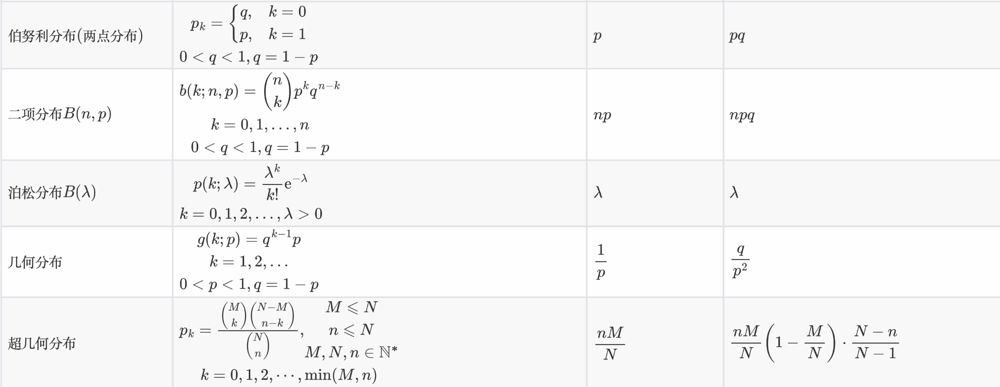
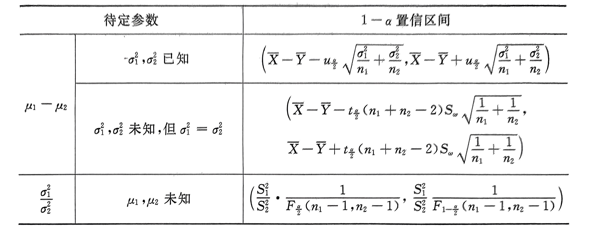
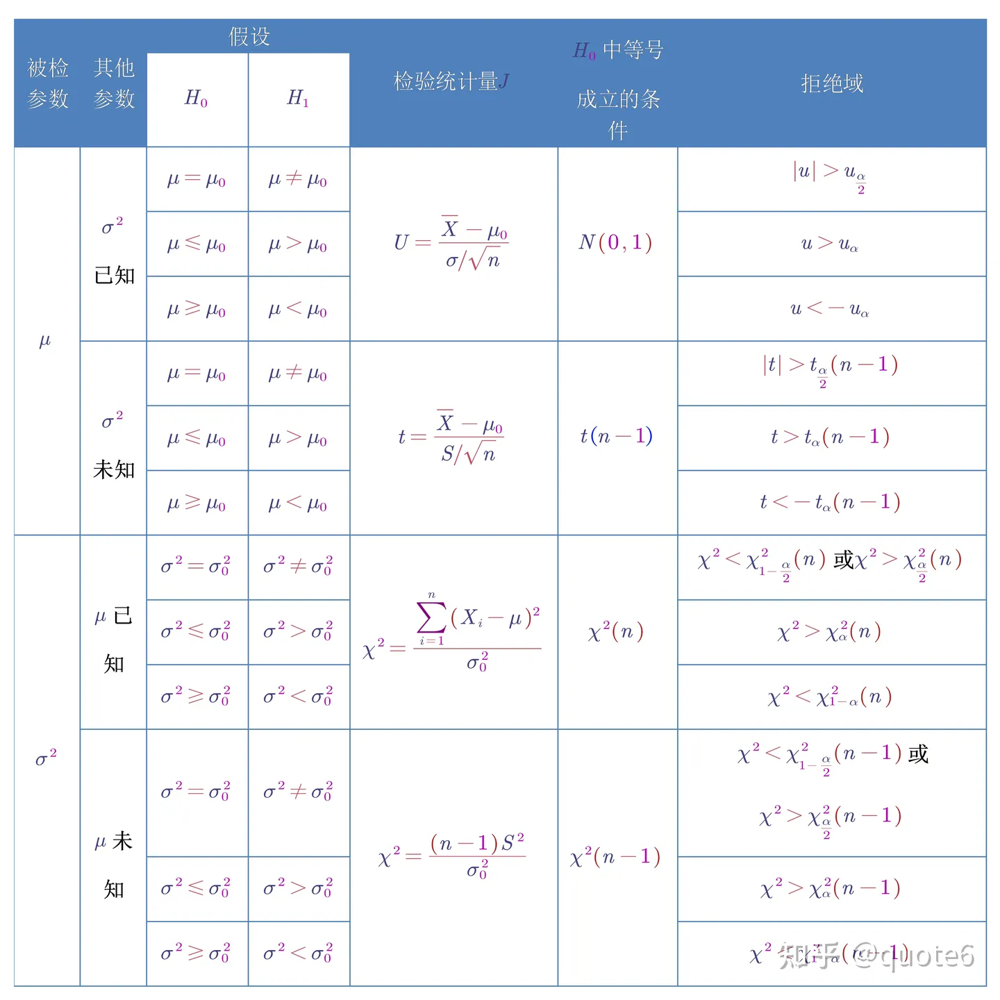

# 概率与统计基础

> 参考：[概率论与数理统计笔记](https://github.com/ChanceQZ/Statistics-note/tree/master)

## 基础概念

**独立**：设$A$，$B$是随机试验中的两个事件，若满足$$P(AB)=P(A)P(B)$$，则称事件$A$和$B$相互独立。

**条件概率**：条件概率就是知道了**一定信息**下得到的随机事件的概率。为事件$B$发生条件下事件$A$发生的条件概率：
$$
P(A|B)=\frac{P(AB)}{P(B)}
$$

**全概率**：**两两不相容**的一组事件分割A的样本空间。
$$
P(A)=\sum_{i=1}^{n}P(A|B_i)P(B_i)
$$

**贝叶斯公式**：条件概率公式+全概率公式：
$$
P(B_i|A)=\frac{P(A|B_i)P(B_i)}{\sum_{j=1}^{n}P(A|B_j)P(B_j)}
$$

**古典概型**：设一个试验有*N*个等可能的结果，而事件$E$恰包含其中的$M$个结果，则事件$E$的概率，记为$P(E)$，定义为
$$
P(E)=M/N
$$
古典概型有**两个条件**：

* 有限性，试验结果只有有限个（记为*n*），
* 等可能性，每个基本时间发生的可能性相同。

## 随机变量及其分布

随机变量（random variable）表示随机试验各种**结果的实值单值函数**。例如某一时间内公共汽车站等车乘客人数，电话交换台在一定时间内收到的呼叫次数，灯泡的寿命等等，都是随机变量的实例。

### 随机变量

- 设$X$为一随机变量，如果$X$**只取有限个或可数个值**，则称$X$为一个（一维）**离散型随机变量**。
- 设$X$为一随机变量，$X$**不仅有无限个而且有不可数个值**，则称$X$为一个**连续型随机变量**。

**概率函数**（离散和连续）：
$$
P(X=a_i)=p_i,i=1,2,...
$$
$$
f(x)=F'(x)
$$

> 连续随机变量的一切取值充满整个样本空间，而这其中有无穷个不可列的实数，因此无法采用分布列表示，采用**概率密度函数**表示。
>
> 概率密度函数不是概率，乘以区间长度微元后就表示概率的近似值，而概率密度函数在一段区间上的积分就是随机变量 X 在这段区间上取值的概率。

**分布函数**（离散和连续）：
$$
F(X)=P(X\leq x)\quad(-\infty<x<\infty)
$$

$$
F(x)=\int_{-\infty}^xf(u)du,\quad-\infty<x<+\infty
$$

> 随机变量的分布函数表述了随机变量的统计规律性，已知一个随机变量的分布函数就可以得知该随机变量落在某一区间的概率。

### 常见分布

> 参考：[概率论常用分布一览表](https://zhuanlan.zhihu.com/p/666593554)

**泊松定理**：在伯努利试验中，$$p_n$$代表事件A在试验中出现的概率。在n较大，通常取大于等于100，p较小，通常取小于等于0.1的情况下，如果$$\lim \limits_{n\rightarrow +\infty} np_n = \lambda$$, 则
$$
\lim \limits_{n\rightarrow +\infty}C_n^kp_n^k(1-p_n)^{n-k} = {\lambda^k\over k!}e^{-\lambda}
$$
**指数分布的无记忆性**：
$$
P(X>s+t∣X>s)=P(X>t)
$$
**正态分布的可加性**：

如果多个随机变量分别服从不同的正态分布，如果这些随机变量彼此独立，那么这些随机变量的和也服从正态分布。

> - 二项分布：常用于检查产品合格率、色盲率调查等等 
> - 两点分别：比赛胜率估计 
> - 泊松分布：常用于一天内到达顾客数、铸件上的砂眼数、一天内电路受到电磁波干扰次数等等
> - 超几何分布：用于进行有限总体中进行不放回抽样。 
> - 几何分布：一次伯努利试验中事件 A 首次出现时的试验次数。例如产品不合格率调查。
> - 正态分布：主要应用于统计理论、误差理论等等 
> - 指数分布：常用于随即服务系统、寿命估计、排队论等等

### 多维随机变量

**边缘分布**（离散和连续）：

> 对于**离散型随机向量**，行和与列和就是边缘分布。即固定某个$$x_i$$，即可计算边缘分布

$$
p_X(x_i)=P(X=x_i)=\sum_{j}^{m}P(X=x_i,Y=y_j)=\sum_{j}^{m}p_{ij}=p_{i\cdot},\quad i=1,2,...,n\\
p_Y(y_i)=P(Y=y_i)=\sum_{i}^{m}P(X=x_i,Y=y_j)=\sum_{i}^{m}p_{ij}=p_{j\cdot},\quad j=1,2,...,n
$$

$$
(X,Y)\sim f(x, y)\\
f_X(u)=\int^{+\infty}_{-\infty}f(u,v)dv\\
f_Y(u)=\int^{+\infty}_{-\infty}f(u,v)du\\
$$

若随机变量$$X_1, ...,X_n$$相互**独立**，则（离散和连续）：
$$
P(X_1=x_1,...,X_n=x_n)=P(X_1=x_1)...P(X_n=x_n)
$$

$$
f(x_1,...,x_n)=f_1(x_1)...f_n(x_n),\quad \forall(x_1,...,x_n)\in \R ^n
$$

> **注：**二维正态分布$$N(a,b,\sigma_1^2,\sigma_2^2,\rho )$$的边缘分布密度分别是一维正态分布$$N(a,\sigma_1^2)$$和$$N(b,\sigma_2^2)$$。联合分布可推边缘分布，而边缘分布不可推联合分布。
>
> 二维正态分布中 X Y 独立的充要条件是 $$\rho=0$$

**条件分布**（离散和连续）：
$$
P(X=x_i|Y=y_j)=\frac{P(X=x_i,Y=y_j)}{P(Y=y_j)}=\frac{p_{ij}}{p_{\cdot j}},\quad i=1,2,...
$$

$$
f_{X|Y}(x|y)=\frac{f(x,y)}{f_Y(y)}, \quad f_Y(y)>0.\\
$$

总结：

联合概率是基于两个随机变量及其相互作用的样本空间的概率。边缘概率是多维随机变量的样本空间中，某一个或多个随机变量构成的子空间的概率。
$$
条件=\frac{联合}{边缘}
$$

### 随机变量的函数的概率分布

**离散型分布的情形**：

设$X$的分布律为$$P(X=x_i)=p_i,Y=g(X)$$，则$$Y$$的分布律为
$$
P(Y=y_j)=P(g(X)=y_j)=\sum_{x_i:g(x_i)=y_j}P(X=x_i)=\sum_{i:g(x_i)=y_j}p_i
$$
即把$$Y=g(X_1,...,X_n)$$可以取的不同值找出来，把与某个值相应的全部$$(X_1,...,X_n)$$值的概率加起来，即得$Y$取这个值的概率。

**连续型分布的情形**：

$$X$$有密度函数$$f(x)$$.$$Y=g(x)$$是一个严格单调的函数，因此其反函数$$X=h(Y)$$存在。有密度函数$$l(y)$$为：
$$
l(y)=f(h(y))|h'(y)|.
$$
设$$(X_1,X_2)$$的联合密度函数为$$f(x_1,x_2)$$，$$Y=X_1+X_2$$的密度函数：

$$
l(y)=\int_{-\infty}^\infty f(x_1,y-x_1)dx_1=\int_{-\infty}^\infty f(x,y-x)dx
$$
若$$X_1,X_2$$独立，则
$$
l(y)=\int_{-\infty}^\infty f_1(x)f_2(y-x)dx=\int_{-\infty}^\infty f_1(y-x)f_2(x)dx
$$

## 随机变量的数字特征

**数学期望**：
$$
E(X)=\sum^\infty_{i=1}a_ip_i
$$

$$
E(X)=\int_{-\infty}^\infty xf(x)dx
$$

**方差**：
$$
D(X)=Var(X)=E(X-EX)^2
$$

$$
Var(X)=E(X^2)-(EX)^2
$$

$$\sigma(X)= \sqrt{Var(X)}$$称为标准差。

**矩**：

$$X$$关于$$c$$点的$$k$$阶矩：
$$
E[(X-c)^k]
$$
特别的，$$k$$阶原点矩（一阶原点矩就是期望）：
$$
a_k=E(X^k)
$$
特别的，$$k$$阶中心矩（二阶中心距是方差）：
$$
\mu_k=E[(X-EX)^k]
$$
**协方差**：
$$
Cov(X,Y)=E[(X-EX)(Y-EY)]
$$

$$
Cov(X,Y)=E(XY)-E(X)E(Y)
$$

- 次序无关，即$$Cov(X,Y)=Cov(Y,X)$$
- $$Cov(c_1X+c_2,c_3Y+c_4)=c_1c_3Cov(X,Y)$$
- $$D(X\pm Y)=D(X)+D(Y)\pm 2Cov(X,Y)$$
- $$Cov(X_1+X_2,Y)=Cov(X_1,Y)+Cov(X_2,Y)$$

> 协方差大于零，表示这两个随机变量呈正相关关系，若协方差小于零表示两个随机变量呈负相关关系。而协方差等于零表示不“线性相关”。

**相关系数**：
$$
\rho_{XY} = \frac{Cov(X,Y)}{\sigma_1\sigma_2}
$$

- 若$$X,Y$$不相关：$$\rho_{XY}=0$$，$$Cov(X,Y)=0$$，$$D(X)D(Y)=0$$

> 相关系数可以看作标准化的协方差，它没有量纲，取值范围在[0, 1]。$$\rho_{XY}=1或-1$$时，有严格线性关系。
>
> 独立一定不相关，而不相关不一定独立。例如线性不相关的随机变量可能是非线性相关。最常见的例子就是 Logistics 函数或者二次函数，自变量和因变量计算所得相关系数很低，但是是互相依赖的变量。

## 大数定理和中心极限定理

> 参考：[大数定律与中心极限定理](https://blog.csdn.net/xq151750111/article/details/120439438)

**切比雪夫不等式**：即使X分布未知，仍可以对距离期望足够远的地方事件出现的概率做出估计：
$$
P\{ \lvert X - \mu \rvert \geq \epsilon \} \leq \frac{\sigma^2}{\epsilon^2}
$$
**切比雪夫大数定律**：说明了对于独立但分布不同的 n 个随机变量，**随机变量的平均值约等于总体期望的平均值**。
$$
\lim_{n \to \infty}P(\lvert \frac{1}{n} \sum_{k=1}^{n}X_k - \frac{1}{n} \sum_{i=1}^{n}E(X_k) \rvert < \epsilon) =1 
$$
**辛钦大数定理**：说明了对于独立同分布且具有均值 a 的 n 个随机变量，当n 很大的时候它们的**算术平均值依概率收敛于均值**。
$$
\lim_{n\to\infty}P\{|\frac{1}{n}\sum\limits_{i=1}^n\xi_i-a|\lt\varepsilon\}=1
$$
**伯努利大数定律**：表明只要随机试验的次数 n 充分大，那么事件 A **频率和概率的绝对偏差很小**，说明在实际应用中，试验次数很大的时候可以用事件的频率来替代事件的概率。
$$
\lim_{n\to\infty}P\{|\frac{\mu_n}{n}-p|\lt\varepsilon\}=1
$$
**独立同分布中心极限定理**： **样本的平均值约等于总体的平均值**。不管总体是什么分布，任意一个总体的样本平均值都会围绕在总体的整体平均值（数学期望）周围，并且呈正态分布。
$$
\lim_{n \to \infty}F_n(x) = \lim_{n \to \infty}P\{\frac{ \sum_{k = 1}^{n}X_k - n \mu}{\sqrt{n} \sigma} \leq x \} = \Phi(x)
$$
等价的：
$$
\sum_{k = 1}^{n}X_k\sim N(n\mu,n\sigma^2)
$$
**棣莫弗-拉普拉斯中心极限定理**：是独立同分布中心极限定理的特殊情况，当$$X_n\sim B(n,p)$$时：
$$
\lim_{n \to \infty}P\{\frac{X_n - np}{\sqrt{np(1-p)}} \leq x \} = \Phi(x)
$$

## 数理统计基础概念

在一个统计问题里，研究对象的全体叫做**总体**，构成总体的每个成员称为**个体**。从总体中随机抽取的部分个体组成的集合称为**样本**，样本个数称为**样本容量**。

**统计量**：不含未知参数的样本函数称为统计量。统计量的分布称为抽样分布。

**样本均值**：
$$
\overline{X}=\frac{1}{n}\sum_{i=1}^{n}X_i
$$

$$
E(\overline{X})=E(X)=\mu
$$

**样本方差**：
$$
S^2=\frac{1}{n-1}\sum_{i=1}^n(X_i-\overline{X})^2
$$

$$
E(S^2)=D(X)=\sigma^2
$$

$$
D(\overline{X})=\frac{1}{n}D(X)=\frac{\sigma^2}{n}
$$

**k阶原点矩**（样本均值为一阶原点矩）：
$$
A_k=\frac{1}{n}\sum_{i=1}^{n}X_i^k
$$
**k阶中心距**（样本方差为二阶中心矩）：
$$
B_k=\frac{1}{n}\sum_{i=1}^n(X_i-\overline{X})^k
$$

### 常用统计抽样分布

> 参考：[统计三大分布](https://blog.csdn.net/SanyHo/article/details/105218103)、[样本及抽样分布](https://wulc.me/2016/11/18/%E6%A6%82%E7%8E%87%E8%AE%BA%E4%B8%8E%E6%95%B0%E7%90%86%E7%BB%9F%E8%AE%A1%E7%9F%A5%E8%AF%86%E6%95%B4%E7%90%86(5)--%E6%A0%B7%E6%9C%AC%E5%8F%8A%E6%8A%BD%E6%A0%B7%E5%88%86%E5%B8%83/)、[正态总体的样本均值与样本方差的分布定理](https://blog.csdn.net/SpiritedAway1106/article/details/108608994)

$$\chi^2$$**分布**：

是由正态分布派生出来的一种分布，如果$$X_1,...X_n$$都服从标准正态分布，则称随机变量：
$$
\chi^2=X_1^2+X_2^2+···+X_n^2
$$
所服从的分布为自由度为n的$$\chi^2$$**分布**，记为$$\chi^2 \sim \chi^2(n) $$

> 关于期望和方差，复习一下上面的常见分布表！

- 可加性：$$\chi_1^2 + \chi_2^2 \sim \chi^2(n_1+n_2) $$
- 上$$\alpha$$分位点

**t分布**：

$$X \sim N(0,1),Y \sim \chi^2(n)$$ 且X与Y相互独立，则称随机变量：
$$
T=\frac{X}{\sqrt{Y/n}}
$$
所服从的分布为自由度为n的t分布。记为 $$T \sim t(n)$$

- t分布的密度函数关于x=0对称，$$t_{1-\alpha}(n)=-t_{\alpha}(n)$$
- 当n充分大时，其图形类似于标准正态分布密度函数的图形。

**F分布**：

X与Y相互独立，$$X \sim \chi^2(n_1),Y \sim \chi^2(n_2)$$，则称随机变量：
$$
F=\frac{X/n_1}{Y/n_2}
$$
服从自由度为$$n_1$$ 以及$$n_2$$ 的F分布，记作$$ F\sim F(n_1,n_2)$$

- $$F_{1-\alpha}(n_1,n_2)=\frac{1}{F_\alpha(n_2,n_1)} $$
- $$\frac{1}{F} \sim F(n_2,n_1)$$

**正态总体的抽样分布性质**：

$$X_1,...X_n$$是来自正态总体$$N(\mu,\sigma^2)$$的样本，则：
$$
E(\overline{X})=\mu,\quad D(\overline{X})=\sigma^2/n, \quad E(S^2)=\sigma^2, \quad \overline{X}\sim N(\mu,\sigma^2/n).
$$
$$\overline{X}$$与$$S^2$$相互独立，且：
$$
\frac{(n-1)S^2}{\sigma^2}\sim \chi^2(n-1) 
$$
$$
\frac{\overline{X}-\mu}{S/\sqrt{n}}\sim t(n-1) 
$$

$$X_1,...X_n$$是来自正态总体$$N(\mu_1,\sigma_1^2)$$的样本，$$Y_1,...Y_n$$是来自正态总体$$N(\mu_2,\sigma_2^2)$$的样本，则：
$$
\quad \frac{S_1^2/\sigma_1^2}{S_2^2/\sigma_2^2}\sim F(n_1-1,n_2-1)
$$

$$
\frac{(\overline{X}-\overline{Y})-(\mu_1-\mu_2)}{S_w\sqrt{\frac{1}{n_1}+\frac{1}{n_2}}}\sim t(n_1+n_2-2)
$$

$$
S_w^2=\frac{(n_1-1)S_1^2+(n_2-1)S_2^2}{n_1+n_2-2}
$$

## 参数估计

统计学与概率论的区别就是归纳和演绎，前者通过样本推测总体的分布（似然），而后者已知总体分布去研究样本。因此参数估计则是归纳的过程。

参数估计有两种形式：**点估计**和**区间估计**（点估计和区间估计都是对于未知参数的估计，而**点估计给出的是一个参数可能的值**，**区间估计给出的是参数可能在的范围**）。

### 点估计

设$$X_1, ..., X_n$$是来自总体的样本，用于估计未知参数$$\theta$$的统计量$$\hat{\theta}=\hat{\theta}(X_1, ..., X_n)$$成为$$\theta$$的估计量，或称为$$\theta$$的点估计。

**无偏估计**：$$E(\hat{\theta})=\theta$$

**更有效的估计**：在都为无偏估计的情况下，$$D(\hat{\theta})$$ 小的更有效

**相合估计**：经验分布函数逼近真实分布函数，$$\lim_{n\rightarrow\infty}P(|\hat{\theta}_n-\theta|\geq\epsilon)=0$$

**矩估计法**：

矩估计基于大数定律（格里纹科定理），实质是用经验分布函数去替换总体分布，矩估计可以概括为：**用样本矩代替总体矩**（可以是原点矩也可以是中心矩）
$$
E(X^j)=\frac{1}{n}\sum_{i=1}^{n}X_i^j
$$

> 公式左边是总体结论，公式右边来自样本，几个未知参数列几个方程（尽量使用低阶矩）

**最大似然估计**：

将样本的联合概率函数看成$$\theta$$的函数，$$L(\theta)$$称为样本的**似然函数**：
$$
L(\theta)=L(x_1,...,x_n;\theta)=\prod_{i=1}^n p(x_i;\theta)
$$
若统计量$$\hat{\theta}=\hat{\theta}(x_1,...,x_n)$$满足
$$
L(\hat{\theta})=\max_{\theta\in\Theta}L(\theta)
$$
则称$$\hat{\theta}$$是$$\theta$$的**最大似然估计**，简称MLE（maximum likelihood estimate），其中$$\Theta$$表示参数空间。换句话说，想找到一个估计，使**已经观测到的事件发生的可能性最大**。

**最大似然估计步骤：**

* 写出似然函数；
* 对似然函数取对数，并整理；
* 求参数向量的偏导，令其为0，得到似然方程；
* 求解似然方程，其解为参数值。

### 区间估计

如果：
$$
P_\theta(\hat{\theta}_L\leq\theta\leq\hat{\theta}_U)=1-\alpha
$$
称随机区间$$[\hat{\theta}_L,\hat{\theta}_U]$$为$$\theta$$的置信水平为$$1-\alpha$$的置信区间

## 假设检验

假设检验基于**小概率事件**，即小概率事件在一次试验中几乎不会发生。

一般步骤：

1. 给出原假设$$H_0$$
2. 选择显著性水平 $$\alpha$$
3. 选择检验统计量T，给出拒绝域形式
4. 求出拒绝域
5. 统计量T在拒绝域中，则拒绝原假设，否则接受原假设

| 观测数据情况 |      总体情况      |      总体情况      |
| :----------: | :----------------: | :----------------: |
|              |    $$H_0$$为真     |    $$H_0$$不真     |
| 接受$$H_0$$  |        正确        | 第二类错误（取伪） |
| 拒绝$$H_0$$  | 第一类错误（拒真） |        正确        |

