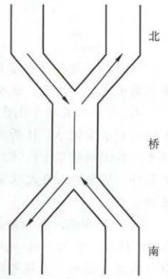

# 同步，互斥与死锁

## 引入

并发：在**同一时间间隔内**多个事件发生。例如一个CPU快速切换执行两个进程。

并行：**同时**多个事件发生。例如两个CPU，正在分别执行进程。

多进程可并发执行，进程的执行可能在任意时间点被中断（`count++`可以细分为多条机器指令），导致部分执行，对于共享数据的并发访问可能导致数据的不一致性，维护数据的一致性需要一定的机制。

**竞争条件（race condition）**：多个进程并发访问并操作共享数据，结果值依赖特定的访问顺序。

为防护竞争条件的发生，每次只允许一个进程访问共享数据。进程同步（process synchronization）处理此类问题。

## 制约关系

进程之间存在两种制约关系，即同步和互斥。同步是指严格控制不同进程中代码段的执行顺序，互斥是指同一时刻只允许一个进程访问临界资源。

-   同步是由于并发进程之间需要协调完成同一个任务时引起的一种关系。例如一个进程等待另一个进程向它发送消息或数据。
-   互斥是由于并发进程之间竞争系统的临界资源引起的。 例如一个进程等待另一个进程已经占有的必须互斥使用的资源。

**例子：**

-   若干学生去图书馆借书：互斥关系，同一本书只能被一个学生借阅，或者任何时刻只能有一个学生借阅一本书。 
-   流水线生产的各道工序：同步关系，一个工序完成后开始下一个工序。
-   有界缓冲区：同步和互斥。

## 临界区

**临界区（Critical Section, CS）**指代码中改变共享变量、更新表格、写文件等操作的区域。必须保证只有一个进程在其CS内。

**临界区问题（Critical Section Problem）**即设计协议（protocol）以便协作进程，每个进程在进入临界区前应获得允许。

请求许可的区域被称为进入区（entry section），临界区之后是退出区（exit section），其他代码为剩余区（remainder section）。

```
do{
	[进入区]
		[临界区]
	[退出区]
	
	[剩余区]
}while(true);
```

临界区的解决方案应满足3个条件：

1.   互斥（mutual Exclusion）：当进程Pi在其CS时，其他进程不能在其CS内 
2.   前进（progress）：当无进程在其CS内且有进程希望进入到其CS时，选择下一进入CS的进程不能无限期推迟
3.   有限等待（bounded waiting）：存在一个限界bound，当一个进程请求进入其CS其在该请求得到允许的期间内，其他进程进入其CS的次数不能超过bound

## 解决方案

- Peterson解决方案
- `test_and_set`与`compare_and_swap`
- 互斥锁的`acquire`和`release`
- 信号量的`wait`和`signal`（或者P和V）

信号量是一个整形变量，它除了初始化外只能通过 wait()和signal()操作来访问。关键操作为 P 操作（wait 操作）和 V 操作（signal 操作）。 P 操作将信号量的值减去 1，若减去后小于 0 则阻塞当前进程。V 操作将信号量的值加上 1，若加上后大于或等于 0 则让一个因P操作阻塞的进程进入就绪状态。

## 经典同步问题

- 有界缓冲问题
- 读者-写者问题
- 哲学家就餐问题

### 有界缓冲问题

生产者和消费者共享数据结构：

```c
int n;//缓冲区大小
semaphore mutex = 1;//缓冲池互斥锁
semaphore empty = n;//几个空位
semaphore full = 0;//几个位置被填充了
```

生产者：

```c
do{
    //生产产品
    
    P(empty);
    P(mutex);
    
    //将一个产品放入缓冲区
    
    V(mutex);
    V(full);
} while(true);
```

消费者：

```c
do{
    P(full);
    P(mutex);
    
    //从缓冲区取出一个产品
    
    V(mutex);
    V(empty);
    
    //消费产品
} while(true);
```

### 读者-写者问题

两种思路：

- 只要还有读者，那么写者应该一直等待。下面的示例采用这种思路。
- 如果写者到来，那么在剩余读者读完后立即开始写，现在即使新的读者到来也先要等待写者。

读者写者共享数据结构：

```c
semaphore rw_mutex = 1;//读者写者共用的锁
semaphore mutex = 1;//用于保护read_count
int read_count = 0;//几个读者正在读
```

写者：

```c
do{
    P(rw_mutex);
    
    //写
    
    V(rw_mutex);
}while(true);
```

读者：

```c
do{
    P(mutex);
    read_count++;
    if(read_count==1)P(rw_mutex);//第一个读者
    V(mutex);
    
    //读
    
    P(mutex);
    read_count--;
    if(read_count==0)V(rw_mutex);//最后一个读者
    V(mutex);
}while(true);
```

### 哲学家就餐问题

小心死锁：每个哲学家都拿起左边的筷子，等待右边的筷子。

等待固定时间后放下筷子：小心活锁：每个哲学家都同时拿起左边的筷子，同时放下，同时拿起，同时放下……

思路：

- 允许最多四个哲学家在餐桌上。
- 必须在临界区内同时拿起两根筷子，下面的示例采用这种思路。
- 单号哲学家先拿左手边筷子，双号哲学家先拿右手边筷子。

共享数据结构：

```c
int chopsticks[5] = {1,1,1,1,1};
semaphore mutex = 1;//用于保护chopsticks
```

哲学家i：

```c
do{
    while(true){
        P(mutex);
        if ((chopsitcks[i] == 1) && (chopsitcks[(i+1)%5] == 1)) {  // 检查左边和右边有没有筷子
            chopsitcks[i]--; // 取走左边筷子
            chopsitcks[(i+1)%5]--; // 取走右边筷子
            V(mutex);
            break;
        }
        else{ // 资源不够，忙别的事，然后进行下一轮检测
            V(mutex);   
            //思考
        }
    }
        
    //吃饭
        
    P(mutex);
    chopsitcks[i]++; // 归还左边筷子
    chopsitcks[(i+1)%5]++; // 归还右边筷子
    V(mutex);
}while(true);
```

> 另外一种写法，简单但是不满足要求（没有人在思考，全在等待）：
>
> 共享数据结构：
>
> ```c
> semaphore chopsticks[5] = {1,1,1,1,1};
> semaphore mutex = 1;//用于保护chopsticks
> ```
>
> 哲学家i：
>
> ```c
> do{
>     P(mutex);
>     P(chopsitcks[i]);
>     P(chopsitcks[(i+1)%5]);
>     V(mutex);   
> 
>     //吃饭;
>         
>     P(mutex);
>     V(chopsitcks[i]);
>     V(chopsitcks[(i+1)%5]);
>     V(mutex);
> }
> ```

> 总结：信号量还是共享数据？是否需要等待操作

## 管程

管程是提供由程序员定义的一组实现互斥操作的一种抽象数据类型。

管程的引入是为了解决临界区分散所带来的管理和控制问题。 在没有管程之前，对临界区的访问分散在各个进程之中，不易发现和纠正分散在用户程序中的不正确地使用 P，V 操作等问题。 管程将这些分散在各进程中的临界区集中起来， 并加以控制和管理， **管程一次只允许一个进程进入管程内**， 从而既便于系统管理共享资源， 又能保证互斥。  

管程的组成部分：

1.  管程的名称。
2.  局部于管程的共享数据结构说明。
3.  对该数据结构进行操作的一组过程。
4.  对局部于管程的共享数据设置初始值的语句。

Hoare（霍尔） 管程的语义如下： 

1. 线程 A 进入管程 
2. 线程 A 等待某个资源 
3. 线程 B 进入管程 
4. 线程 B 释放线程 A 等待的资源，唤醒线程 A，而线程 B 进入Signal Queue 
5. 线程 A 重新进入管程继续执行 
6. 线程 A 离开管程 
7. 线程 B 重新进入管程 
8. 线程 B 离开管程 
9. 其他线程可以继续进入管程

## 死锁与必要条件

死锁：两个或两个以上的进程在执行过程中，因竞争资源造成的一种互相等待的现象，若无外力作用，都将无法继续推进。

- 互斥：进程要求对所分配的资源进行排它性控制，即在一段时间内某资源仅为一进程所占用
- 占有并等待：当进程因请求资源而阻塞时，对已获得的资源保持不放
- 非抢占：进程已获得的资源在未使用完之前，不能剥夺，只能在使用完时由自己释放
- 循环等待：在发生死锁时，必然存在一个进程--资源的环形链。

如果每个资源类型只有一个实例，那么如果资源分配图（长方形代表资源，圆形代表进程）有环，则是死锁的充分必要条件。

如果每个资源类型有多个实例，那么如果资源分配图有环，则是死锁的必要条件。

## 死锁处理方法

- 预防死锁。
- 避免死锁。
- 检测死锁再加以恢复。
- 忽略死锁，这个（放弃治疗的）做法被大部分操作系统采用，考虑到代价。

### 死锁预防

即破坏四个必要条件来预防死锁：

- 互斥：破坏互斥？不现实。
- 持有并等待：让每个进程在执行前申请所有需要的资源；或者在申请更多的资源前，需要释放已有的所有资源。
- 无抢占：破环无抢占只能用于可以保存和恢复的资源。
- 循环等待：对所有资源进行排序，按照顺序申请资源。

### 死锁避免

即在进程申请可用资源时，操作系统应当决定可以立即分配还是应该让进程等待。只有在分配资源后系统仍然处于安全状态才能允许申请。

非安全状态时死锁状态的必要条件。

如果每个资源类型只有一个实例，那么如果资源分配图有环，则是死锁的充分必要条件。

如果每个资源类型有多个实例，采用银行家算法：

数据结构：

```c
int n;//n个进程
int m;//m个资源类型

int Available[m];//每种资源可用实例数量
int Max[n][m];//进程i最多需求k个资源j
int Allocation[n][m];//进程i已经分配k个资源j
int Need[n][m];//进程i还需要k个资源j，即Max[i][j]-Allocation[i][j]
```

符号：

如果向量X与Y长度都为n，X<Y指X的所有元素小于Y对应的元素

行向量表示，例如$$Allocation_i$$代表分配给进程$$P_i$$的资源

安全算法（判断系统是否正处于安全状态）：具体算法看书，只要能回收资源就回收资源，如果全部进程能完成则安全。

资源请求算法（判断请求后系统是否处于安全状态）：基于Need，具体算法看书，首先请求不能超过其最大需求，如果当前Available不够则等待，够则判断如果分配完是否安全，如果安全则分配。

### 死锁检测

如果每个资源类型只有一个实例，那么如果等待图有环，则是死锁的充分必要条件。

如果每个资源类型有多个实例，具体算法看书。与银行家的资源请求算法有两个不同点：

- 初始化时，如果一个进程没有分配任何资源，它不可能参与死锁，Finish置True
- 基于Request而不是基于Need，因为死锁检测关注现在，死锁避免关注未来。

### 死锁恢复

- 终止进程
- 抢占资源，但不可以从非死锁进程抢占资源

## 例题

### T1

某系统有 n 台互斥使用的同类设备，三个并发进程分别需要 3、4、5 台设备，求可确保系统不发生死锁的设备数 n 最小数。
$$
(3-1)+(4-1)+(5-1)+1=10
$$

### T2

某系统中共有 11 台磁带机，X 个进程共享此磁带机设备，每个进程最多请求使用3 台，求系统必然不会死锁的最大 X 值。
$$
X\times(3-1)<11 \to X<5.5\to X=5
$$

### T3

在一个仓库中可以存放 A 和 B 两种产品，要求: 

1. 每次只能存入一种产品。 
2. A 产品数量-B 产品数量<M
3. B 产品数量-A 产品数量<N

其中，M、N 是正整数，试用Р操作、V 操作描述产品 A 与产品 B 的入库过程。

```c
semaphore sa = M - 1;
semaphore sb = N - 1;
semaphore mutex = 1;

void A(){
    while(1){
        P(sa);
        P(mutex);
        //A入库
        V(mutex);
        P(sb);
    }
}

void B(){
    while(1){
        P(sb);
        P(mutex);
        //B入库
        V(mutex);
        P(sa);
    }
}
```

### T4

某寺庙，有小和尚、老和尚若干，有一水缸，由小和尚提入水缸供老和尚饮用。水缸可容 10 桶水，水取自同一井中。水井径窄，每次只能容一个桶取水。水桶总数为3 个。每次入缸取水仅为 1 桶水，且不可同时进行。试给出有关从缸取水、入水的算法描述。

```c
semaphore well = 1;//保护水井
semaphore vat = 1;//保护水缸
semaphore pail = 3;//几个水桶可以用
semaphore empty = 10;//几个空位
semaphore full = 0;//几个满

void old(){
    while(1){
        P(full);
        P(pail);
        P(vat);
        //从水缸打水
        V(vat);
        V(pail);
        V(empty);
    }
}

void young(){
    while(1){
        P(empty);
        P(pail);
        P(well);
        //从水井打水
        V(well);
        P(vat);
        //放入水缸
        V(vat);
        V(pail);
        V(full);
    }
}
```

### T5

有桥如图所示。车流方向如箭头所示。回答如下问题： 



1. 假设该桥上每次只能有一辆车行驶,试用信号灯的 P、V 操作实现 交通管理。 
2. 假设该桥上不允许两车交会,但允许同方向多个车一次通过（即 桥上可有多个同方向行驶的车)。试用信号灯的 P、V 操作实现桥上 交通管理。

第一小题：

```c
semaphore bridge = 1;//保护桥

void NS(){
    P(bridge);
    //从北向南
    V(bridge);
}

void SN(){
    P(bridge);
    //从南向北
    V(bridge);
}
```

第二小题：

```c
int countSN = 0;//多少辆车正在从南向北
int countNS = 0;//多少辆车正在从北向南
semaphore mutexSN = 1;//保护countSN
semaphore mutexNS = 1;//保护countNS
semaphore bridge = 1;//保护桥

void NS(){
    P(mutexNS);
    countNS++;
    if(countNS == 1) P(bridge);
    V(mutexNS);
    
    //从北向南
    
    P(mutexNS);
    countNS--;
    if(countNS == 0) V(bridge);
    V(mutexNS);
}

void SN(){
    P(mutexSN);
    countSN++;
    if(countSN == 1) P(bridge);
    V(mutexSN);
    
    //从南向北
    
    P(mutexSN);
    countSN--;
    if(countSN == 0) V(bridge);
    V(mutexSN);
}
```

### T6

10个并发进程共享变量，最多允许4个进程进入临界区，那么信号量可能的取值为：

4，3，2，1，0，-1，-2，-3，-4，-5，-6

### T7

在一个俱乐部中，客人如果要抽烟，那么服务员甲送烟，服务员乙送火， 使用P、V 操作实现。

```c
semaphore rc = 0;//请求烟的数量
semaphore rf = 0;//请求火的数量
semaphore c = 0;//送烟
semaphore f = 0;//送火

void customer(){
    while(1){
        V(rc);
        P(c);
        
        V(rf);
        P(f);
    }
}

void jia(){
    while(1){
        P(rc);
        V(c);
    }
}

void yi(){
    while(1){
        P(rf);
        V(f);
    }
}
```

### T8

生产者生产产品放到缓冲区1，搬运者从缓冲区1搬运产品放到缓冲区2，消费者消费缓冲区2的产品，假设缓冲区容量都是1，使用P、V 操作实现。

```c
semaphore mutex1 = 1;//保护缓冲区1
semaphore full1 = 0;//缓冲区1几个填满
semaphore empty1 = 1;//缓冲区1几个空位
semaphore mutex2 = 1;//保护缓冲区2
semaphore full2 = 0;//缓冲区2几个填满
semaphore empty2 = 1;//缓冲区2几个空位

void producer(){
    while(1){
        //生产产品
        
        P(empty1);
        P(mutex1);
        //放入缓冲区1
        V(mutex1);
        V(full1);
    }
}

void carrier(){
    while(1){
        P(full1);
        P(mutex1);
        //从缓冲区1拿出一个产品
        V(mutex1);
        V(empty1);
        
        P(empty2);
        P(mutex2);
        //放入缓冲区2
        V(mutex2);
        V(full2);
    }
}

void customer(){
    while(1){
        P(full2);
        P(mutex2);
        //从缓冲区2拿出一个产品
        V(mutex2);
        V(empty2);
        
        //消费产品
    }
}
```


