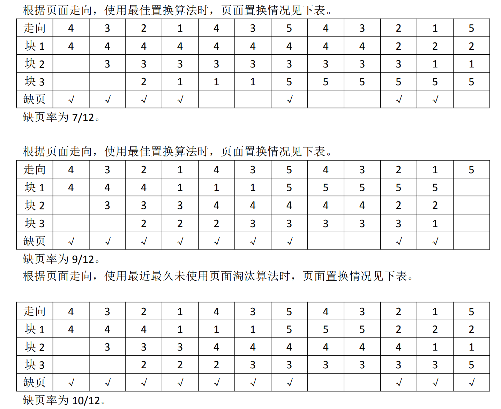

# 内存管理

## 地址

逻辑地址（虚拟地址）指CPU生成的地址，物理地址指内存单元看到的地址。

- 程序源代码：地址以符号出现。
- 编译成目标文件：符号绑定到可重定位地址（例如本模块开始的第14字节）。
- 静态链接为可执行程序：将可重定位地址绑定到绝对地址，形成逻辑地址。
- 装载（加载）：静态装入将程序运行所需要的指令和数据全部装入内存中。动态装入的思想是程序用到哪个模块，就将哪个模块装入内存，如果暂时不装入就存放在磁盘中。
- 动态链接：在运行时进行链接。
- 执行：进行动态重定位，指在程序运行过程中进行逻辑地址与物理地址的变换。

## 连续内存分配

- 单一连续分配
- 固定分区分配
- 可变分区/动态分区分配，在进程创建时动态建立。
  - 首次适应
  - 最优适应
  - 最差适应

外部碎片与内部碎片问题。

## 分段

将程序分为多个**长度不同**的多个段。允许进程的物理空间非连续。存在外部碎片。

逻辑地址有两个部分组成：段号、段偏移。由段号在段表中找到条目，每个条目两个信息：段基地址、段界限。

对于32位的逻辑地址，如果段号16位，则段偏移16位，则一个进程最多有$$2^{16}$$个段，每个段最长$$2^{16}B=64KB$$

## 分页

将程序分为多个**长度相同**的多个部分。一个部分，从物理内存看叫帧，从逻辑内存看叫页。允许进程的物理空间非连续。存在内部碎片。

逻辑地址有两个部分组成：页码、页偏移。由页码在页表中找到条目，每个条目一个信息：帧号。

如果逻辑地址空间$$2^mB$$，页面大小$$2^nB$$，那么逻辑地址中页码占(m-n)位，页偏移占n位。如果物理地址空间$$2^kB$$，那么物理地址中前(k-n)位为帧号，后n位是偏移。页表共$$2^{m-n}$$个条目，每个条目长(k-n)位。

举个例子，如果每个页表条目4B长，帧大小为4KB，那么可以访问的物理内存大小为$$2^{32+12}B=16TB$$

当内存资源不足时，**Linux把某些页的内容转移至硬盘上的一块空间上，以释放内存空间**。硬盘上的那块空间叫做**交换空间**(swap space)。

其他概念：

- TLB（转换表缓冲区，Translation Look-aside Buffer）
- 保护
- 共享页

## 页表结构

- 分层分页（向前映射表）
- 段页式：每个进程一张段表，每个段一张页表
- 哈希页表
- 倒置页表

## 虚拟内存

虚拟内存是计算机系统内存管理的一种技术。它使得应用程序认为它拥有连续可用的内存（一个连续完整的地址空间），而实际上，它通常是被分隔成多个物理内存碎片，还有部分暂时存储在外部磁盘存储器上，在需要时进行数据交换。与没有使用虚拟内存技术的系统相比，使用这种技术的系统使得大型程序的编写变得更容易，对真正的物理内存（例如 RAM）的使用也更有效率。

基本概念：

- 请求调页：缺页中断，决定淘汰页，页面调出，页面调入。
- 写时复制

**请求调页**是指操作系统在执行某个程序时，当程序需要访问的页面（即程序中的某一部分数据或代码）不在内存中时，操作系统需要将该页面从磁盘（通常是硬盘）加载到内存中的过程。虚拟内存系统将物理内存和磁盘结合起来使用，使得程序可以运行时不必将所有数据都装入物理内存中。

**缺页中断**是当程序试图访问的页面不在物理内存中时，由硬件自动触发的中断。缺页中断的触发过程和处理步骤如下：

1. **页面访问**：程序试图访问某个虚拟地址。
2. **页表检查**：硬件或操作系统检查页表，发现该虚拟地址对应的页面不在物理内存中。
3. **缺页中断触发**：硬件触发缺页中断，通知操作系统处理这个情况。
4. **中断处理**：操作系统中断处理程序开始执行，处理缺页中断。
5. 页面调入：
   - **页框分配**：操作系统分配一个空闲的物理页框，或者通过页面替换算法（如LRU、FIFO）选择一个现有的页框进行替换。
   - **磁盘读取**：从磁盘读取所需页面数据，将其加载到分配的物理页框中。
6. **页表更新**：更新页表，使其指向新的物理页框。
7. **恢复执行**：中断处理完成后，恢复程序执行，重新尝试访问之前失败的虚拟地址，现在它已经在内存中。

## 页面置换算法

两个评价准则：

- 缺页错误率，越低越好。
- 希望当帧数量增加时，缺页错误数量降低。反之则称具有Belady异常。

算法分类：

- FIFO先进先出。具有Belady异常
- OPT最优页面置换：每次选择淘汰的页面将是以后永不使用，或者在最长时间内不再被访问的页面，这样可以保证最低的缺页率。
- LRU最近最少使用
- 近似LRU：额外引用位算法、第二次机会算法（别名CLOOK）、增强型第二次机会算法（别名改进型CLOOK）
- LFU最不经常使用
- MFU最经常使用

## 帧分配

每个进程的最小帧数由体系结构决定，最大帧数不能超过可用物理内存数量。

> 虚拟内存大小不能超过内存与外存容量之和，也不能超过计算机地址位数能容纳的最大容量。

- 平均分配
- 比例分配

- 全局置换
- 局部置换

## 其他概念

- 抖动：刚刚换出的页面马上要换入主存，刚刚换入的页面马上要换出主存这样的现象。原因是系统中同时运行的进程太多，分配给每个进程的物理块太少，不能满足基本需求，频繁出现缺页错误。
- 工作集：最近一段时间内，进程访问的页面集合。
- 内存映射：将磁盘文件的全部或者部分内容与进程虚拟地址空间的某个区域建立映射关系，可以直接访问被映射的文件，不必使用IO和缓存。可用于进程数据共享。
- 伙伴系统

## 例题

### T1

 已知系统为32位实地址，采用48位虚拟地址，页面大小4KB，页表项大小为8B；每段最大为4GB。

（1）假设系统使用纯页式存储，则要采用多少级页表，页内偏移多少位？

页面大小为4KB，故页内偏移需要12位
页表项大小为8B，而一个页面4KB，故一个页面可以放4KB/8B，即$2^9$个页面号，而虚拟地址为48位，故需要采用的页表级数为(48-12)/9，答案为4级页表

（2）假设系统采用一级页表，TLB命中率为98%，TLB访问时间为10ns，内存访问时间为100ns，并假设当TLB访问失败后才访问内存，问平均页面访问时间是多少？

页面访问需要访问内存，查页表需要访问内存，TLB不在内存中。
$$
0.02\times (10+100+100)+0.98\times (10+100)=112ns
$$
（3）如果是二级页表，页面平均访问时间是多少？
$$
0.02\times (10+100+100+100)+0.98\times (10+100)=114ns
$$
（4）按照（2）中，如果要满足访问时间<=120ns，那么命中率需要至少多少？
$$
(1-x)\times210+x\times 110=120 \to x=0.95
$$

### T2

页式存储管理允许用户的编程空间为 32 个页面（每页 1KB），主存为16KB。如有一用户程序为 10 页长，且某时刻该用户程序页见表：

| 逻辑页号 | 物理块号 |
| -------- | -------- |
| 0        | 8        |
| 1        | 7        |
| 2        | 4        |
| 3        | 10       |

若分别遇到三个逻辑地址 0AC5H,1AC5H,3AC5H 处的操作，计算并说明存储管理系统将如何处理。

页面大小为 1KB，所以低 10 位为页内偏移地址；用户编程空间为 32 个页面，即逻辑地址高 5 位为虚页号；主存为 16 个页面，即物理地址高 4 位为物理块号。

- 逻辑地址 0AC5H 转换为二进制是 000 1010 1100 0101B,虚页号为 2(00010B),映射至物理块号 4,故系统访问物理地址 12C5H(01 0010 1100 0101B)。 
- 逻辑地址 1AC5H 转换为二进制是 001 1010 11000101B,虚页号为 6(00110B),不在页面映射表中，会产生缺页中断，系统进行缺页中断处理。 
- 逻辑地址 3AC5H 转换为二进制是 011 1010 1100 0101B,页号为 14,而该用户程序只有10 页，故系统产生越界中断。

### T3

页式管理机制下，若页表长度是 4，逻辑地址是 8 位，物理地址是 10 位， 则 

1. 该页式系统下最多支持多少个物理页？ 
2. 某进程的页表如下图，则逻辑地址 241 对应的物理地址是什么？

| 逻辑页号 | 物理块号 |
| -------- | -------- |
| 0        | 2        |
| 1        | 5        |
| 2        | 1        |
| 3        | 8        |

第一小题：

页表长度是 4，逻辑地址中高2位为页号，那么低6位是偏移，那么物理地址中高4位是块号，支持$2^4=16$个物理页

第二小题：
$$
(241)_{10}=(11110001)_2
$$
低6位是偏移，高2位逻辑页号是3，查表得物理块号是8，所以：
$$
(1000110001)_2=(561)_{10}
$$

### T4

在一个请求分页存储管理系统中，一个作业的页面走向为 4，3，2，1，4，3，5，4，3，2，1，5，当分配给作业的物理块数为 3 时，计算采用下述页面淘汰算法时的缺页率（假设开始执行时主存中没有页面），并比较结果。 （1）最佳置换算法。 （2）先进先出置换算法。 （3）最近最久未使用方法。

