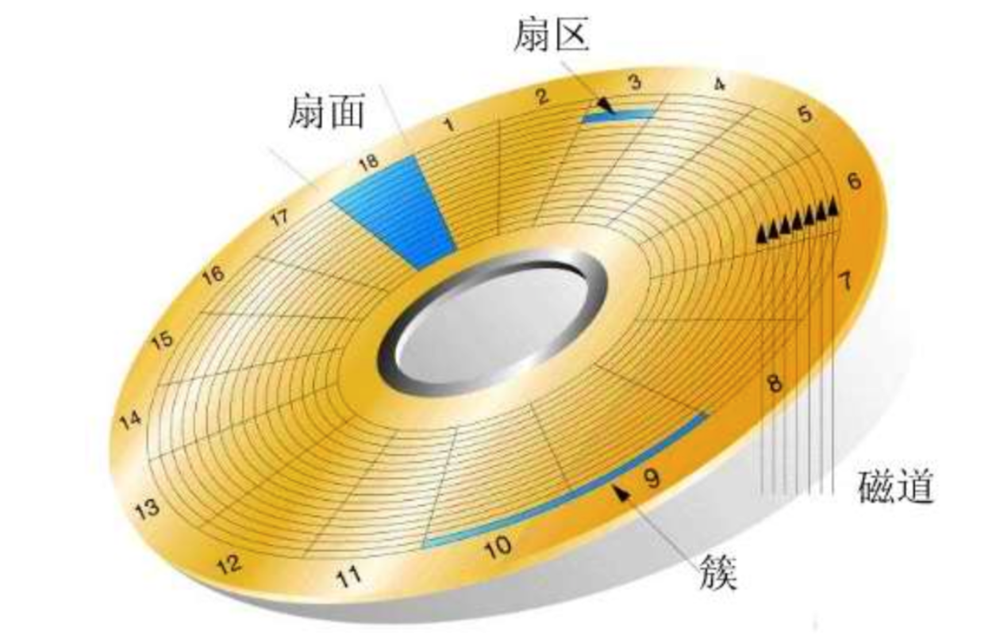
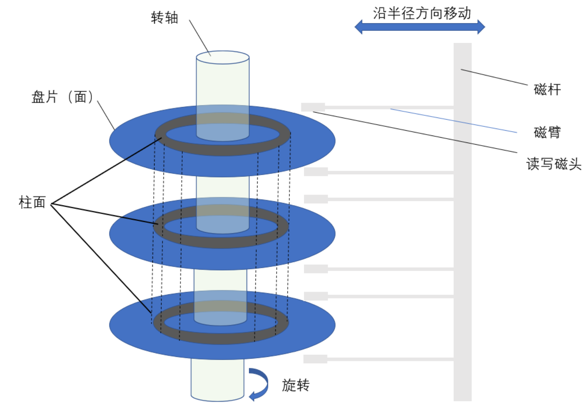

# 文件系统

[TOC]

## 接口

### 文件类型

- 按文件的性质和用途分，分为系统文件、库文件和用户文件
- 按文件的组织形式分，分为普通文件、目录文件和特殊文件
- 按文件的保护级别分，分为只读文件、读写文件、可执行文件和不保护文件

在 UNIX 操作系统中，将 I/O 设备视为特殊文件。

### 访问方法

- 顺序存取（顺序访问）。每次存取都必须从当前文件指针位置，按地址从低到高的顺序依次访问每个数据。适用于老式的大容量存储设备。
- 随机存取（直接访问，相对访问）。每次可以访问任意指定的地址上的数据。更为灵活高效。
- 索引。

### 目录结构

- 单级目录。重名问题。
- 两级目录。不利于文件共享。
- 树形目录。UNIX使用带链接的树形目录结构。
- 无环图目录。共享。
- 通用图目录。检索和删除需要特殊算法。

软连接（基于符号链），可以看成是window的快捷方式，可以让你快速链接到目标文件或目录，它找的是源文件名，再通过源文件名，找到文件的真实内容。

硬链接（基于索引节点）。通过文件系统的inode值，产生新的**文件名**，不是新文件，类似给一个文件取了一个别名，这个别名文件和源文件都指向源文件的inode

- ln -s创建软链接 ln创建硬链接
- 目录不能创建硬链接，且不能跨分区系统创建。软链接支持文件和目录，且能跨分区系统创建
- 硬链接文件与源文件的inode是一样的，软链接不一样
- 删除软链接文件和硬链接文件对源文件没有任何影响
- 删除源文件，软链接失效，硬链接没有影响还可以访问（通过inode找到block的真实数据）删除源文件和硬链接，这个文件会真正被删除

## 实现

### 文件系统结构

由上到下为：

- 应用程序（不属于文件系统）
- 逻辑文件系统：则负责文件系统的逻辑结构，即元数据。
- 文件组织系统：负责给文件数据分配磁盘块，同时也负责管理空闲磁盘块。
- 基本文件系统：以磁盘块为单位控制磁盘驱动进行读写。
- I/O 控制：最底层，由设备驱动程序和中断处理程序组成，实现内存与磁盘之前的信息传输。
- 设备（不属于文件系统）

### 文件物理结构/磁盘空间分配方法

指文件在磁盘上如何存储。

- 连续分配。难以确定文件大小。
- 链接分配。没有外部碎片，随机访问耗时长。一个变种是FAT（文件分配表，File-Allocation Table）
- 索引分配。每个文件有索引块，包含所有磁盘块的指针。索引块的具体方案包括链接，多级和组合方案。UNIX的inode使用组合方案。

### 空闲空间管理

- 位图法。占用的管理空间更小，更为灵活高效。
- 链接法。空闲磁盘块用链表链接起来。
- 组/成组链接。在一个空闲块中放入(n-1)个空闲数据块地址和下一个包含地址的空闲块。UNIX采用成组链接。
- 计数。

## 外存结构

### 磁盘概念

- 磁臂。
- 磁道。
- 扇区：基本存储单位
- 柱面。
- 分区：一个磁盘可以划分为多个分区，每个分区可以有各自的文件系统。
- 卷：包含文件系统的分区称为卷
- 延迟：寻道时间+旋转延迟

### 磁盘调度

- FCFS（先来先服务）
- SSTF（最短寻道时间优先，贪心）
- SCAN（扫描，或者电梯算法）
- C-SCAN。当磁头达到一端时，立即返回但不处理回程时的任何请求。
- LOOK，基于SCAN。（或者C-LOOK基于C-SCAN）到达最远请求而不是一端时返回。

### 其他概念

- 格式化
- 引导：加电启动，固件上的引导程序，磁盘上的引导程序，调入操作系统执行
- 交换空间
- RAID

> 1、低级格式化就是和操作系统⽆关的格式化。
>         低级格式化是物理级的格式化，简单的说硬盘在制作的时候，划分磁柱⾯、建⽴扇区的过程就是低级初始化，这是一个从无到有的过程。所以大家刚买来的硬盘就是已经经过低级格式化的硬盘，不用自己做低级格式化了。
>
>         什么时候会用到低级格式化呢？这种情况用的不多，大多数情况下都是硬盘坏道太多了，影响数据正确性，还可能导致操作系统都不可用了，这个时候就需要低级格式化了。
>
> 2、⾼级格式化就是和操作系统有关的格式化
>         ⾼级格式化主要是对硬盘的各个分区进⾏磁道的格式化，在逻辑上划分磁道。高级格式化，又称逻辑格式化，它是指根据用户选定的文件系统（如FAT12、FAT16、FAT32、NTFS、EXT2、EXT3等），在磁盘的特定区域写入特定数据，以达到初始化磁盘或磁盘分区、清除原磁盘或磁盘分区中所有文件的一个操作。
>
>         ⾼级格式化就是清除硬盘上的数据、⽣成引导区信息、初始化FAT表、标注逻辑坏道等。⼀般我们重装系统时都是⾼级格式化，因为MBR不重写（主引导记录MBR也被称为主引导扇区，是计算机开机以后访问硬盘时所必须要读取的第一个扇区，主引导扇区记录着硬盘本身的相关信息以及硬盘各个分区的大小及位置信息）。