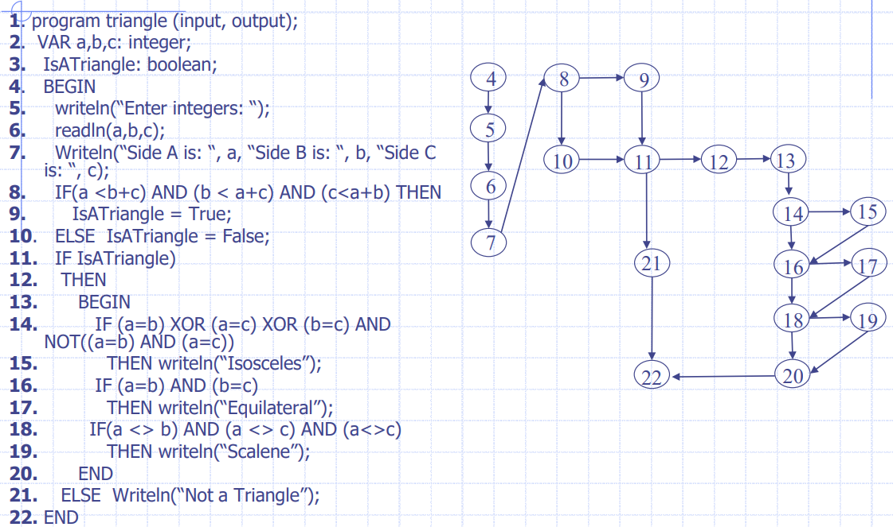
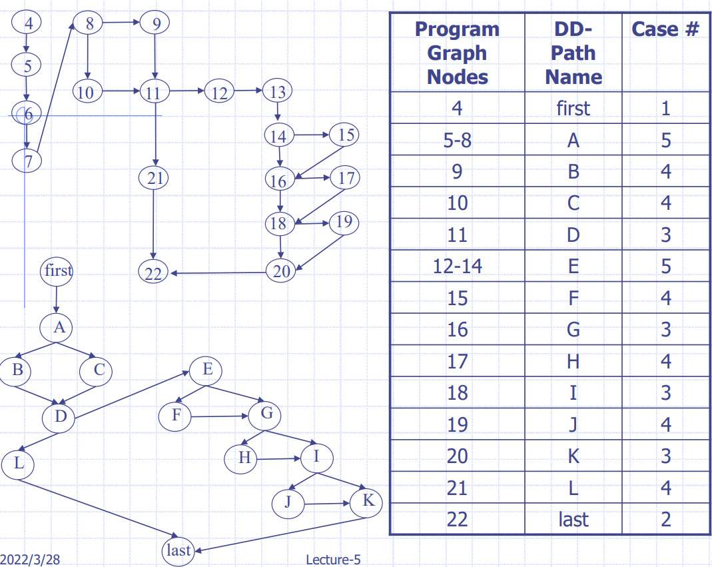
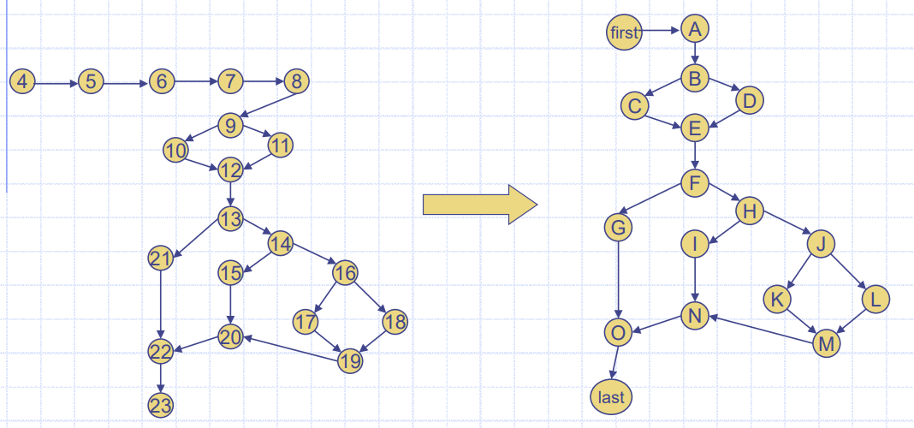
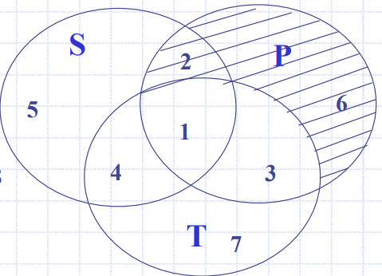
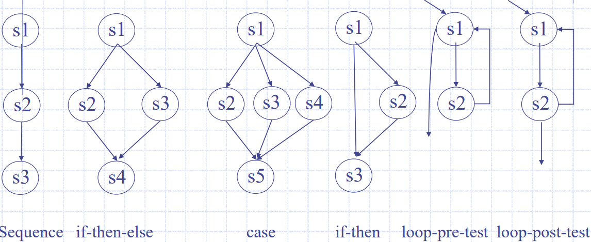
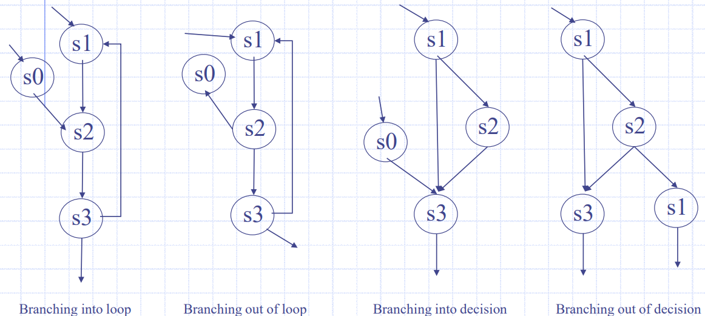
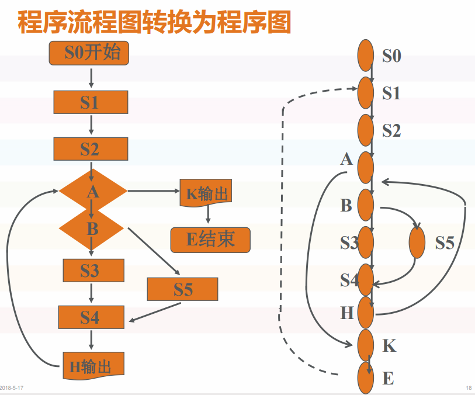

# 白盒测试

也叫结构测试

## 代码逻辑覆盖测试

覆盖率是用来度量测试完整性的一个手段。分为逻辑覆盖和功能覆盖两大类。

逻辑覆盖包括：

- 语句覆盖。即每个语句至少能执行一次
- 判定覆盖。每个判定的分支至少执行一次。
- 条件覆盖。即一个判断语句中往往包含了若干条件（复合条件例如`a>1&&b<10`)。通过给出测试用例，使判断中的每个条件都获得各种可能的结果。
- 判断/条件覆盖。选取足够多的测试数据，使判断中每个条件都取得各种可能值，并使每个判断表达式也取到各种可能的结果。
- 条件组合覆盖。使得每个判断中条件的各种可能组合都至少出现一次。

## DD-Path

**路径测试**的重点是基于**程序图**的测试路径选择的测试技术。如果正确选择了一组路径，那么我们可以声称我们已经达到了一定的测试范围。

程序图例子：三角形问题



DD-Path 即 decision-to-decision path，DD-PATH是从程序图获得的链，其中链是一条**初始节点**和**终端节点**不同的路径，并且每个内部节点都具有indegree = 1，并且Outdegree = 1（即没有内部分支）。我们在下图中显示从程序图中选择节点以形成DD-Path链。 DD路径用于创建DD-PATH图


a DD-Path is a chain obtained from a program graph such that: 

- Case1: it consists of a single node with indeg=0. 
- Case2: it consists of a single node with outdeg=0, 
- Case3: it consists of a single node with indeg ≥ 2 or outdeg ≥ 2 
- Case4: it consists of a single node with indeg =1, and outdeg = 1 
- Case5: it is a maximal chain of length ≥ 1

## DD-Path图

给定一个程序，其DD-Path图是一个标记的有向图，其中节点是其程序图的DD-Path，而边缘表示连接DD-Paths之间的控制流。



## Basis Path

我们可以通过上面的DD-Path图识别六个可能的路径：

1. A-B-D-E-G-I-J-K-Last
2. A-C-D-E-G-I-J-K-Last
3. A-B-D-L-Last
4. A-B-D-E-F-G-I-J-K-Last
5. A-B-D-E-F-G-H-I-J-K-Last
6. A-B-D-E-F-G-H-I-K-Last

程序存在约束：

```
if Node B is traversed -> D, E are traversed
if Node C is traversed -> D, L are traversed
if Node E is traversed -> F, G, I are traversed
if Node F is traversed -> G, I are traversed
if Node H is traversed -> G, I are traversed
if Node J is traversed -> G, I are traversed
```

其中一些路径不可能，剩下：

1. A-C-D-L-Last
2. A-B-D-E-F-G-I-K-Last
3. A-B-D-E-G-H-I-K-Last
4. A-B-D-E-G-I-J-K-Last

------

另外一个例子：



我们可以通过DD-Path图识别八个可能的路径：

1. first – A – B – C – E – F – G – O – last  
2. first – A – B – D – E – F – G – O – last 
3. first – A – B – C – E – F – H – I – N – O – last 
4. first – A – B – D – E – F – H – I – N – O – last 
5. first – A – B – C – E – F – H – J – K – M – N – O – last 
6. first – A – B – D – E – F – H – J – K – M – N – O – last 
7. first – A – B – C – E – F – H – J – L – M – N – O – last 
8. first – A – B – D – E – F – H – J – L – M – N – O – last

由于代码的约束，Paths 1, 4, 6 and 8 不可能，剩下 2, 3, 5, 7

-------

我们可以将上面这些例子总结一下，一个程序和测试包括：

- 指定的程序行为，Specified program behavior (S)
- 程序可行路径，Programmed behavior (feasible paths) (P)
- 拓扑上可行的路径（包括由于程序约束不可行的路径），Topologically feasible paths (T)



- 区域1包含由可行路径实现的指定行为 - 最可取的。
- 每条可行的路径在拓扑上都是可能的，因此集合P的2,6应该为空。
- 区域3包含与未指定行为相对应的可行路径。必须检查此类额外功能。
- 区域4和7包含实际程序中不可行的路径。但是区域4是有问题的，因为它与指定行为相对应，这是编码错误。
- 区域 7 是指未指定的、不可行的、但拓扑上可能的路径（潜在的维护问题）可能成为区域 3。

## 结构化程序

结构化程序包含以下几种：



非结构化程序的例子：



