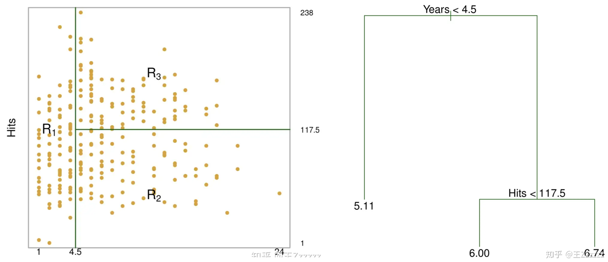
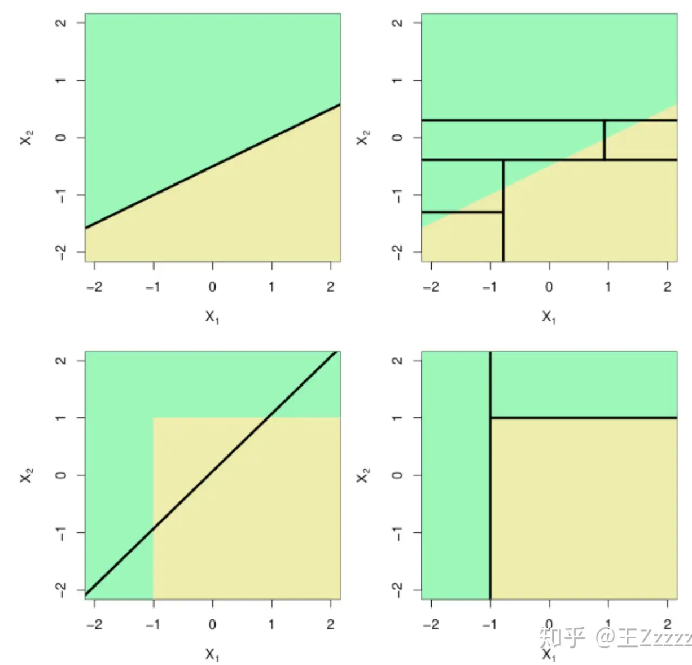

# 基于树的方法

## 决策树基本概念

决策树是贪心算法，每一步都选择当前步最好的，而不是选择对后面形成的整棵树最好的

### 回归树

建立回归树的步骤：

1. 将预测变量空间（X1...Xp可能取值的集合）分为J个互不重叠的区域R1...Rj
2. 对落入Rj的每个观测值作同样的预测，预测值等于Rj上训练集响应值的算术平均，如果是分类树，则分类为该区域最多的那类



计算决策树模型的RSS：
$$
\sum_{j=1}^{J}\sum_{i \in R_j}(y_i-\hat{y}_{R_j})^2
$$

其中，$\hat{y}_{R_j}$ 是第 j 个矩形区域中训练集的平均响应值

### 分类树

分类树与回归树类似，但是评判标注不能使用RSS，改为分类错误率、基尼系数和互熵

分类错误率（classification error rate）
$$
E=1-\max_{k}(\hat{p}_{mk})
$$
其中，$\hat{p}_{mk}$ 代表第 m 个区域的训练集中第 k 类所占比例。

基尼系数（Gini index）
$$
G=\sum_{k=1}^{K}\hat{p}_{mk}(1-\hat{p}_{mk})
$$
希望其越小越好

互熵（cross-entropy）
$$
D=-\sum_{k=1}^{K}\hat{p}_{mk}\log\hat{p}_{mk}
$$

希望其越小越好

## 树的剪枝

上述方法在训练集取得良好预测效果，但是可能造成过拟合，更好的策略是生成一个很大的树$T_0$，然后通过剪枝得到子树

剪枝的目的是选出使测试集预测误差最小的子树

**代价复杂性剪枝**也称**最弱联系剪枝**，不考虑每一棵可能的子树，而是考虑以非负调整参数α标记的一系列子树，每一个α的取值对应一棵子树$T⊂T_0$，当α一定时，其对应的子树使下式最小
$$
\sum_{m=1}^{|T|}\sum_{x_i∈R_m}(y_i-\hat{y}_{R_m})^2+α|T|
$$
$|T|$表示终端结点数，调整系数α在子树的复杂性与训练数据的契合度之间控制权衡，α增大：模型的偏差变大方差变小

剪枝过程：

```
(1)利用递归二叉分裂在训练集中生成一颗大树，只有当终端结点包含的观测值个数低于某个最小值时才停止
(2)对大树进行代价复杂性剪技，得到一系列最优子树，子树是α的函数
(3)利用K折交叉验证选择α。具体做法是将训练集分为K折。对所有k=1,...,K，有:
	(a)对训练集上所有不属于第K折的数据重复步骤1和2，得到与α一一对应的子树
	(b)求出上述子树在第k折上的均方预测误差
	上述操作结束后，每个α会有相应的K个均方预测误差，对这K个值求平均，选出使平均误差最小的α
(4)找出选定的α值在步骤2中对应的子树中即可
```

## 决策树评估

### 树与线性模型的比较

线性回归假设了如下模型形式：
$$
f(X)=β_0+\sum_{j=1}^{P}X_jβ_j
$$
回归树的模型形式为：
$$
f(X)=\sum_{m=1}^{M}c_m*1_{(X∈R_m)}
$$


- 线性边界，线性模型效果往往会更好
- 非线性边界：决策树效果好，但“广义”线性模型也可以达到这个效果。

### 树的优缺点

- 解释性强，比线性回归更好解释
- 更接近人的决策模式
- 可以使用图形表示，非专业人士轻松解释
- 可以直接处理定性的预测变量而不需创建哑变量
- 预测准确率一般低于其他回归和分类方法的水平

## 装袋法、随机森林和提升法

### 装袋法 Bagging

基本思想/目的：对一组观测求平均可以减小方差

从总体中抽取多个训练集，对每个训练集分别建立预测模型，再对由此得到的多个预测值求平均
$$
\hat{f}_{avg}(x)=\frac{1}{B}\sum_{b=1}^{B}\hat{f}^b(x)
$$
求平均的具体方法：多数投票（majority vote），将B个预测中出现频率最高的类作为总体预测

袋外误差估计：平均每棵树能利用约三分之二的观测值，剩余三分之一没有使用的观测称为此树的袋外（out-of-bag，OOB）观测值

可以用所有将第i个观测值作为OOB的树来预测第i个观测值的响应值，则有B/3个对第i个观测值的预测，对这些值计算总体的OOB均方误差（对回归问题）或分类误差（对分类问题），由此得到的OOB误差是对装袋法模型测试误差的有效估计

变量重要性：对基尼系数平均减小值最多的变量

### 随机森林 Random Forest

基本思想/目的：根分裂结点基本上都是最重要的预测变量，导致装袋法中抽取的树高度相关。故每次分裂点随机取变量，对树作去相关处理，降低模型方差

每次考虑树上的一个分裂点，从全部的p个变量中随机（每次都随机）选m个，作为候选变量。这次的分裂点只能从这m个中挑选，通常$m≈\sqrt{p}$

### 提升法 Boosting

目的：降低学习率，舒缓的迭代，使模型预测效果变好

1.对训练集中的所有i，令$\hat{f}(x)=0$，$r_i=y_i$

2.对$b=1,2,...,B$重复以下过程

​	（a）对训练数据$(X,r)$建立一棵有d个分裂点的树$\hat{f}^b$

​	（b）将压缩后的新树加入模型以更新$\hat{f}$：
$$
\hat{f}(x)⬅\hat{f}(x)+λ\hat{f}^b(x)
$$
​	（c）更新残差：
$$
r_i⬅r_i-λ\hat{f}^b(x)
$$
3.输出经过提升的模型：
$$
\hat{f}(x)=\sum_{b=1}^{B}λ\hat{f}^b(x)
$$

- 树的总数B：与装袋法和随机森林不同，B值过大可能过拟合，但是发展很缓慢，用交叉验证来选择B
- 取极小正值的压缩参数λ：控制学习速度，常取0.01或0.001，若λ很小，B则需要大一些
- 每棵树的分裂点数d：控制模型的复杂度，表示交互深度，d=1时（每棵树都是一个树桩）通常效果上佳。树更小模型解释性更强，用树桩会得到所谓加法模型