# R语言速查

## 下载和导入包

```R
install.packages("ISLR")
library(ISLR) 
```

补充：读取CSV：`Birth = read.csv("D:/Data/AIDataSet/data.csv")`

## 生成点

```R
x = rnorm(100)  # 100个服从N(0,1)的点
eps = rnorm(100, 0, 0.25)  # 100个服从均值为0，标准差为0.25的服从正态分布的点
dis.grid = seq(from = dislim[1], to = dislim[2], by = 0.1)  # 生成了一个序列，以0.1为步长，覆盖了dis的取值范围。
```

## 数据集信息

```R
str(College)
fix(college)
summary(college)
help(College)
dim(Auto)
names(Boston)
```

## 绘图

### 变量相关图

```R
pairs(college[,2:11])
```

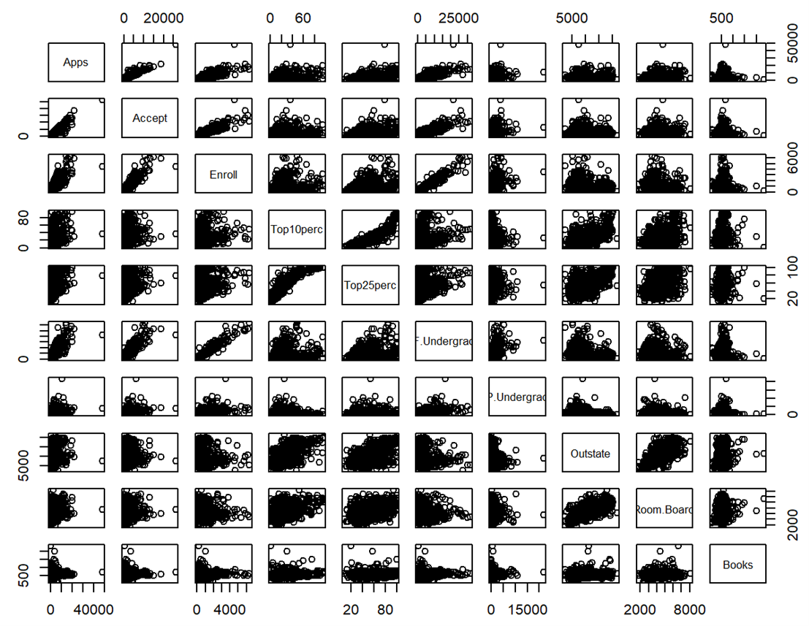

### 箱线图

```R
plot(factor(college$Private) ,college$Outstate)  # 非数值变量需要先经过 factor
```

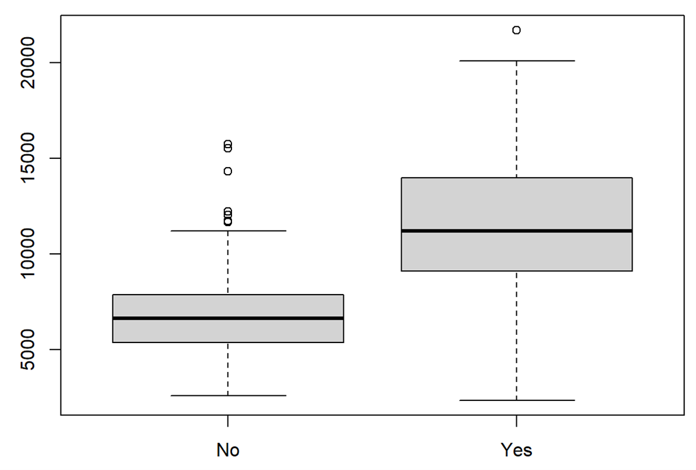

箱线图，元素包括：

- 上边缘
- 上四分位数
- 中位数
- 下四分位数
- 下边缘
- 异常值（离群点）

### 同时展示多幅图像

```R
par(mfrow=c(2,2))
hist(college$Apps)  # 直方图
hist(college$perc.alumni)
hist(college$S.F.Ratio)
hist(college$Expend)
```


### 散点图

```R
plot(Auto$horsepower,Auto$acceleration)
```

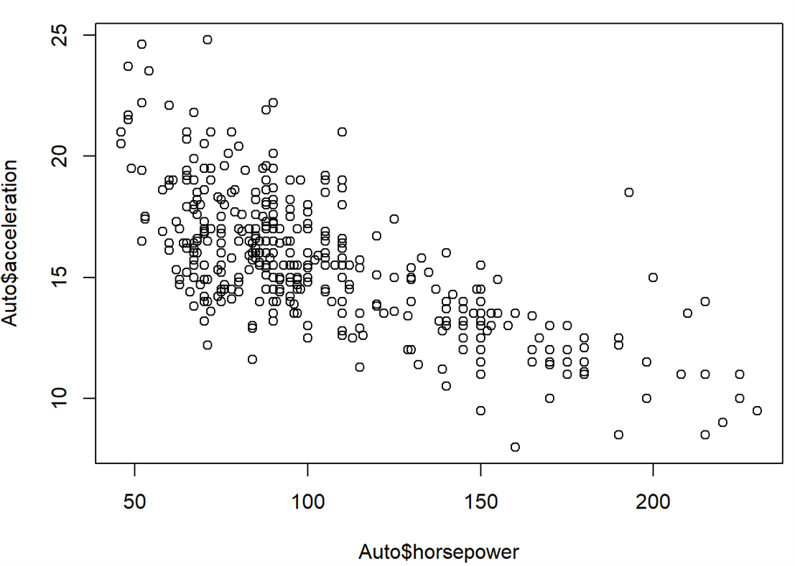

> 在R语言中，plot函数的参数包括：
>
> - x：要绘制的对象的横坐标数据。
> - y：要绘制的对象的纵坐标数据。
> - type：绘图类型，例如："p"表示散点图，"l"表示折线图, "b"表示同时绘制散点和折线等。
> - main：图表的主标题。
> - xlab：x轴的标签。
> - ylab：y轴的标签。
> - xlim：x轴的取值范围。
> - ylim：y轴的取值范围。
> - col：绘图的颜色。
> - pch：散点图中点的符号。
> - lty：线条的类型。
> - lwd：线条的宽度。
> - cex：点的大小。
> - bg：散点图中点的填充颜色。
> - las：坐标轴文本的方向。

## 线性回归

```R
lm.fit=lm(medv~lstat,data=Boston)
summary(lm.fit)
```

```
Call:
lm(formula = medv ~ lstat, data = Boston)

Residuals:
    Min      1Q  Median      3Q     Max 
-15.168  -3.990  -1.318   2.034  24.500 

Coefficients:
            Estimate Std. Error t value Pr(>|t|)    
(Intercept) 34.55384    0.56263   61.41   <2e-16 ***
lstat       -0.95005    0.03873  -24.53   <2e-16 ***
---
Signif. codes:  0 ‘***’ 0.001 ‘**’ 0.01 ‘*’ 0.05 ‘.’ 0.1 ‘ ’ 1

Residual standard error: 6.216 on 504 degrees of freedom
Multiple R-squared:  0.5441,	Adjusted R-squared:  0.5432 
F-statistic: 601.6 on 1 and 504 DF,  p-value: < 2.2e-16
```

```R
lm.fit = lm(mpg~ log(weight)+sqrt(year)+I(origin^2), data=Auto)
```

置信区间

```R
confint(lm.fit)
```

预测时的置信区间

```R
predict(lm.fit, data.frame(horsepower=c(98)), interval="confidence")
```

```
       fit      lwr      upr
1 24.46708 23.97308 24.96108
```

预测时的预测区间

```R
predict(lm.fit, data.frame(horsepower=c(98)), interval="prediction")
```

```
       fit     lwr      upr
1 24.46708 14.8094 34.12476
```

绘制散点图和回归曲线

```R
plot(Boston$lstat,Boston$medv)
abline(lm.fit)
```


检查拟合效果/离群点/高杠杆点

```R
par(mfrow=c(2,2))
plot(lm.fit)
```

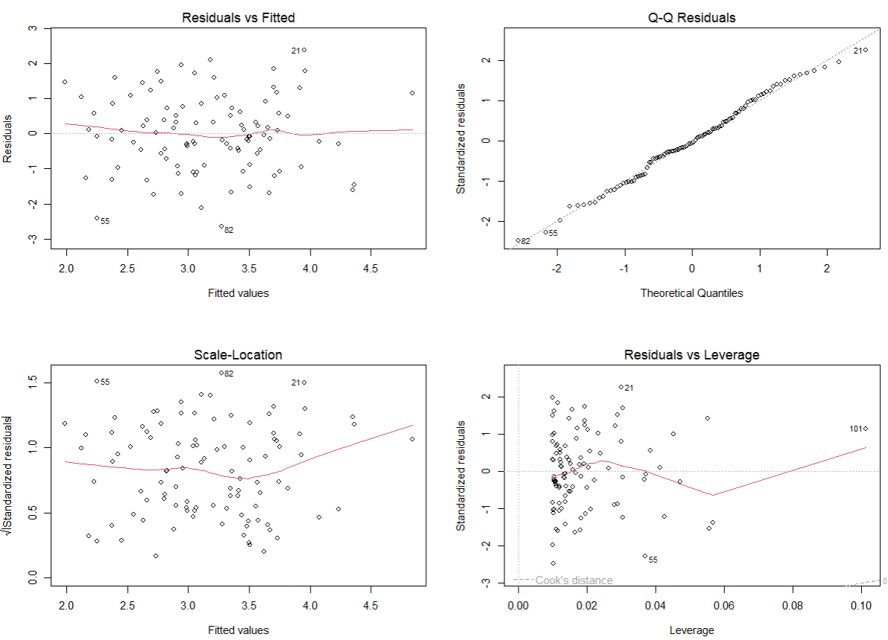

**Q-Q（Quantile-Quantile）Residuals 图**用于检验线性回归模型的残差是否符合正态分布。在这个图中：

1. 横轴通常表示标准化的理论分位数（来自于一个正态分布）。
2. 纵轴通常表示标准化的残差的样本分位数。

如果残差符合正态分布，那么残差的样本分位数应该落在理论分位数的直线上。因此，Q-Q Residuals 图提供了一种直观的方式来检查模型残差是否符合正态分布的假设。

通过观察Q-Q Residuals 图，我们可以检查残差是否存在明显的偏离正态分布的情况。如果残差点在图上基本上沿着一条直线分布，那么可以认为残差符合正态分布。反之，如果残差点呈现出明显的偏离，可能意味着模型的残差不符合正态分布。

**Residuals vs Leverage（残差与杠杆值）图**是用于识别在线性回归模型中具有高杠杆值（leverage）和/或高残差的数据点。在这个图中：

1. 横轴通常表示标准化的杠杆值，用于衡量每个观测对回归系数估计的影响程度。
2. 纵轴通常表示标准化的残差，即观测值与模型拟合值之间的差异。

Residuals vs Leverage 图的主要目的是帮助识别杠杆值高且/或残差高的观测数据点，这些数据点可能对回归模型的参数估计产生较大的影响。在图中，通常会画出一条水平参考线，称为Cook's 距离，用于帮助识别那些对回归系数估计具有较大影响的数据点。

通过Residuals vs Leverage 图，可以检查是否有任何杠杆值高且/或残差高的异常值或离群点，以及它们对回归分析的影响程度。这有助于判断模型是否符合回归分析的假设，并检测异常值的存在。

## 逻辑斯蒂回归

如果只有一个预测变量：
$$
P(X) = \frac{e^{\beta_0+\beta_1X}}{1+e^{\beta_0+\beta_1X}}
$$
多元逻辑斯蒂回归：
$$
P(X) = \frac{e^{\beta_0+\beta_1X_1+...+\beta_pX_p}}{1+e^{\beta_0+\beta_1X_1+...+\beta_pX_p}}
$$

```R
library(ISLR)
attach(Smarket)
glm.fit = glm(Direction~Lag1+Lag2+Lag3+Lag4+Lag5+Volume, family = binomial)
summary(glm.fit)
```

```
Call:
glm(formula = Direction ~ Lag1 + Lag2 + Lag3 + Lag4 + Lag5 + 
    Volume, family = binomial)

Coefficients:
             Estimate Std. Error z value Pr(>|z|)
(Intercept) -0.126000   0.240736  -0.523    0.601
Lag1        -0.073074   0.050167  -1.457    0.145
Lag2        -0.042301   0.050086  -0.845    0.398
Lag3         0.011085   0.049939   0.222    0.824
Lag4         0.009359   0.049974   0.187    0.851
Lag5         0.010313   0.049511   0.208    0.835
Volume       0.135441   0.158360   0.855    0.392

(Dispersion parameter for binomial family taken to be 1)

    Null deviance: 1731.2  on 1249  degrees of freedom
Residual deviance: 1727.6  on 1243  degrees of freedom
AIC: 1741.6

Number of Fisher Scoring iterations: 3
```

混淆矩阵和整体预测准确率

```R
glm.probs = predict(glm.fit, type = "response")
glm.pred = rep("Down", length(glm.probs))
glm.pred[glm.probs > 0.5] = "Up"
table(glm.pred, Direction)
```

```
        Direction
glm.pred Down  Up
    Down   54  48
    Up    430 557
```

将09，10年的数据单独拿出，其余作为训练集，在测试集上验证准确率

```R
train = (Year < 2009)
Weekly.0910 = Weekly[!train, ]
glm.fit = glm(Direction ~ Lag2, data = Weekly, family = binomial, subset = train)
glm.probs = predict(glm.fit, Weekly.0910, type = "response")
glm.pred = rep("Down", length(glm.probs))
glm.pred[glm.probs > 0.5] = "Up"
Direction.0910 = Direction[!train]
table(glm.pred, Direction.0910)
```

```
        Direction.0910
glm.pred Down Up
    Down    9  5
    Up     34 56
```

## 线性判别分析

贝叶斯定理：
$$
Pr(Y=k|X=x) = \frac{\pi_kf_k(x)}{\sum_{i=1}^K \pi_i f_i(x)}
$$
如果只有一个预测变量，那么：
$$
f_k(x) = \frac{1}{\sqrt{2\pi}\sigma_k} \exp(- \frac{1}{2\sigma_k^2}(x-\mu_k)^2)
$$
带入，那么结论是观测会被分类到下面的值取最大的类别中：
$$
\delta_k(x)=x\frac{\mu_k}{\sigma^2}-\frac{\mu_k^2}{2\sigma^2}+log\pi_k
$$
如果多个预测变量：
$$
f(x) = \frac{1}{(2\pi)^{p/2} |\Sigma|^{1/2}} \exp(- \frac{1}{2}(x-\mu)^T \Sigma^{-1} (x-\mu))
$$
QDA（二次判别分析）假设每一类观测都有自己的协方差矩阵，决策边界是非线性的。

```R
library(MASS)
library(ISLR)
attach(Smarket)
lda.fit = lda(Direction~Lag1+Lag2,data=Smarket)
lda.fit
```

```
Call:
lda(Direction ~ Lag1 + Lag2, data = Smarket)

Prior probabilities of groups:
  Down     Up 
0.4816 0.5184 

Group means:
            Lag1        Lag2
Down  0.05068605  0.03229734
Up   -0.03969136 -0.02244444

Coefficients of linear discriminants:
            LD1
Lag1 -0.7567605
Lag2 -0.4707872
```

```R
plot(lda.fit)
```

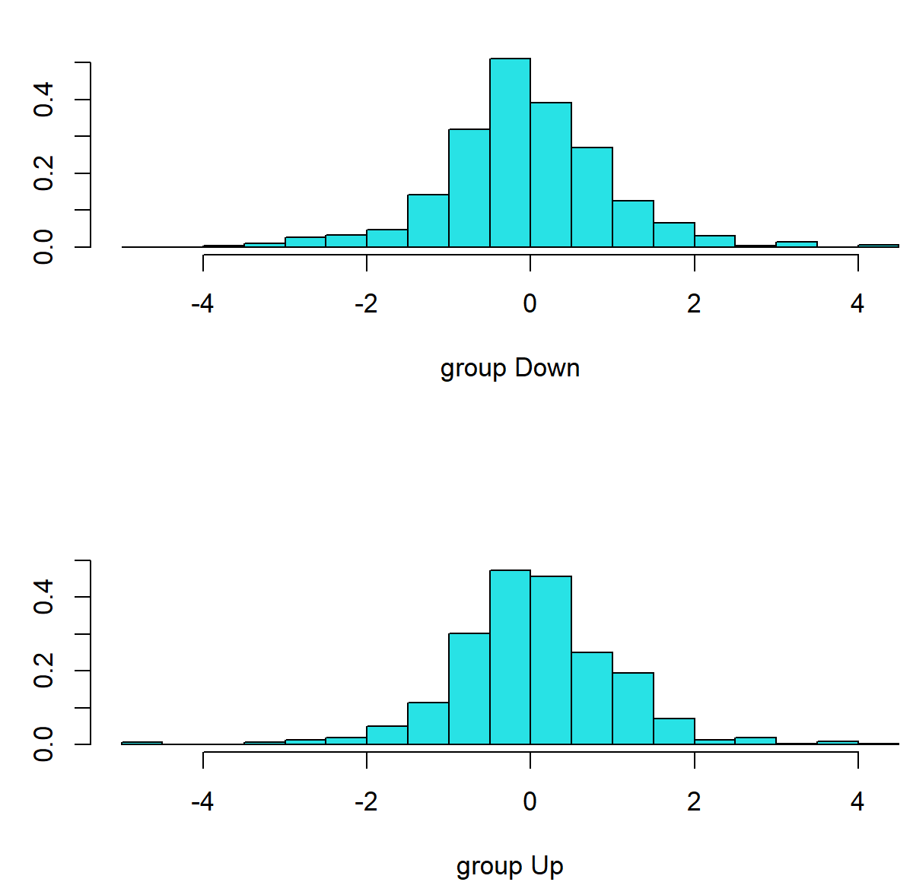

## 自助法

自助法只是一种取样方法。

例子一：估计中位数估计 $\hat{\mu}$ 的标准误差

```R
library(MASS)
library(boot)
set.seed(1)
attach(Boston)

medv.mean = mean(medv)  # 中位数估计
medv.mean
```

```shell
[1] 22.53281
```

```R
boot.fn = function(data, index){
    return(mean(data[index]))  # 把上面的函数搬过来
}
bstrap = boot(medv, boot.fn, 1000)  # 采样1000次
bstrap
```

```shell
ORDINARY NONPARAMETRIC BOOTSTRAP
Call:
boot(data = medv, statistic = boot.fn, R = 1000)
Bootstrap Statistics :
    original      bias    std. error
t1* 22.53281 0.007650791   0.4106622
```

medv.mean = 22.53281，自助法的中位数估计22.53281，标准误差为0.4106622

例子二：估计多元逻辑斯蒂回归中的标准误差

```R
library(ISLR)
attach(Default)
set.seed(1)
```

1. 创建一个关于统计量的函数

   ```R
   boot.fn = function(data, index) {
   	return(coef(glm(default ~ income + balance, data = data, family = binomial, subset = index)))
   }
   ```

2. 使用boot()函数，三个参数：数据集，函数，取样几次

   ```R
   library(boot)
   boot(Default, boot.fn, 50)
   ```

输出：

```shell
ORDINARY NONPARAMETRIC BOOTSTRAP

Call:
boot(data = Default, statistic = boot.fn, R = 50)

Bootstrap Statistics :
         original        bias     std. error
t1* -1.154047e+01  5.590545e-02 4.581367e-01
t2*  2.080898e-05 -7.182676e-07 4.630969e-06
t3*  5.647103e-03 -1.718515e-05 2.461466e-04
```

我们可以对比glm()函数的标准误差：

```R
glm.fit = glm(default ~ income + balance, data = Default, family = binomial)
summary(glm.fit)
```

```shell
Coefficients:
              Estimate Std. Error z value Pr(>|z|)    
(Intercept) -1.154e+01  4.348e-01 -26.545  < 2e-16 ***
income       2.081e-05  4.985e-06   4.174 2.99e-05 ***
balance      5.647e-03  2.274e-04  24.836  < 2e-16 ***
```

t1到t3的std. error分别对应glm()函数输出的三个Std. Error

## LOOCV方法

对于 $n$ 个观测 $\{(x_1,y_1),(x_2,y_2), ..., (x_n,y_n)\}$

取一个作为验证集，其余作为训练集。在训练集上拟合模型，对 $x_i$ 得到预测 $\hat{y_i}$
$$
MSE_i= \frac{1}{n}(y_i-\hat{y_i})^2
$$

$$
CV_{(n)}=\frac{1}{n}\sum_{i=1}^{n}MSE_i
$$

得到测试集上均方误差的估计。

```R
library(boot)

set.seed(1)
y = rnorm(100)
x = rnorm(100)
y = x - 2 * x^2 + rnorm(100)
Data = data.frame(x, y)
library(boot)

glm.fit = glm(y ~ x)  # 相当于最小二乘拟合
cv.glm(Data, glm.fit)$delta  # 使用LOOCV方法输出测试集上均方误差的估计
```

```shell
[1] 5.890979 5.888812
```

在 R 语言中，`cv.glm()` 函数用于执行广义线性模型的交叉验证。该函数返回一个对象，其中包含了交叉验证的结果，其中 `$delta` 属性是其中一个属性。

对于 `$delta` 属性，它是一个包含两个值的向量。这两个值分别表示：

1. 第一个值是关于模型的偏差（bias）的度量，通常使用均方误差（Mean Squared Error，MSE）作为偏差的估计。MSE 是真实观测值与预测值之间差异的平均平方值。较低的 MSE 值表示模型具有更小的偏差，即模型能够更好地拟合数据的真实情况。
2. 第二个值是关于模型的方差的度量，通常使用均方误差的标准差（Standard Deviation of Mean Squared Error，SDMSE）作为方差的估计。SDMSE 表示交叉验证期间均方误差的变化程度，用于衡量模型的稳定性。较低的 SDMSE 值表示模型具有较小的方差，即模型对不同的数据子集具有相似的性能。

通过对模型的偏差和方差进行综合考虑，可以评估模型的整体性能。一般来说，我们希望偏差和方差都尽可能地小，即具有较低的 MSE 和 SDMSE 值。

例子2：n折CV方法

```R
set.seed(1)
library(MASS)
attach(Boston)
library(boot)
all.deltas = rep(NA, 10)
for (i in 1:10) {
    glm.fit = glm(nox ~ poly(dis, i), data = Boston)  # 拟合了10个模型
    all.deltas[i] = cv.glm(Boston, glm.fit, K = 10)$delta[2]  # 对每个模型使用 10 折CV
}
plot(1:10, all.deltas, xlab = "Degree", ylab = "CV error", type = "l", pch = 20, lwd = 2)
```

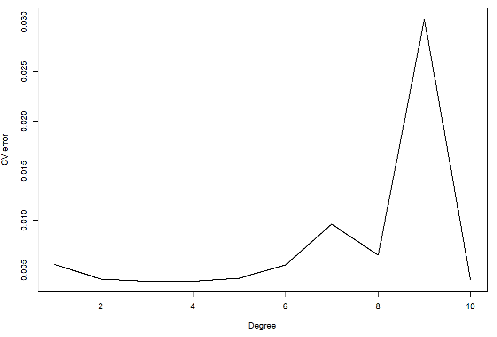

## 最优子集选择

生成数据：

```R
set.seed(1)
X = rnorm(100)
eps = rnorm(100)
beta0 = 3
beta1 = 2
beta2 = -3
beta3 = 0.3
Y = beta0 + beta1 * X + beta2 * X^2 + beta3 * X^3 + eps
library(leaps)
data.full = data.frame(y = Y, x = X)
```

关键代码：

```java
mod.full = regsubsets(y ~ poly(x, 10, raw = T), data = data.full, nvmax = 10)
mod.summary = summary(mod.full)
```

nvmax = 10 代表选择最优的10个预测变量

设置 `raw = T`，可以保持原始变量的尺度，避免对变量进行标准化或缩放操作。这样，多项式回归模型将直接拟合原始变量的高阶次方

mod.summary 以及计算好了各个模型的 RSS、 $C_p$，BIC 和调整 $R^2$ ，让我们绘制出来：

```R
par(mfrow=c(2,2))
plot(mod.summary$rss, type="l")
plot(mod.summary$cp, type="l")
plot(mod.summary$bic, type="l")
plot(mod.summary$adjr2, type="l")
```

type="l"表示将各个点连线。

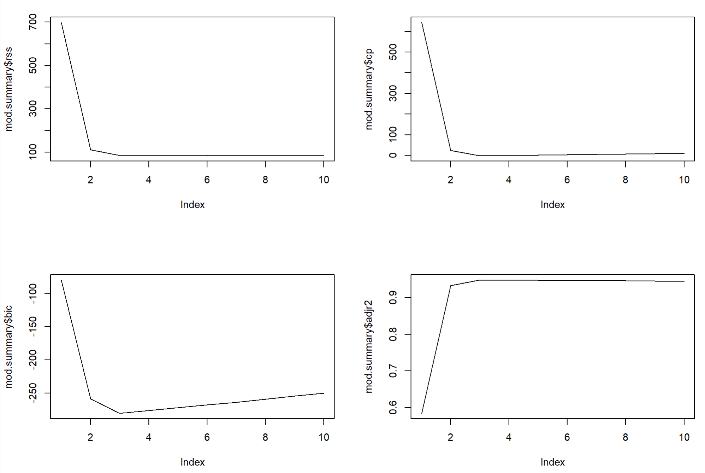

分别用 $C_p$，BIC 和调整 $R^2$ 选择最优模型：

```R
which.min(mod.summary$cp)  # 3
which.min(mod.summary$bic)  # 3
which.min(mod.summary$rss)  # 10
which.max(mod.summary$adjr2)  # 3
```

让我们用红点标识最好的模型：

```R
par(mfrow=c(2,2))
plot(mod.summary$rss, type="l")
points(10, mod.summary$rss[10], col="red", cex=2, pch=2)
plot(mod.summary$cp, type="l")
points(3, mod.summary$cp[3], col="red", cex=2, pch=2)
plot(mod.summary$bic, type="l")
points(3, mod.summary$bic[3], col="red", cex=2, pch=2)
plot(mod.summary$adjr2, type="l")
points(3, mod.summary$adjr2[3], col="red", cex=2, pch=2)
```

通过指定参数 `10` 表示 x 坐标轴上的位置，`mod.summary$rss[10]` 表示 y 坐标轴上的位置，`col="red"` 指定颜色为红色，`cex=2` 控制点的大小为 2，`pch=2` 设置点的形状为三角。

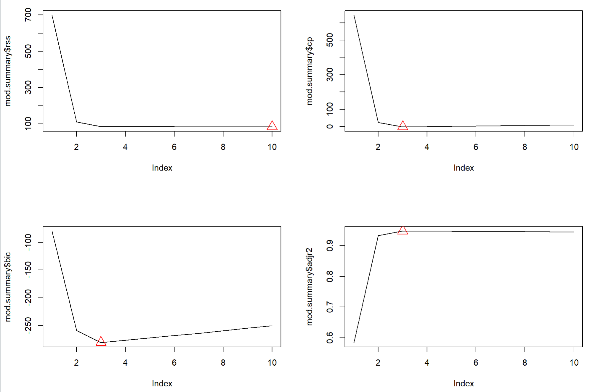

再来点图：

```R
par(mfrow=c(2,2))
plot(mod.full,scale="r2")
plot(mod.full,scale="adjr2")
plot(mod.full,scale="Cp")
plot(mod.full,scale="bic")
```

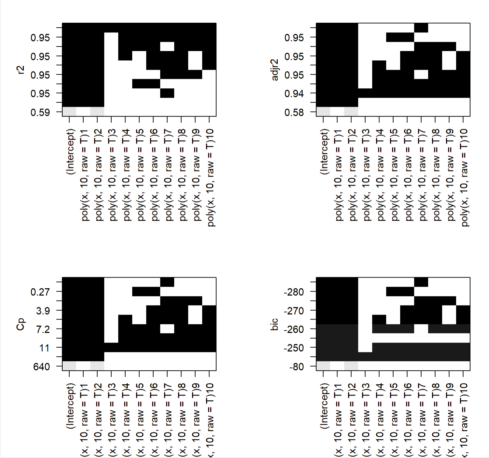

黑块代表相应指标下选择的变量。

提取参数：

```R
coefficients(mod.full, id = 3)
```

```shell
          (Intercept) poly(x, 10, raw = T)1 poly(x, 10, raw = T)2 
           3.07627412            2.35623596           -3.16514887 
poly(x, 10, raw = T)7 
           0.01046843 
```

## 前向选择和后向选择

```R
mod.fwd = regsubsets(y ~ poly(x, 10, raw = T), data = data.full, nvmax = 10, 
    method = "forward")
mod.bwd = regsubsets(y ~ poly(x, 10, raw = T), data = data.full, nvmax = 10, 
    method = "backward")
fwd.summary = summary(mod.fwd)
bwd.summary = summary(mod.bwd)
```

绘图：

```R
par(mfrow = c(2, 3))
plot(fwd.summary$cp, xlab = "Subset Size", ylab = "Forward Cp", pch = 20, type = "l")
points(3, fwd.summary$cp[3], pch = 4, col = "red", lwd = 7)
plot(bwd.summary$cp, xlab = "Subset Size", ylab = "Backward Cp", pch = 20, type = "l")
points(3, bwd.summary$cp[3], pch = 4, col = "red", lwd = 7)
plot(fwd.summary$bic, xlab = "Subset Size", ylab = "Forward BIC", pch = 20, 
    type = "l")
points(3, fwd.summary$bic[3], pch = 4, col = "red", lwd = 7)
plot(bwd.summary$bic, xlab = "Subset Size", ylab = "Backward BIC", pch = 20, 
    type = "l")
points(3, bwd.summary$bic[3], pch = 4, col = "red", lwd = 7)
plot(fwd.summary$adjr2, xlab = "Subset Size", ylab = "Forward Adjusted R2", 
    pch = 20, type = "l")
points(3, fwd.summary$adjr2[3], pch = 4, col = "red", lwd = 7)
plot(bwd.summary$adjr2, xlab = "Subset Size", ylab = "Backward Adjusted R2", 
    pch = 20, type = "l")
points(4, bwd.summary$adjr2[4], pch = 4, col = "red", lwd = 7)
```

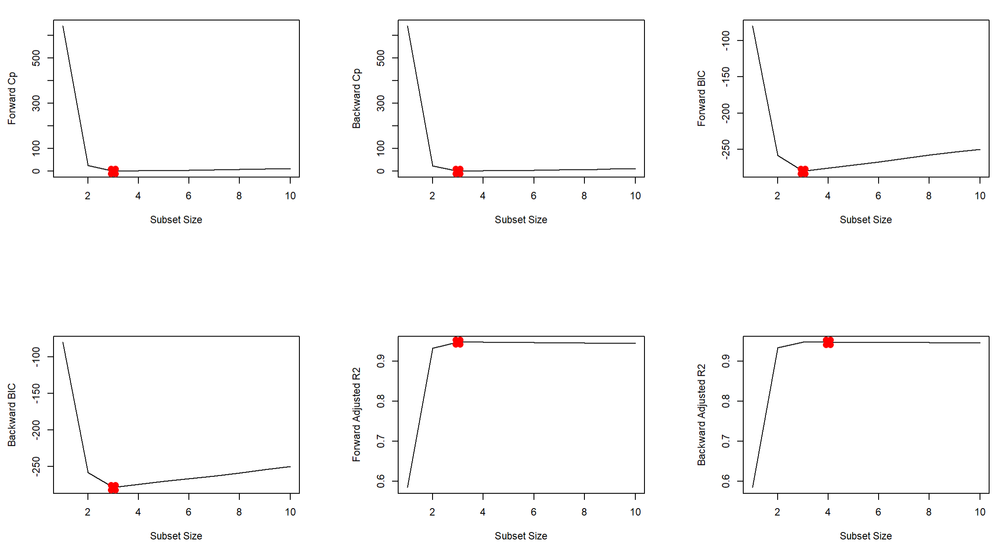

提取参数：

```R
coefficients(mod.fwd, id = 3)
```

```shell
          (Intercept) poly(x, 10, raw = T)1 poly(x, 10, raw = T)2 poly(x, 10, raw = T)7 
           3.07627412            2.35623596           -3.16514887            0.01046843 
```

```R
coefficients(mod.bwd, id = 3)
```

```shell
          (Intercept) poly(x, 10, raw = T)1 poly(x, 10, raw = T)2 poly(x, 10, raw = T)9 
          3.078881355           2.419817953          -3.177235617           0.001870457 
```

## Lasso/岭回归

即 L1正则化 和 L2正则化

```R
library(glmnet)
xmat = model.matrix(y ~ poly(x, 10, raw = T), data = data.full)[, -1]  # 构造回归设计矩阵
mod.lasso = cv.glmnet(xmat, Y, alpha = 1)  # alpha = 1 代表使用 lasso
best.lambda = mod.lasso$lambda.min  # 得到最佳的 lambda 值
best.lambda
```

```shell
[1] 0.03991416
```

> `model.matrix()`函数的主要用途是将一个线性回归模型或广义线性模型中的公式和数据转换为设计矩阵。
>
> 设计矩阵是用于拟合线性回归模型或广义线性模型的基础数据结构。它将因变量和自变量转换为数值化的矩阵形式，方便模型的计算和分析。
>
> `model.matrix()`函数接受一个公式和数据作为参数。公式表示了模型的结构，例如`y ~ x1 + x2`表示因变量y与自变量x1和x2之间的线性关系。数据则包含了用于拟合模型的观测值。
>
> `cv.glmnet()`函数用于进行弹性网络（Elastic Net）模型的交叉验证。弹性网络是一种结合了L1正则化（LASSO回归）和L2正则化（岭回归）的线性回归模型。它可以处理高维数据，并具有变量选择的能力。
>
> `cv.glmnet()`通过交叉验证，该函数会自动调整lambda的取值范围，并在每个lambda值下计算得到相应的模型。然后基于交叉验证误差，选择具有最小误差的lambda作为最佳lambda。
>
> `cv.glmnet()`函数的一般用法如下：
>
> ```
> cv.glmnet(x, y, alpha, nfolds)
> ```
>
> 其中，`x`是设计矩阵，`y`是因变量向量，`alpha`是弹性网络中L1和L2正则化的权重比例参数（0代表纯岭回归，1代表纯LASSO回归），`nfolds`是交叉验证的折数。

绘制图像

```R
plot(mod.lasso)
```


在整个数据集上使用最佳 $\lambda$ 参数拟合模型：

```R
best.model = glmnet(xmat, Y, alpha = 1)
predict(best.model, s = best.lambda, type = "coefficients")
```

```shell
11 x 1 sparse Matrix of class "dgCMatrix"
                                  s1
(Intercept)             3.0398151056
poly(x, 10, raw = T)1   2.2303371338
poly(x, 10, raw = T)2  -3.1033192679
poly(x, 10, raw = T)3   .           
poly(x, 10, raw = T)4   .           
poly(x, 10, raw = T)5   0.0498410763
poly(x, 10, raw = T)6   .           
poly(x, 10, raw = T)7   0.0008068431
poly(x, 10, raw = T)8   .           
poly(x, 10, raw = T)9   .           
poly(x, 10, raw = T)10  . 
```

## PCR主成分回归

```R
library(ISLR)
train.size = dim(College)[1] / 2
train = sample(1:dim(College)[1], train.size)
test = -train
College.train = College[train, ]
College.test = College[test, ]
```

关键代码：

```R
pcr.fit = pcr(Apps~., data=College.train, scale=T, validation="CV")
validationplot(pcr.fit, val.type="MSEP")
```


```R
pcr.pred = predict(pcr.fit, College.test, ncomp=10)
```

## PLS偏最小二乘

语法与PCR类似

```R
pls.fit = plsr(Apps~., data=College.train, scale=T, validation="CV")
validationplot(pls.fit, val.type="MSEP")
pls.pred = predict(pls.fit, College.test, ncomp=10)
```

```
test.avg = mean(College.test[, "Apps"])
lm.test.r2 = 1 - mean((College.test[, "Apps"] - lm.pred)^2) /mean((College.test[, "Apps"] - test.avg)^2)
ridge.test.r2 = 1 - mean((College.test[, "Apps"] - ridge.pred)^2) /mean((College.test[, "Apps"] - test.avg)^2)
lasso.test.r2 = 1 - mean((College.test[, "Apps"] - lasso.pred)^2) /mean((College.test[, "Apps"] - test.avg)^2)
pcr.test.r2 = 1 - mean(((College.test[, "Apps"] - data.frame(pcr.pred))^2)$Apps.10.comps) /mean((College.test[, "Apps"] - test.avg)^2)
pls.test.r2 = 1 - mean(((College.test[, "Apps"] - data.frame(pls.pred))^2)$Apps.10.comps) /mean((College.test[, "Apps"] - test.avg)^2)
barplot(c(lm.test.r2, ridge.test.r2, lasso.test.r2, pcr.test.r2, pls.test.r2), col="red", names.arg=c("OLS", "Ridge", "Lasso", "PCR", "PLS"), main="Test R-squared")
```

## 绘制非线性拟合模型

准备：

```R
set.seed(1)
library(MASS)
attach(Boston)
lm.fit = lm(nox ~ poly(dis, 3), data = Boston)
```

绘制：

```R
dislim = range(dis)  # 计算出了自变量dis的取值范围
dis.grid = seq(from = dislim[1], to = dislim[2], by = 0.1)  # 生成了一个序列，以0.1为步长，覆盖了dis的取值范围。
lm.pred = predict(lm.fit, list(dis = dis.grid))  # 预测，得到了对应的因变量nox的预测值。
plot(nox ~ dis, data = Boston, col = "darkgrey")  # 绘制了实际数据点的散点图
lines(dis.grid, lm.pred, col = "red", lwd = 2)  # 绘制了基于线性回归模型预测值的拟合直线，颜色为"red"，线宽为2。
```

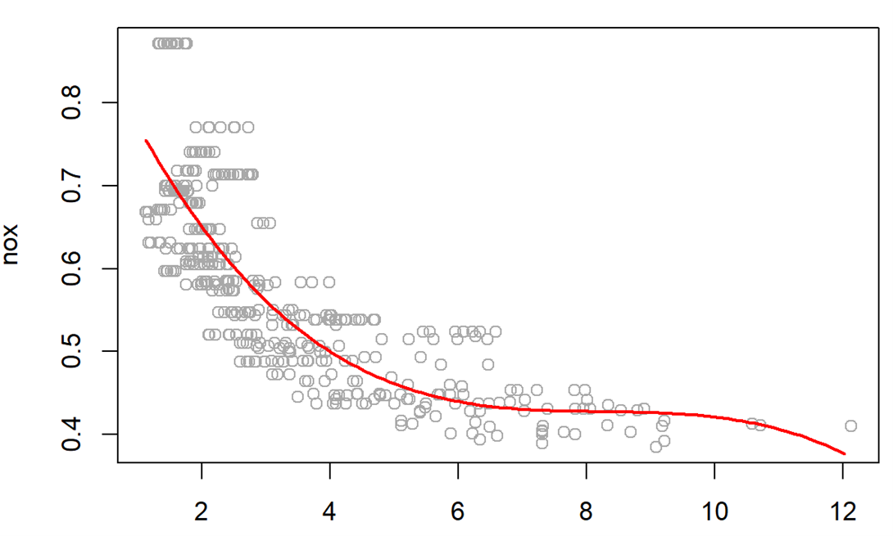

例子2：

```R
par(mfrow=c(2,5))
all.rss = rep(NA, 10)
for (i in 1:10) {
    lm.fit = lm(nox ~ poly(dis, i), data = Boston)
    lm.pred = predict(lm.fit, list(dis = dis.grid))
    plot(nox ~ dis, data = Boston, col = "darkgrey")
    lines(dis.grid, lm.pred, col = "red", lwd = 2)
    all.rss[i] = sum(lm.fit$residuals^2)
}
```

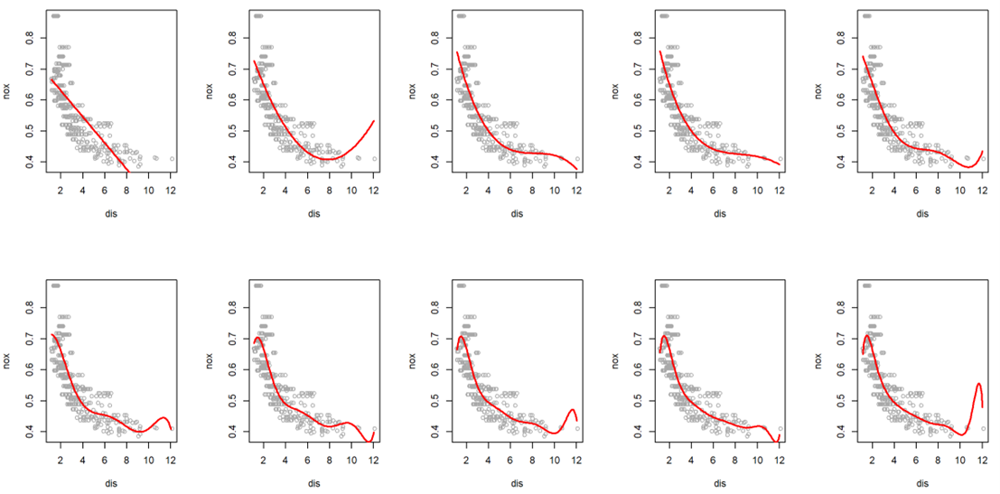

## 回归样条

数据准备同 *绘制非线性拟合模型* 一节

```R
library(splines)
sp.fit = lm(nox ~ bs(dis, df = 4, knots = c(4, 7, 11)), data = Boston)
summary(sp.fit)
```

```shell
Call:
lm(formula = nox ~ bs(dis, df = 4, knots = c(4, 7, 11)), data = Boston)

Residuals:
      Min        1Q    Median        3Q       Max 
-0.124567 -0.040355 -0.008702  0.024740  0.192920 

Coefficients:
                                      Estimate Std. Error t value Pr(>|t|)    
(Intercept)                            0.73926    0.01331  55.537  < 2e-16 ***
bs(dis, df = 4, knots = c(4, 7, 11))1 -0.08861    0.02504  -3.539  0.00044 ***
bs(dis, df = 4, knots = c(4, 7, 11))2 -0.31341    0.01680 -18.658  < 2e-16 ***
bs(dis, df = 4, knots = c(4, 7, 11))3 -0.26618    0.03147  -8.459 3.00e-16 ***
bs(dis, df = 4, knots = c(4, 7, 11))4 -0.39802    0.04647  -8.565  < 2e-16 ***
bs(dis, df = 4, knots = c(4, 7, 11))5 -0.25681    0.09001  -2.853  0.00451 ** 
bs(dis, df = 4, knots = c(4, 7, 11))6 -0.32926    0.06327  -5.204 2.85e-07 ***
---
Signif. codes:  0 ‘***’ 0.001 ‘**’ 0.01 ‘*’ 0.05 ‘.’ 0.1 ‘ ’ 1

Residual standard error: 0.06185 on 499 degrees of freedom
Multiple R-squared:  0.7185,	Adjusted R-squared:  0.7151 
F-statistic: 212.3 on 6 and 499 DF,  p-value: < 2.2e-16
```

> `bs(dis, df = 4, knots = c(4, 7, 11))`是指定自变量以样条函数（B-spline）的形式建模。
>
> - 其中`dis`是自变量
> - `df`参数指定样条函数的自由度（自变量的拟合程度）
> - `knots`参数指定样条函数的节点（分段点）位置。

然后绘制图像

```R
sp.pred = predict(sp.fit, list(dis = dis.grid))
plot(nox ~ dis, data = Boston, col = "darkgrey")
lines(dis.grid, sp.pred, col = "red", lwd = 2)
```

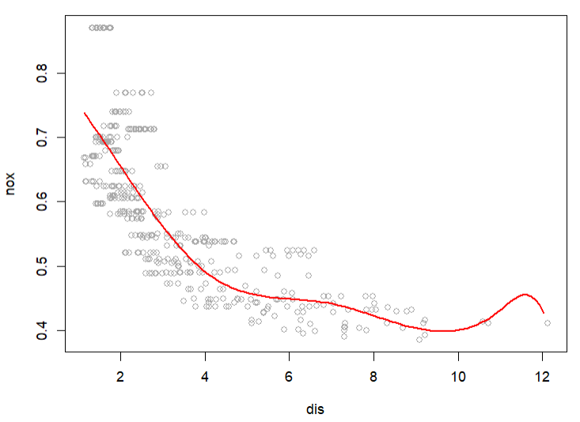

例子2：

```R
par(mfrow=c(3,5))
all.cv = rep(NA, 16)
for (i in 3:16) {
    lm.fit = glm(nox ~ bs(dis, df = i), data = Boston)
    sp.pred = predict(lm.fit, list(dis = dis.grid))
    plot(nox ~ dis, data = Boston, col = "darkgrey")
    lines(dis.grid, sp.pred, col = "red", lwd = 2)
    all.cv[i] = cv.glm(Boston, lm.fit, K = 10)$delta[2]
}
plot(3:16, all.cv[-c(1, 2)], lwd = 2, type = "l", xlab = "df", ylab = "CV error")
```

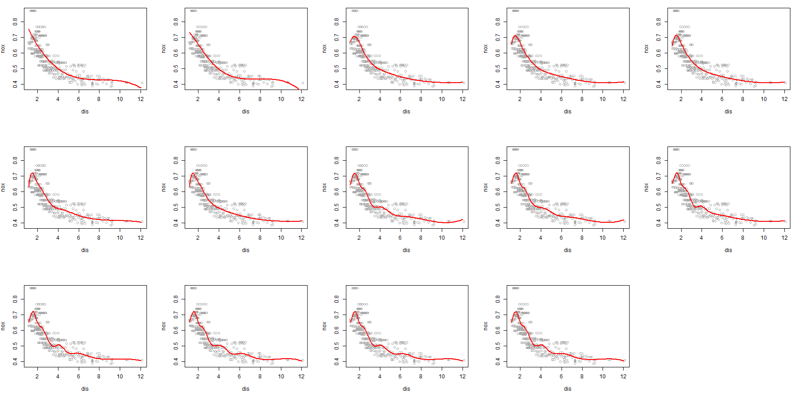

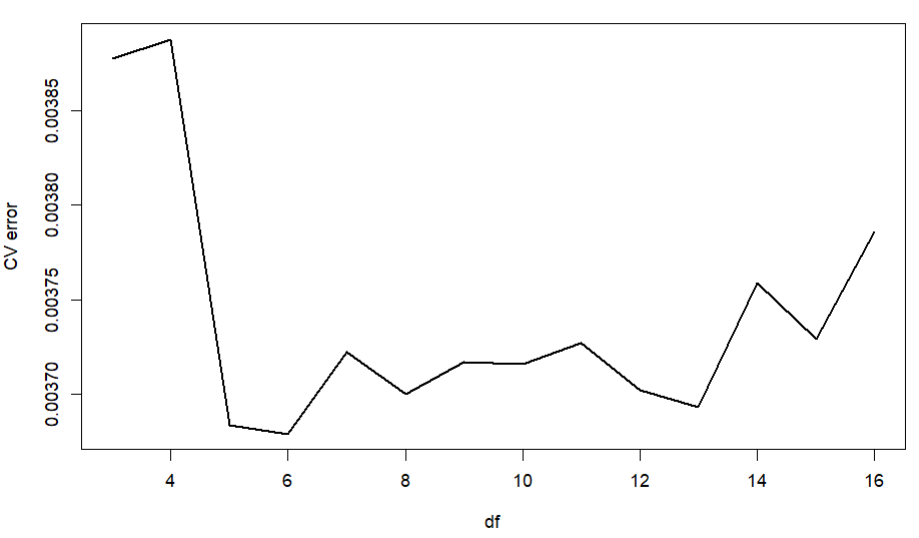

## 逐步回归

准备数据：

```R
set.seed(1)
library(ISLR)
library(leaps)
attach(College)
train = sample(length(Outstate), length(Outstate)/2)
test = -train
College.train = College[train, ]
College.test = College[test, ]
```

关键代码：

```R
reg.fit = regsubsets(Outstate ~ ., data = College.train, nvmax = 17, method = "forward")
reg.summary = summary(reg.fit)
```

使用regsubsets函数：

- `regsubsets()`函数用于执行逐步回归分析。
- `nvmax = 17`是指定最大模型大小的参数，这里设置为17，表示最多选择17个自变量进行回归分析。
- `method = "forward"`表示使用向前法进行逐步回归分析，即每一步选择与因变量相关性最大的自变量加入模型。

绘图，随变量加入模型评估值的变化：

```R
par(mfrow = c(1, 3))
plot(reg.summary$cp, xlab = "Number of Variables", ylab = "Cp", type = "l")
plot(reg.summary$bic, xlab = "Number of Variables", ylab = "BIC", type = "l")
plot(reg.summary$adjr2, xlab = "Number of Variables", ylab = "Adjusted R2", type = "l")
```


选择模型：

```R
which.min(reg.summary$bic)
```

```shell
[1] 6
```

查看包含哪些变量：

```R
reg.fit = regsubsets(Outstate ~ ., data = College, method = "forward")
coefi = coef(reg.fit, id = 6)
names(coefi)
```

```shell
[1] "(Intercept)" "PrivateYes"  "Room.Board"  "PhD"         "perc.alumni" "Expend"      "Grad.Rate"  
```

## GAM广义可加模型

数据准备同 *逐步回归* 一节

```R
library(gam)
gam.fit = gam(Outstate ~ Private + s(Room.Board, df = 2) + s(PhD, df = 2) + s(perc.alumni, df = 2) + s(Expend, df = 5) + s(Grad.Rate, df = 2), data = College.train)
```

使用广义加性模型（Generalized Additive Model, GAM）进行拟合：

- `gam()`函数用于执行广义加性模型的拟合。
- `s(Room.Board, df = 2)`表示对`Room.Board`变量拟合光滑样条，并指定平滑自由度为2。

绘图：

```R
par(mfrow = c(2, 3))
plot(gam.fit, se = T, col = "blue")
```

- `se = T`表示在图形中绘制拟合曲线的标准误差带（Standard Error Band）。这个带子反映了拟合曲线的不确定性范围。
- `col = "blue"`表示将拟合曲线和标准误差带的颜色设置为蓝色。

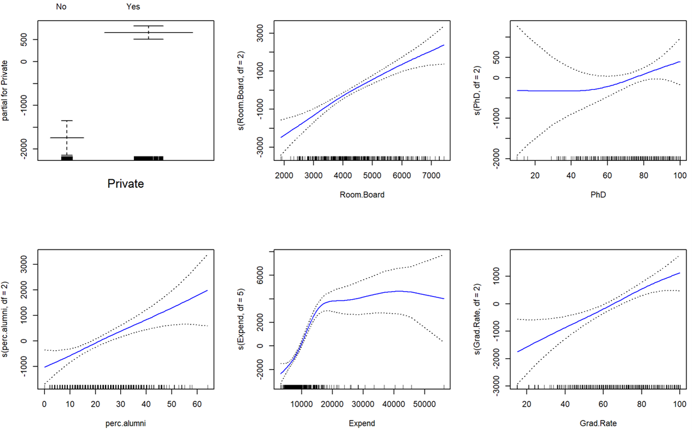

在测试集上得到误差：

```R
gam.pred = predict(gam.fit, College.test)
gam.err = mean((College.test$Outstate - gam.pred)^2)
gam.err
```

```shell
[1] 3349290
```

```R
gam.tss = mean((College.test$Outstate - mean(College.test$Outstate))^2)
test.rss = 1 - gam.err/gam.tss
test.rss
```

```shell
[1] 0.7660016
```

总结：

```R
summary(gam.fit)
```

```shell
Call: gam(formula = Outstate ~ Private + s(Room.Board, df = 2) + s(PhD, 
    df = 2) + s(perc.alumni, df = 2) + s(Expend, df = 5) + s(Grad.Rate, 
    df = 2), data = College.train)
Deviance Residuals:
     Min       1Q   Median       3Q      Max 
-7402.89 -1114.45   -12.67  1282.69  7470.60 

(Dispersion Parameter for gaussian family taken to be 3711182)

    Null Deviance: 6989966760 on 387 degrees of freedom
Residual Deviance: 1384271126 on 373 degrees of freedom
AIC: 6987.021 

Number of Local Scoring Iterations: NA 

Anova for Parametric Effects
                        Df     Sum Sq    Mean Sq F value    Pr(>F)    
Private                  1 1778718277 1778718277 479.286 < 2.2e-16 ***
s(Room.Board, df = 2)    1 1577115244 1577115244 424.963 < 2.2e-16 ***
s(PhD, df = 2)           1  322431195  322431195  86.881 < 2.2e-16 ***
s(perc.alumni, df = 2)   1  336869281  336869281  90.771 < 2.2e-16 ***
s(Expend, df = 5)        1  530538753  530538753 142.957 < 2.2e-16 ***
s(Grad.Rate, df = 2)     1   86504998   86504998  23.309 2.016e-06 ***
Residuals              373 1384271126    3711182                      
---
Signif. codes:  0 ‘***’ 0.001 ‘**’ 0.01 ‘*’ 0.05 ‘.’ 0.1 ‘ ’ 1

Anova for Nonparametric Effects
                       Npar Df  Npar F     Pr(F)    
(Intercept)                                         
Private                                             
s(Room.Board, df = 2)        1  1.9157    0.1672    
s(PhD, df = 2)               1  0.9699    0.3253    
s(perc.alumni, df = 2)       1  0.1859    0.6666    
s(Expend, df = 5)            4 20.5075 2.665e-15 ***
s(Grad.Rate, df = 2)         1  0.5702    0.4506    
---
Signif. codes:  0 ‘***’ 0.001 ‘**’ 0.01 ‘*’ 0.05 ‘.’ 0.1 ‘ ’ 1
```

- ANOVA（Analysis of Variance）是一种用于比较两个或多个样本均值是否相等的假设检验方法。在ANOVA中，将数据集分为若干组，比较这些组之间的差异是否显著，以确定是否存在一个或多个因素对数据的影响。
- `Anova for Parametric Effects` 表示对于模型中的线性参数部分使用ANOVA方法进行假设检验，判断这些参数是否显著。P值低的表示该变量为线性关系。
- `Anova for Nonparametric Effects` 表示对于模型中的非线性参数部分使用ANOVA方法进行假设检验，判断这些参数是否显著。P值低的表示该变量为非线性关系。

## 决策树/分类树

准备数据：

```R
library(ISLR)
library(tree)
attach(Carseats)
set.seed(1)

train = sample(dim(Carseats)[1], dim(Carseats)[1]/2)
Carseats.train = Carseats[train, ]
Carseats.test = Carseats[-train, ]
```

关键代码：

```R
tree.carseats = tree(Sales ~ ., data = Carseats.train)
summary(tree.carseats)
```

```shell
Regression tree:
tree(formula = Sales ~ ., data = Carseats.train)
Variables actually used in tree construction:
[1] "ShelveLoc"   "Price"       "Age"         "Advertising" "CompPrice"  
[6] "US"         
Number of terminal nodes:  18 
Residual mean deviance:  2.167 = 394.3 / 182 
Distribution of residuals:
    Min.  1st Qu.   Median     Mean  3rd Qu.     Max. 
-3.88200 -0.88200 -0.08712  0.00000  0.89590  4.09900 
```

画图：

```R
plot(tree.carseats)
text(tree.carseats, pretty = 0)
```

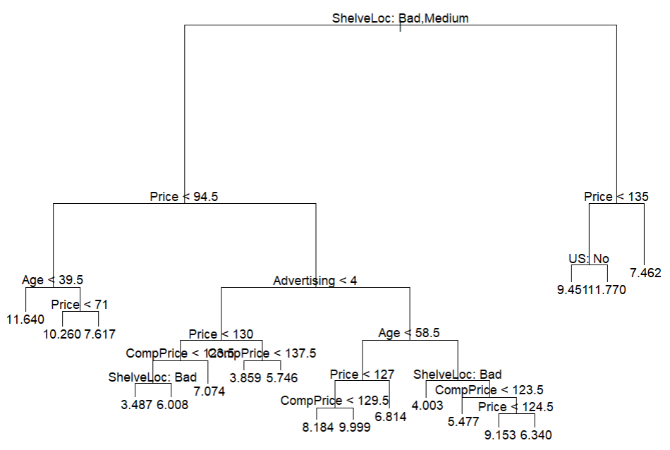

减枝：

```R
# 交叉验证选择最优的树结构，prune.tree() 函数用于根据选择的最优树进行剪枝
cv.carseats = cv.tree(tree.carseats, FUN = prune.tree)

# 画图
par(mfrow = c(1, 2))
plot(cv.carseats$size, cv.carseats$dev, type = "b")  # 树结构大小与误差变化之间的关系
plot(cv.carseats$k, cv.carseats$dev, type = "b")  # 不同剪枝程度（k）对应的误差变化情况
```

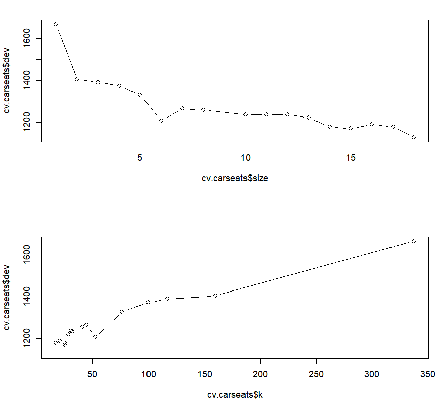

剪枝后的树：

```R
pruned.carseats = prune.tree(tree.carseats, best = 9)  # 选择剪枝后的树，size大小为9
par(mfrow = c(1, 1))
plot(pruned.carseats)
text(pruned.carseats, pretty = 0)
```


具体信息：

```R
tree.carseats
```

```shell
node), split, n, deviance, yval
      * denotes terminal node

  1) root 200 1573.000  7.578  
    2) ShelveLoc: Bad,Medium 158  964.600  6.908  
      4) Price < 94.5 24  110.900  9.285  
        8) Age < 39.5 6    9.117 11.640 *
        9) Age > 39.5 18   57.310  8.499  
         18) Price < 71 6    7.686 10.260 *
         19) Price > 71 12   21.610  7.617 *
......
```

- node: 节点编号，表示当前节点在决策树中的位置。
- split: 分裂条件，表示当前节点的分裂条件。例如，ShelveLoc: Bad,Medium 表示根据 ShelveLoc 列的取值为 Bad 或 Medium 进行分裂。
- n: 节点样本数量，表示当前节点的样本个数。
- deviance: 节点的不纯度或损失函数值，用于衡量节点的纯度。
- yval: 节点的预测值，表示当前节点的目标变量的平均值（或其他统计量）。

带有 "*" 符号的行表示叶子节点，即决策树的终止节点，不再进行进一步的分裂。这些叶子节点将用于最终的预测。

### 装袋法

准备数据步骤同上

```R
library(randomForest)
bag.carseats = randomForest(Sales ~ ., data = Carseats.train, mtry = 10, ntree = 500, importance = T)
# mtry = 10 表示在每次分裂时随机选择 10 个特征进行评估，ntree = 500 表示构建 500 棵决策树，importance = T 表示计算特征的重要性。
# 因为一共就10个特征，虽然套的是随机森林的算法，所以可以认为是装袋法。
bag.pred = predict(bag.carseats, Carseats.test)
mean((Carseats.test$Sales - bag.pred)^2)
```

```shell
[1] 2.622982
```

查看哪些变量最重要

```R
importance(bag.carseats)
```

```shell
               %IncMSE IncNodePurity
CompPrice   25.8083065    176.750788
Income       4.3976727     90.755860
Advertising 12.2530540     96.396343
Population  -3.1644545     55.382276
Price       56.2028471    501.877790
ShelveLoc   46.4048838    377.701755
Age         16.0014582    155.431845
Education   -0.2585088     44.103966
Urban       -0.3479058      8.679922
US           5.5939322     18.643493
```

### 随机森林

```R
rf.carseats = randomForest(Sales ~ ., data = Carseats.train, mtry = 5, ntree = 500, importance = T)
rf.pred = predict(rf.carseats, Carseats.test)
mean((Carseats.test$Sales - rf.pred)^2)
```

### 提升法

数据准备：

```R
library(ISLR)
Hitters = Hitters[-which(is.na(Hitters$Salary)), ]
Hitters$Salary = log(Hitters$Salary)
train = 1:200
Hitters.train = Hitters[train, ]
Hitters.test = Hitters[-train, ]
```

关键代码

```R
boost.hitters = gbm(Salary ~ ., data = Hitters.train, distribution = "gaussian", n.trees = 1000, shrinkage = 0.1)
```

Gradient Boosting Machine (GBM) 算法是一种集成学习方法，用于解决回归和分类问题。它通过迭代地训练多个弱学习器（通常是决策树），然后将它们组合起来形成一个更强大的预测模型。（可以认为是提升法）

- gbm() 是 GBM 算法的函数，用于训练 GBM 模型。
- distribution = "gaussian" 表示使用高斯分布作为目标变量的分布。
- n.trees = 1000 表示生成 1000 棵决策树。
- shrinkage = 0.1 表示每棵决策树的权重缩减系数为 0.1，用于控制学习速率和过拟合程度。

为了寻找最好的 $\lambda$ ，通常使用循环看哪个效果最好

```R
set.seed(103)
pows = seq(-10, -0.2, by = 0.1)
lambdas = 10^pows
length.lambdas = length(lambdas)
train.errors = rep(NA, length.lambdas)
test.errors = rep(NA, length.lambdas)
for (i in 1:length.lambdas) {
    boost.hitters = gbm(Salary ~ ., data = Hitters.train, distribution = "gaussian", n.trees = 1000, shrinkage = lambdas[i])
    train.pred = predict(boost.hitters, Hitters.train, n.trees = 1000)
    test.pred = predict(boost.hitters, Hitters.test, n.trees = 1000)
    train.errors[i] = mean((Hitters.train$Salary - train.pred)^2)
    test.errors[i] = mean((Hitters.test$Salary - test.pred)^2)
}

par(mfrow=c(2,1))
plot(lambdas, train.errors, type = "b", xlab = "Shrinkage", ylab = "Train MSE", col = "blue", pch = 20)
plot(lambdas, test.errors, type = "b", xlab = "Shrinkage", ylab = "Test MSE", col = "red", pch = 20)
```

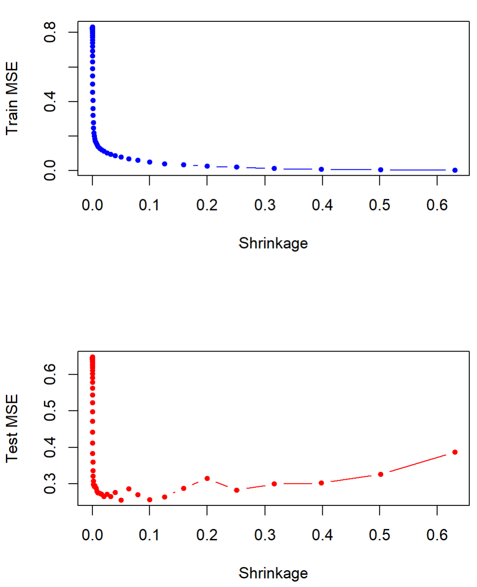

然后在测试集上看最好的模型

```R
lambdas[which.min(test.errors)]
```

```shell
[1] 0.05011872
```

查看最好的模型

```R
boost.best = gbm(Salary ~ ., data = Hitters.train, distribution = "gaussian", n.trees = 1000, shrinkage = lambdas[which.min(test.errors)])
summary(boost.best)
```

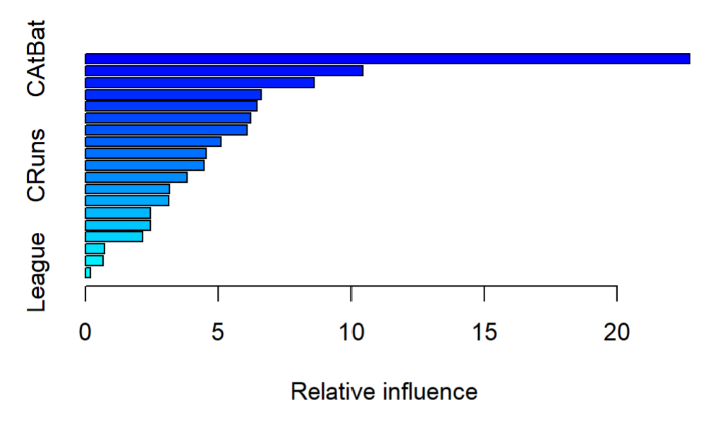

## 支持向量机SVM

> https://blog.princehonest.com/stat-learning/ch9/4.html

准备数据：

```R
set.seed(131)
x = rnorm(100)
y = 3 * x^2 + 4 + rnorm(100)
train = sample(100, 50)  # 对1到100之间的数字进行了随机抽样，抽取了50个样本
y[train] = y[train] + 3
y[-train] = y[-train] - 3
# Plot using different colors
plot(x[train], y[train], pch="+", lwd=4, col="red", ylim=c(-4, 20), xlab="X", ylab="Y")
points(x[-train], y[-train], pch="o", lwd=4, col="blue")
```

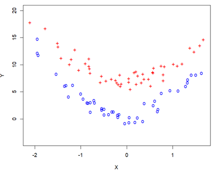

### 支持向量分类器

```R
svm.linear = svm(z~., data=data.train, kernel="linear", cost=10)
plot(svm.linear, data.train)
```

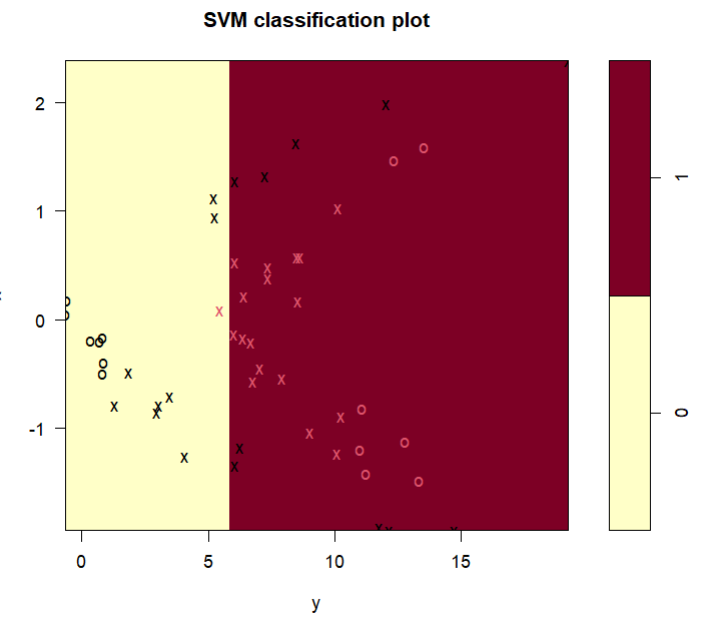

在训练集和测试集上的预测结果

```R
table(z[final.train], predict(svm.linear, data.train))
table(z[-final.train], predict(svm.linear, data.test))
```

### 使用多项式核函数

```R
svm.poly = svm(z~., data=data.train, kernel="polynomial", cost=10)
plot(svm.poly, data.train)
```

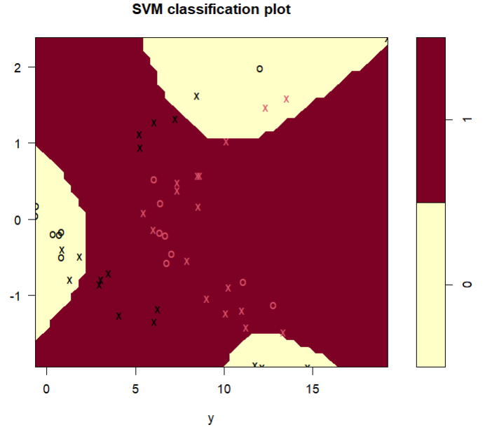

### 使用径向基函数

```R
svm.radial = svm(z~., data=data.train, kernel="radial", gamma=1, cost=10)
plot(svm.radial, data.train)
```


### 使用不同的cost

```R
library(ISLR)
tune.out = tune(svm, mpglevel ~ ., data = Auto, kernel = "linear", ranges = list(cost = c(0.01, 0.1, 1, 5, 10, 100)))
summary(tune.out)
```

```
Parameter tuning of ‘svm’:

- sampling method: 10-fold cross validation 

- best parameters:
 cost
    1

- best performance: 0.01269231 

- Detailed performance results:
   cost      error dispersion
1 1e-02 0.07397436 0.06863413
2 1e-01 0.05102564 0.06923024
3 1e+00 0.01269231 0.02154160
4 5e+00 0.01519231 0.01760469
5 1e+01 0.02025641 0.02303772
6 1e+02 0.03294872 0.02898463
```

类似的

```R
tune.out = tune(svm, mpglevel ~ ., data = Auto, kernel = "polynomial", ranges = list(cost = c(0.1, 1, 5, 10), degree = c(2, 3, 4)))
```

```R
tune.out = tune(svm, mpglevel ~ ., data = Auto, kernel = "radial", ranges = list(cost = c(0.1, 1, 5, 10), gamma = c(0.01, 0.1, 1, 5, 10, 100)))
```

## PCA主成分分析与k均值聚类

准备数据

```R
> set.seed(2)
> x = matrix(rnorm(20*3*50, mean=0, sd=0.001), ncol=50)
> x[1:20, 2] = 1
> x[21:40, 1] = 2
> x[21:40, 2] = 2
> x[41:60, 1] = 1
```

关键代码

```R
> pca.out = prcomp(x)  # 对数据集x进行主成分分析
> km.out = kmeans(x, 3, nstart=20)  # 对数据集x进行k均值聚类分析，将数据集分成3个簇，并进行20次不同初始中心点的尝试
> km.out$cluster  # 输出聚类的结果，即每个样本所属的簇的编号
```

```
[1] 1 1 1 1 1 1 1 1 1 1 1 1 1 1 1 1 1 1 1 1 3 3 3 3 3 3 3 3 3 3 3 3 3 3
[35] 3 3 3 3 3 3 2 2 2 2 2 2 2 2 2 2 2 2 2 2 2 2 2 2 2 2
```

画图

```R
plot(pca.out$x[,1:2], col=2:4, xlab="Z1", ylab="Z2", pch=19)
# 选择了PCA结果中的前两个主成分作为横纵坐标，将数据集在二维平面上以散点图的形式展现出来，不同颜色的点代表不同的聚类簇。
```

